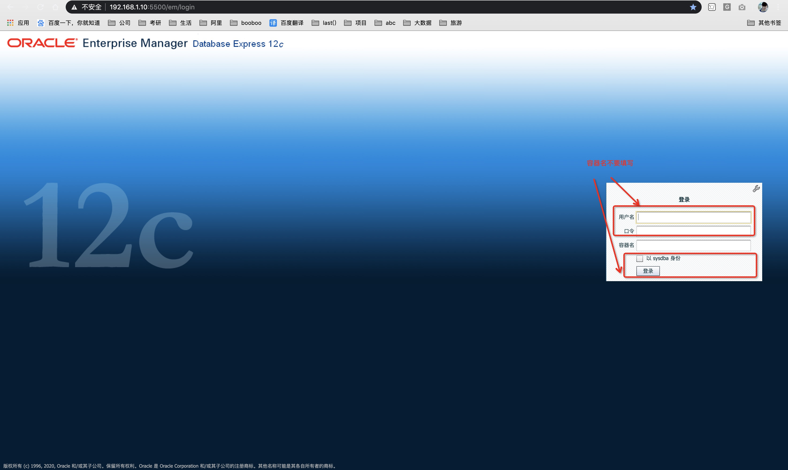
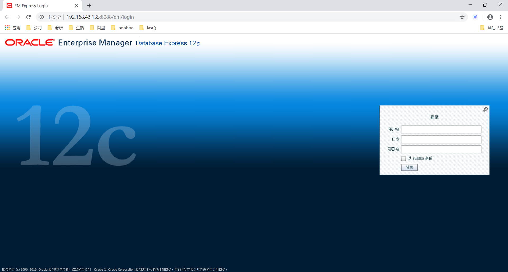
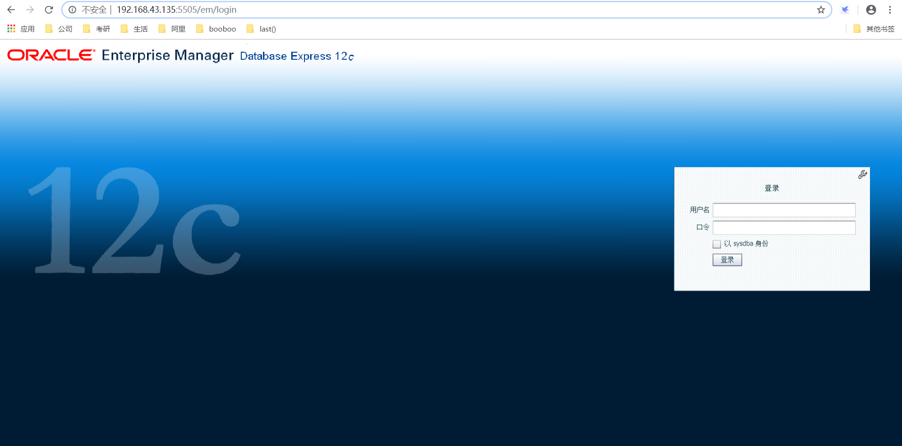
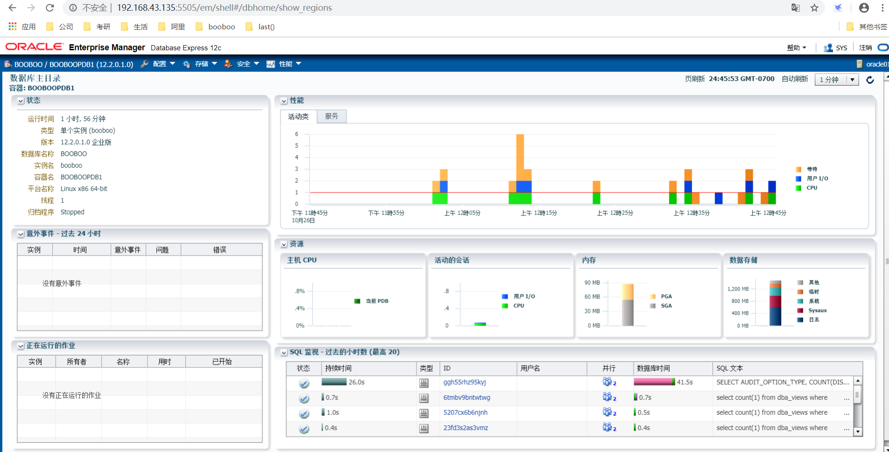

# 01-配置使用Oracle企业管理工具em

> 2019.10.27 BoobooWei
>
> Configuring Enterprise Manager Database Express

<!-- MDTOC maxdepth:6 firsth1:1 numbering:0 flatten:0 bullets:1 updateOnSave:1 -->

- [01-配置使用Oracle企业管理工具em](#01-配置使用oracle企业管理工具em)   
   - [访问CDB](#访问cdb)   
   - [访问PDB](#访问pdb)   

<!-- /MDTOC -->

默认安装oracle12c 时已安装oem工具`exec DBMS_XDB.setHTTPPort(5500)`，访问时必须通过https

 https://192.168.43.135:5500/em/login

手动添加其他oem的访问端口时``exec dbms_xdb_config.sethttpport(5505);`，必须通过 http

 http://192.168.43.135:5505/em

## 访问CDB

注意这里不填写容器名，如果填写，浏览器则会弹出输入框，你输入什么都没有用。
这里你们可能会遇见错误：登录被拒绝; 用户名/口令无效。



## 访问PDB


1. sqlplus / as sysdba`
2. `exec dbms_xdb_config.sethttpport(8088);`
3. ` alter session set container=booboopdb1;`
4. `exec dbms_xdb_config.sethttpport(5505);`
5. `ss -luntp |grep tnslsnr`


```sql
[oracle@oracle01 ~]$ sqlplus / as sysdba

SQL*Plus: Release 12.2.0.1.0 Production on Sun Oct 27 00:18:40 2019

Copyright (c) 1982, 2016, Oracle.  All rights reserved.


Connected to:
Oracle Database 12c Enterprise Edition Release 12.2.0.1.0 - 64bit Production

SQL> show parameter dispatchers;

NAME				     TYPE	 VALUE
------------------------------------ ----------- ------------------------------
dispatchers			     string	 (PROTOCOL=TCP) (SERVICE=booboo
						 XDB)
max_dispatchers 		     integer
SQL> exec dbms_xdb_config.sethttpport(8088);

PL/SQL procedure successfully completed.

SQL> alter session set container=booboopdb1;

Session altered.

SQL> exec dbms_xdb_config.sethttpport(5505);

PL/SQL procedure successfully completed.

[oracle@oracle01 install]$ ss -luntp|grep tnslsnr
tcp    LISTEN     0      128      :::1521                 :::*                   users:(("tnslsnr",pid=5206,fd=8))
tcp    LISTEN     0      128      :::8088                 :::*                   users:(("tnslsnr",pid=5206,fd=16))
tcp    LISTEN     0      128      :::5500                 :::*                   users:(("tnslsnr",pid=5206,fd=15))
tcp    LISTEN     0      128      :::5505                 :::*                   users:(("tnslsnr",pid=5206,fd=18))

```

访问  http://192.168.43.135:8088/em/login



访问 http://192.168.43.135:5505/em/login




