# 配置使用Oracle企业云管理工具ocm

> 2019.10.27 BoobooWei
>
> [Enterprise Manager Cloud Control](https://oracle-base.com/articles/12c/cloud-control-12cr5-silent-installation-on-oracle-linux-7)

[TOC]

[企业管理器云控制管理员指南 ](https://docs.oracle.com/cd/E73210_01/EMADM/toc.htm)

安装注意事项：

1. 先安装OCM软件需要的Oracle CDB数据库`emcdb`和pdb `emrep`
2. 再安装OCM软件


## Cloud Control 12cR5 图形化安装


### 官方帮助文档

 https://docs.oracle.com/cd/E24628_01/install.121/e22624/install_em_exist_db.htm#EMBSC165

 https://oracle-base.com/articles/12c/cloud-control-12cr5-installation-on-oracle-linux-5-and-6

 其他帮助

 https://www.jianshu.com/p/91b0b782e507

### 图形化安装

#### 虚拟机配置

| IP 地址       | 192.168.14.154                                      |
| ------------- | --------------------------------------------------- |
| 操作系统      | Red Hat Enterprise Linux Server release 7.3 (Maipo) |
| 文件系统 (GB) | 63.96                                               |
| 内存大小 (MB) | 5060                                                |
| 地址长度 (位) | 64-bit                                              |
| CPU (核)      | 4                                                   |

#### 安装步骤

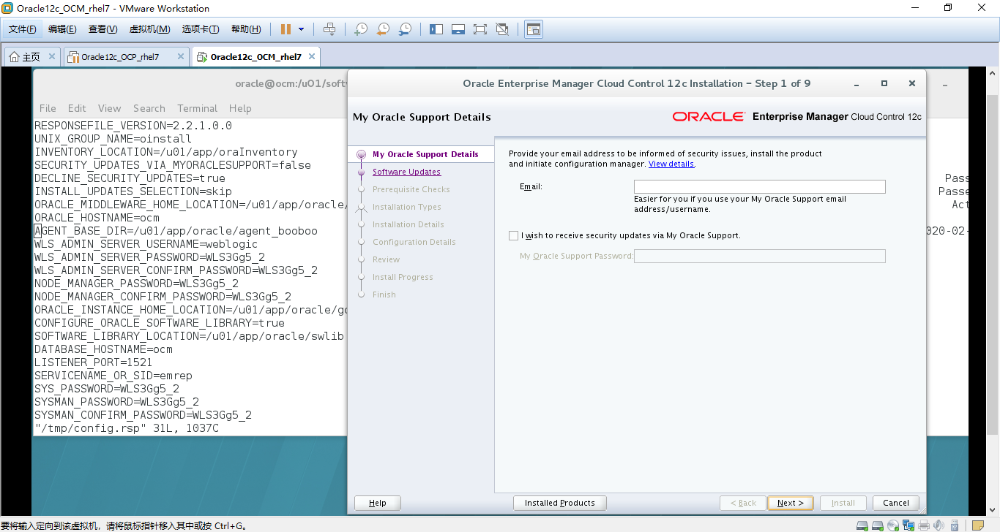
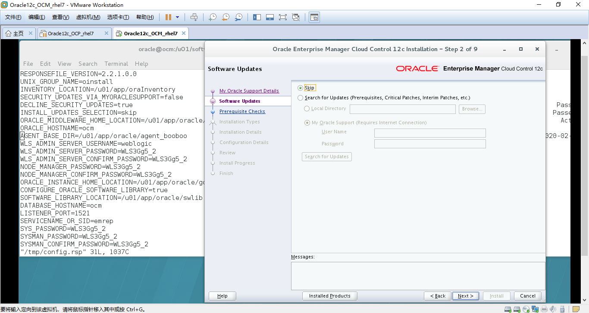
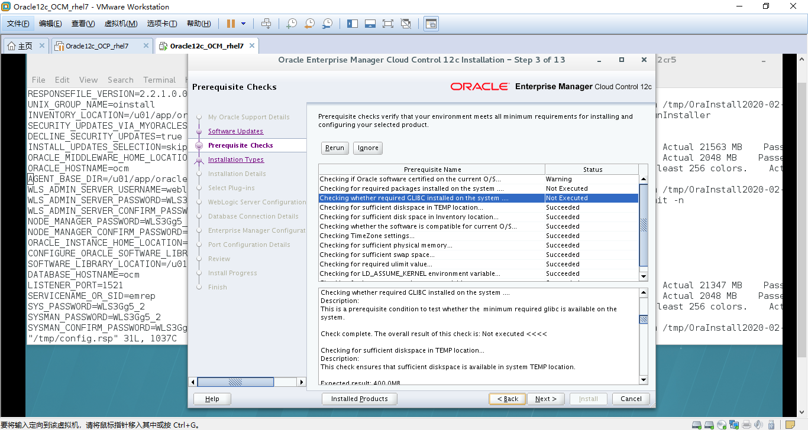
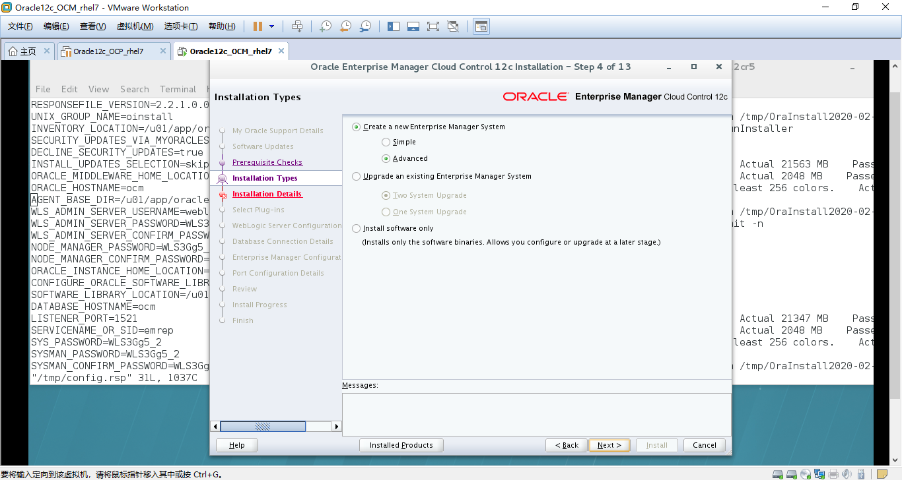
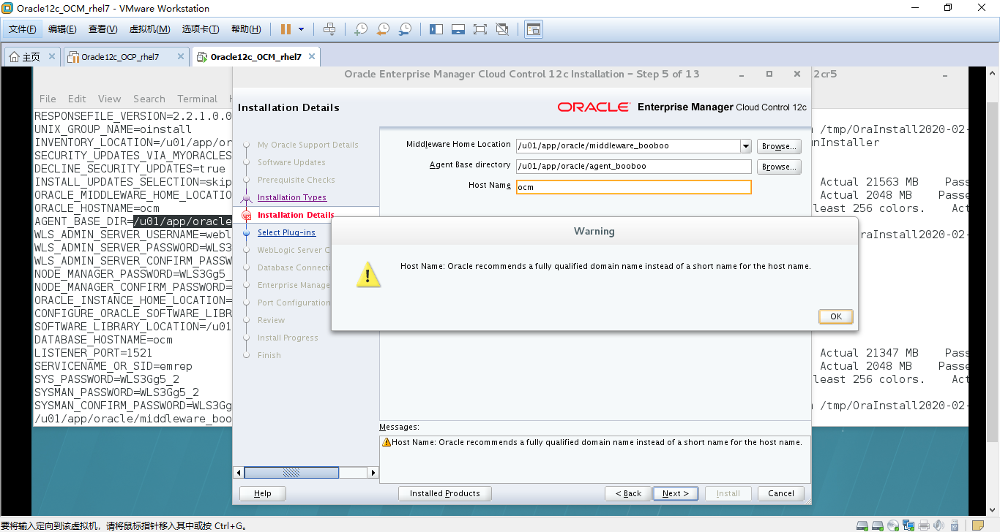
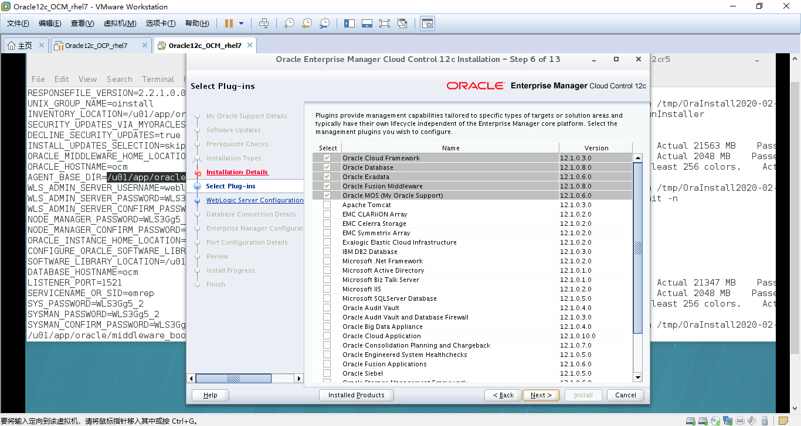

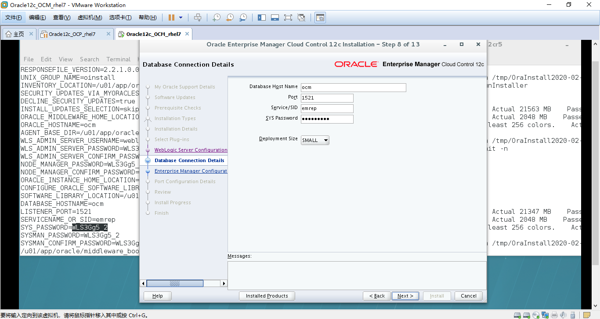


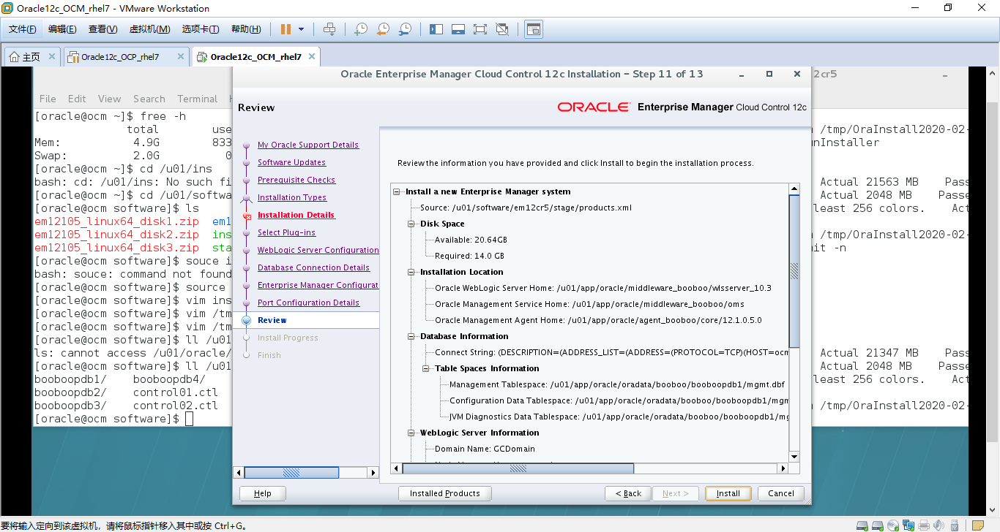
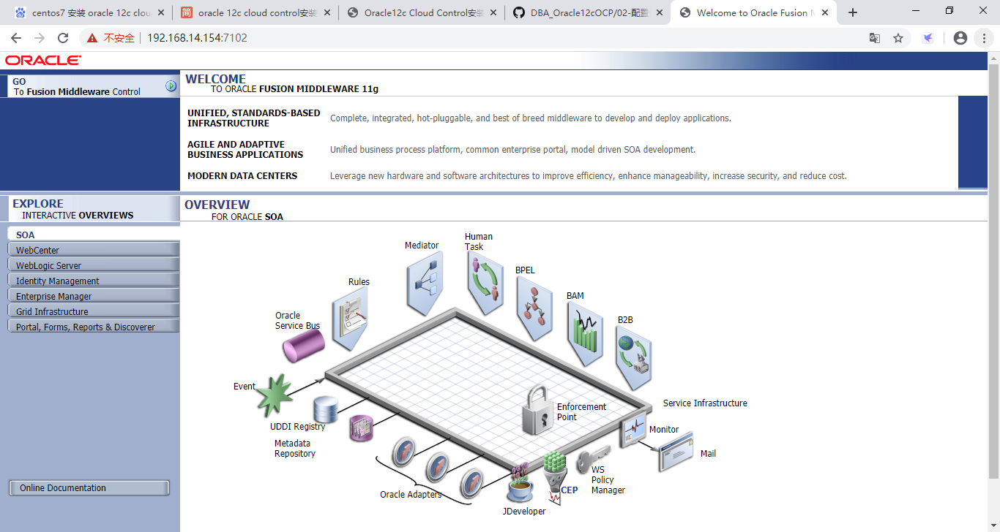


### 访问oem

 https://192.168.14.154:7301/em

 https://192.168.14.154:7102/console

 

 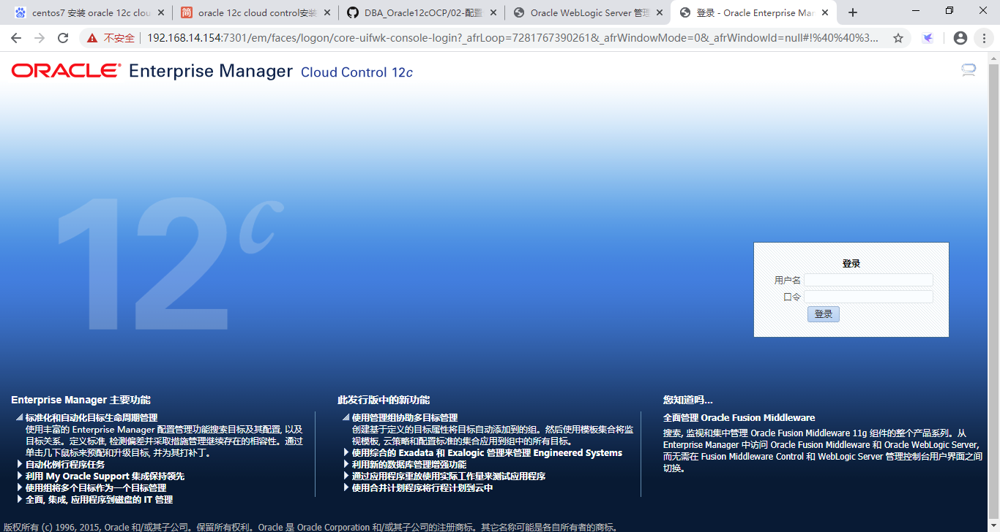

 

 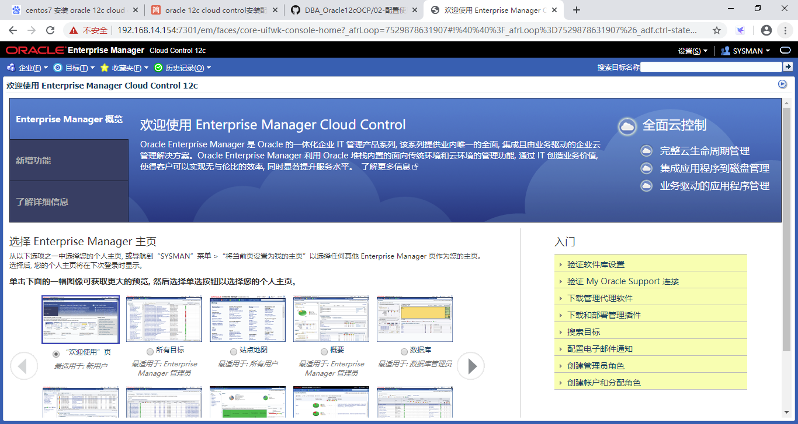


### 手动添加新目标

1. 设置->添加目标->手动添加目标->添加主机 
2. 192.168.56.201机器上创建目录/u01/app/oracle/agent12c
3. 点击命名的身份证明右边的➕号，并行执行如下命令赋予oracle sudo权限。

```bash
visudo
root    ALL=(ALL)       ALL
oracle  ALL=(ALL)   NOPASSWORD:ALL
```


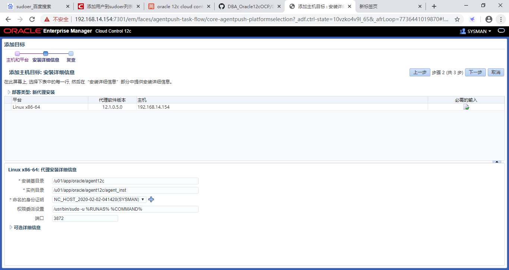

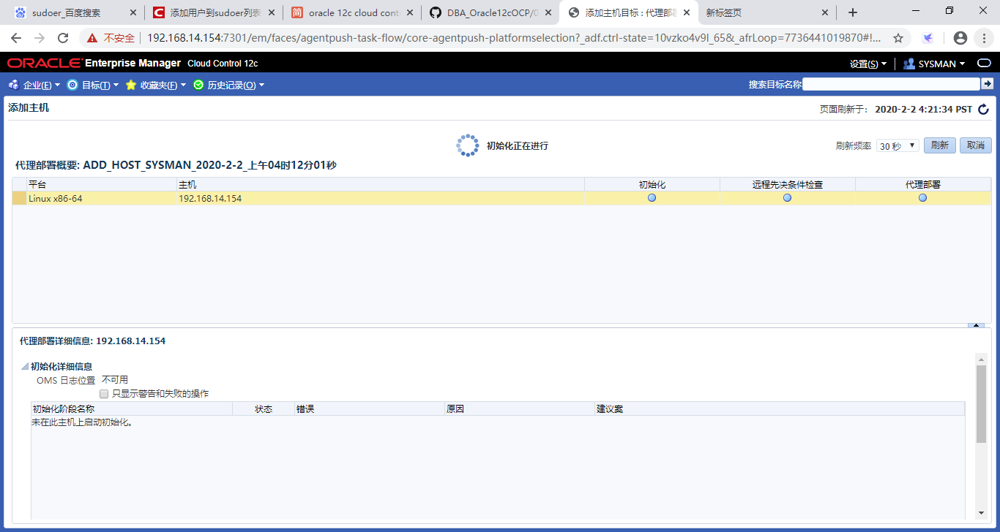


### 自动添加当前服务器的目标


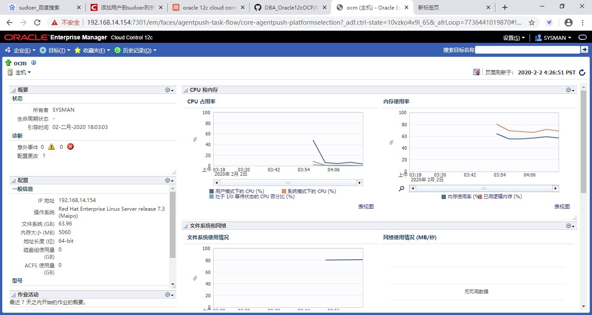


### 添加数据库

设置->添加目标->手动添加目标

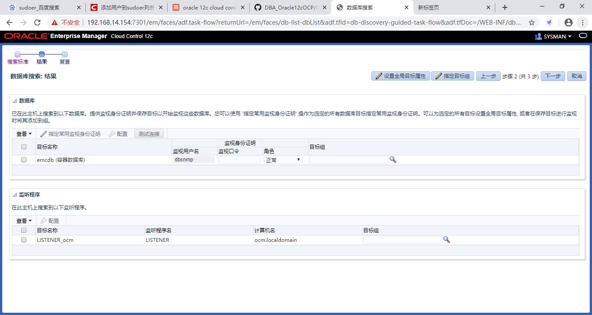
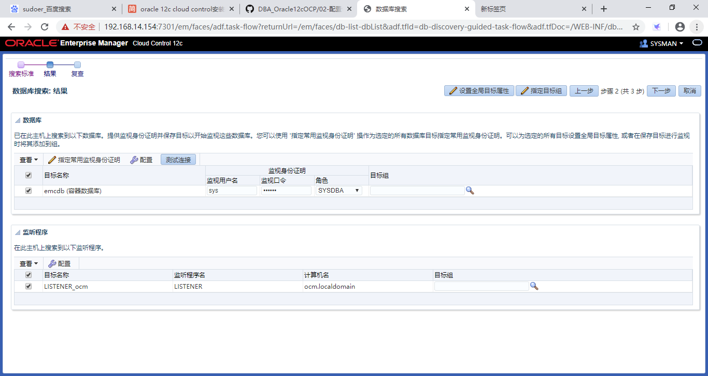
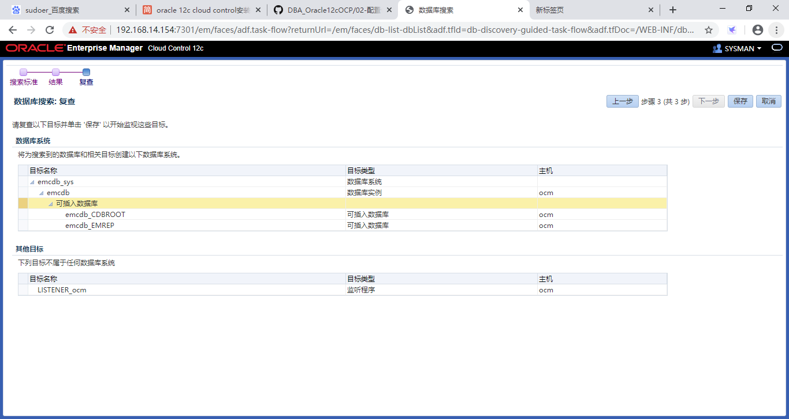
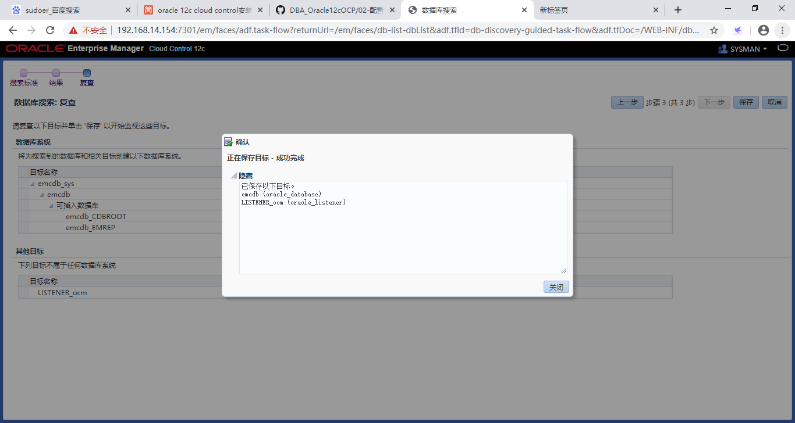

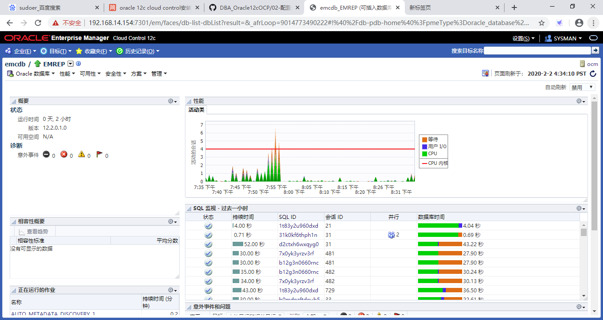
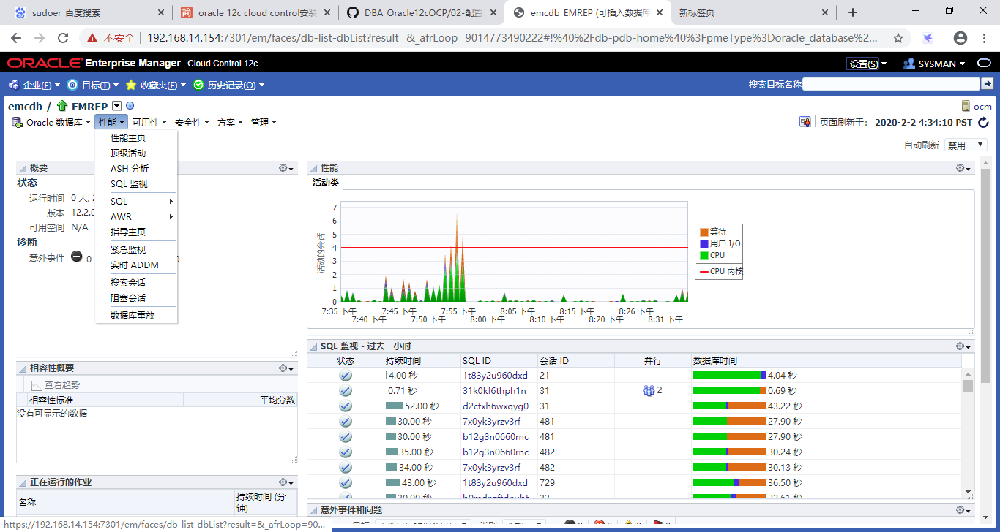

## Cloud Control 12cR5 静默安装

<https://oracle-base.com/articles/12c/cloud-control-12cr5-silent-installation-on-oracle-linux-7>

### 0. Software

Download the following software:

- [Oracle Linux 7 (x86_64)](http://edelivery.oracle.com/linux)
- [Oracle Database (x86_64) 12.1.0.2  Enterprise Edition](http://www.oracle.com/technetwork/database/enterprise-edition/downloads/index.html)
- [Enterprise Manager Cloud Control 12c Release 5 (12.1.0.5) (x86_64)](http://www.oracle.com/technetwork/oem/grid-control/downloads/index.html)

#### OS Installation

Install Oracle Linux (OL) in the same way you would for a regular Oracle Database installation. You can see examples of this type of installation below. Remember to check database installation article (listed below) for the specific package group selection. These Linux installations articles are generic, not specific for Cloud Control.

- [Oracle Linux 7.x Installation](https://oracle-base.com/articles/linux/oracle-linux-7-installation)

#### Database Installation (Software-Only)

The Cloud Control 13.3 installation can use database versions 12.1.0.2, 12.2.0.1 or 18.x for the repository. You should use apply the latest patchset, but the installation will work with the base release. For this installation you will need 18c for the repository database, but the same instructions work for 12.2, so use the installation instructions from this article.

- [Oracle Database 12c Release 1 (12.1) Installation On Oracle Linux 7 (OL7)](https://oracle-base.com/articles/12c/oracle-db-12cr1-installation-on-oracle-linux-7)

#### Repository Database Creation

Create a database to hold the repository.

- As mentioned above, database version 12.1.0.2 is used for this installation.
- You can use a Non-CDB database, or a PDB. Here we are using a CDB called "emcdb" and a PDB called "emrep".
- Character set AL32UTF8.
- There are some minimum recommended settings listed in the example database creation below.

```bash
lsnrctl start

mkdir -p /u01/oradata

dbca -silent -createDatabase                                                    \
     -templateName General_Purpose.dbc                                          \
     -gdbname emcdb -sid emcdb -responseFile NO_VALUE                           \
     -characterSet AL32UTF8                                                     \
     -sysPassword SysPassword1                                                  \
     -systemPassword SysPassword1                                               \
     -createAsContainerDatabase true                                            \
     -numberOfPDBs 1                                                            \
     -pdbName emrep                                                             \
     -pdbAdminPassword PdbPassword1                                             \
     -databaseType MULTIPURPOSE                                                 \
     -automaticMemoryManagement false                                           \
     -totalMemory 2048                                                          \
     -storageType FS                                                            \
     -datafileDestination /u01/oradata                                          \
     -redoLogFileSize 600                                                       \
     -emConfiguration NONE                                                      \
     -ignorePreReqs


# Set the PDB to auto-start.
sqlplus / as sysdba <<EOF
  alter system set db_create_file_dest='/u01/oradata';
  alter pluggable database emrep save state;

  -- Recommended settings.
  alter system set session_cached_cursors=200 scope=spfile;
  alter system set db_securefile=PERMITTED;

  -- Recommended: processes=600
  alter system set processes=600 scope=spfile;

  -- Recommended: pga_aggregate_target=1G
  alter system set pga_aggregate_target=450M scope=spfile;

  -- Recommended: sga_target=2G
  alter system set sga_target=800M scope=spfile;

  -- Recommended: shared_pool_size=600M
  --alter system set shared_pool_size=600M scope=spfile;
  exit;
EOF


# Set restart flag in /etc/oratab.
cp /etc/oratab /tmp
sed -i -e "s|${ORACLE_SID}:${ORACLE_HOME}:N|${ORACLE_SID}:${ORACLE_HOME}:Y|g" /tmp/oratab
cp -f /tmp/oratab /etc/oratab
```


### 1. 创建目录

```bash
 mkdir -p /u01/app/oracle/middleware_booboo
 mkdir -p /u01/app/oracle/agent_booboo
```

### 2. 准备安装软件包

```bash
SOFTWARE_DIR=/u01/software
cd ${SOFTWARE_DIR}
mkdir -p em12cr5
unzip -oqd em12cr5 em12105_linux64_disk1.zip
unzip -oqd em12cr5 em12105_linux64_disk2.zip
unzip -oqd em12cr5 em12105_linux64_disk3.zip
cd em12cr5
```

### 3. 准备应答文件

```bash
# Set parameters.
ORACLE_BASE=/u01/app/oracle
ORA_INVENTORY=/u01/app/oraInventory
ORACLE_HOSTNAME=${HOSTNAME}
PDB_NAME=emrep
SYS_PASSWORD=WLS3Gg5_2
UNIX_GROUP_NAME=oinstall
MW_HOME=${ORACLE_BASE}/middleware_booboo
OMS_HOME=${MW_HOME}/oms
GC_INST=${ORACLE_BASE}/gc_inst
AGENT_BASE=${ORACLE_BASE}/agent_booboo
WLS_USERNAME=weblogic
WLS_PASSWORD=WLS3Gg5_2
SYSMAN_PASSWORD=${WLS_PASSWORD}
AGENT_PASSWORD=${WLS_PASSWORD}
SOFTWARE_LIBRARY=${ORACLE_BASE}/swlib
DATABASE_HOSTNAME=ocm
LISTENER_PORT=1521
SOFTWARE_DIR=/u01/software

# Create Response file.
cat > /tmp/install.rsp <<EOF
RESPONSEFILE_VERSION=2.2.1.0.0
UNIX_GROUP_NAME=${UNIX_GROUP_NAME}
INVENTORY_LOCATION=${ORA_INVENTORY}
SECURITY_UPDATES_VIA_MYORACLESUPPORT=false
DECLINE_SECURITY_UPDATES=true
INSTALL_UPDATES_SELECTION=skip
ORACLE_MIDDLEWARE_HOME_LOCATION=${MW_HOME}
ORACLE_HOSTNAME=${ORACLE_HOSTNAME}
AGENT_BASE_DIR=${AGENT_BASE}
WLS_ADMIN_SERVER_USERNAME=${WLS_USERNAME}
WLS_ADMIN_SERVER_PASSWORD=${WLS_PASSWORD}
WLS_ADMIN_SERVER_CONFIRM_PASSWORD=${WLS_PASSWORD}
NODE_MANAGER_PASSWORD=${WLS_PASSWORD}
NODE_MANAGER_CONFIRM_PASSWORD=${WLS_PASSWORD}
ORACLE_INSTANCE_HOME_LOCATION=${GC_INST}
CONFIGURE_ORACLE_SOFTWARE_LIBRARY=true
SOFTWARE_LIBRARY_LOCATION=${SOFTWARE_LIBRARY}
DATABASE_HOSTNAME=${DATABASE_HOSTNAME}
LISTENER_PORT=${LISTENER_PORT}
SERVICENAME_OR_SID=${PDB_NAME}
SYS_PASSWORD=${SYS_PASSWORD}
SYSMAN_PASSWORD=${SYSMAN_PASSWORD}
SYSMAN_CONFIRM_PASSWORD=${SYSMAN_PASSWORD}
DEPLOYMENT_SIZE=SMALL
AGENT_REGISTRATION_PASSWORD=${AGENT_PASSWORD}
AGENT_REGISTRATION_CONFIRM_PASSWORD=${AGENT_PASSWORD}
PLUGIN_SELECTION={}
b_upgrade=false
EM_INSTALL_TYPE=NOSEED
CONFIGURATION_TYPE=LATER
CONFIGURE_SHARED_LOCATION_BIP=false
FROM_LOCATION="${SOFTWARE_DIR}/em12cr5/oms/Disk1/stage/products.xml"
EOF
```

### 4. 开始静默安装

```bash
./runInstaller -silent -responseFile /tmp/install.rsp -waitforcompletion
```

具体安装过程

20:28~20:45

```bash
[oracle@oracle01 em12cr5]$ ./runInstaller -silent -responseFile /tmp/install.rsp -waitforcompletion
Starting Oracle Universal Installer...

Checking Temp space: must be greater than 400 MB.   Actual 15262 MB    Passed
Checking swap space: must be greater than 150 MB.   Actual 1955 MB    Passed
Preparing to launch Oracle Universal Installer from /tmp/OraInstall2019-11-02_11-36-50PM. Please wait ...Installer has detected  host name as ol7-122.localdomain, you have changed the host name to oracle01.

Installing ORACLE_HOME /u01/app/oracle/middleware_booboo/jdk16
Installation in progress
................
Install successful
Linking in progress

Link successful
Setup in progress

Setup successful
Installing Oracle WebLogic Server

Installing ORACLE_HOME /u01/app/oracle/middleware_booboo/Oracle_BI1
Installation in progress
.................
Install successful
Linking in progress

Link successful
Setup in progress

Setup successful

Installing ORACLE_HOME /u01/app/oracle/middleware_booboo/oms
Installation in progress
........Installation in progress
..Unable to find product oracle.swd.jre[1.5.0.0.0, 9.9.9] in Oracle Inventory
..
Install successful
Linking in progress
Error in invoking target 'install' of makefile '/u01/app/oracle/middleware_booboo/oms/sqlplus/lib/ins_sqlplus.mk'. See '/u01/app/oraInventory/logs/installActions2019-11-02_11-45-26-PM.log' for details.

Link successful
Setup in progress
.
Setup successful
Copying plug-ins to Management Service Oracle Home
You can find the log of this install session at:
 /u01/app/oraInventory/logs/installActions2019-11-02_11-53-31-PM.log

Installing ORACLE_HOME /u01/app/oracle/agent_booboo/core/12.1.0.5.0
Installation in progress
..........
Install successful
Linking in progress

Link successful
Setup in progress
......
Setup successful
You can find the log of this install session at:
 /u01/app/oraInventory/logs/cloneActions2019-11-02_11-55-46-PM.log

Installing ORACLE_HOME /u01/app/oracle/agent_booboo/sbin
Installation in progress

Install successful
Linking in progress

Link successful
Setup in progress

Setup successful
Extracting WT.zip
You can find the log of this install session at:
 /u01/app/oraInventory/logs/cloneActions2019-11-02_11-55-52-PM.log

Installing ORACLE_HOME /u01/app/oracle/middleware_booboo/oracle_common
Installation in progress
.............
Install successful
Linking in progress

Link successful
Setup in progress
...
Setup successful
You can find the log of this install session at:
 /u01/app/oraInventory/logs/cloneActions2019-11-02_11-59-27-PM.log

Installing ORACLE_HOME /u01/app/oracle/middleware_booboo/Oracle_WT
Installation in progress
................
Install successful
Linking in progress
Error in invoking target 'install' of makefile '/u01/app/oracle/middleware_booboo/Oracle_WT/webcache/lib/ins_calypso.mk'. See '/u01/app/oraInventory/logs/cloneActions2019-11-02_11-59-27-PM.log' for details.

Link successful
Setup in progress

Setup successful
Applying the required oneoff patches.
Warning: The following configuration scripts need to be executed as the "root" user
  /u01/app/oracle/middleware_booboo/oms/allroot.sh
To execute the configuration scripts:
 1. Open a new  terminal window
 2. Login in as "root"
 3. Run the scripts

Enterprise Manager Cloud Control Installation has finished.
```


### 5. 解决OL7的报错

* /u01/app/oraInventory/logs/cloneActions2019-11-02_11-59-27-PM.log

报错如下：

```bash
Error in invoking target 'install' of makefile '/u01/app/oracle/middleware/Oracle_WT/webcache/lib/ins_calypso.mk'. See '/u01/app/oraInventory/logs/cloneActions2019-11-02_08-32-45-PM.log' for details.

Link successful
Setup in progress

Setup successful
Applying the required oneoff patches.

Warning: The following configuration scripts need to be executed as the "root" user
  /u01/app/oracle/middleware/oms/allroot.sh
To execute the configuration scripts:
 1. Open a new  terminal window
 2. Login in as "root"
 3. Run the script
```

解决报错的方法：

```bash
sed -i -e "s|-lipgo|-lipgo -ldms2|g" ${MW_HOME}/Oracle_WT/lib/sysliblist

cd ${MW_HOME}/Oracle_WT/webcache/lib

gcc -o webcached \
  -L$MW_HOME/Oracle_WT/webcache/lib/ -L$MW_HOME/Oracle_WT/lib/ -L$MW_HOME/Oracle_WT/lib/stubs/ \
  main.o libwebcache.a -Wl,-rpath,$MW_HOME/Oracle_WT/lib -liau -lnnz11 -lxml11 -lclntsh \
  -lcore11 -lunls11 -lnls11  $MW_HOME/Oracle_WT/lib/liboraz.a -ldmsapp -lons \
  `cat $MW_HOME/Oracle_WT/lib/sysliblist` -lrt -Wl,-rpath,$MW_HOME/Oracle_WT/lib -lm \
  `cat $MW_HOME/Oracle_WT/lib/sysliblist` -lrt -ldl -lm -L$MW_HOME/Oracle_WT/lib

mv ./webcached ../bin/.
chmod 750 ${MW_HOME}/Oracle_WT/webcache/bin/webcached
```

切换到`root`执行

```bash
bash ${OMS_HOME}/allroot.sh
```

操作记录

```bash
root@oracle01 oms]# bash allroot.sh

Starting to execute allroot.sh .........

Starting to execute /u01/app/oracle/middleware_booboo/oms/root.sh ......
Finished execution of  /u01/app/oracle/middleware_booboo/oms/root.sh ......


Starting to execute /u01/app/oracle/agent_booboo/core/12.1.0.5.0/root.sh ......
Finished product-specific root actions.
/etc exist
/u01/app/oracle/agent_booboo/core/12.1.0.5.0
Finished execution of  /u01/app/oracle/agent_booboo/core/12.1.0.5.0/root.sh ......
```


### 6. 准备配置文件

```bash
cat > /tmp/config.rsp <<EOF
RESPONSEFILE_VERSION=2.2.1.0.0
UNIX_GROUP_NAME=${UNIX_GROUP_NAME}
INVENTORY_LOCATION=${ORA_INVENTORY}
SECURITY_UPDATES_VIA_MYORACLESUPPORT=false
DECLINE_SECURITY_UPDATES=true
INSTALL_UPDATES_SELECTION=skip
ORACLE_MIDDLEWARE_HOME_LOCATION=${MW_HOME}
ORACLE_HOSTNAME=${ORACLE_HOSTNAME}
AGENT_BASE_DIR=${AGENT_BASE}
WLS_ADMIN_SERVER_USERNAME=${WLS_USERNAME}
WLS_ADMIN_SERVER_PASSWORD=${WLS_PASSWORD}
WLS_ADMIN_SERVER_CONFIRM_PASSWORD=${WLS_PASSWORD}
NODE_MANAGER_PASSWORD=${WLS_PASSWORD}
NODE_MANAGER_CONFIRM_PASSWORD=${WLS_PASSWORD}
ORACLE_INSTANCE_HOME_LOCATION=${GC_INST}
CONFIGURE_ORACLE_SOFTWARE_LIBRARY=true
SOFTWARE_LIBRARY_LOCATION=${SOFTWARE_LIBRARY}
DATABASE_HOSTNAME=${DATABASE_HOSTNAME}
LISTENER_PORT=${LISTENER_PORT}
SERVICENAME_OR_SID=${PDB_NAME}
SYS_PASSWORD=${SYS_PASSWORD}
SYSMAN_PASSWORD=${SYSMAN_PASSWORD}
SYSMAN_CONFIRM_PASSWORD=${SYSMAN_PASSWORD}
DEPLOYMENT_SIZE=SMALL
AGENT_REGISTRATION_PASSWORD=${AGENT_PASSWORD}
AGENT_REGISTRATION_CONFIRM_PASSWORD=${AGENT_PASSWORD}
PLUGIN_SELECTION={}
b_upgrade=false
EM_INSTALL_TYPE=NOSEED
CONFIGURATION_TYPE=ADVANCED
CONFIGURE_SHARED_LOCATION_BIP=false
EOF
```

### 7. 运行配置

```bash
${OMS_HOME}/sysman/install/ConfigureGC.sh -silent -responseFile /tmp/config.rsp
```

#### 报错1-ORA-28040: No matching authentication protocol

```bash
[oracle@oracle01 em12cr5]$ ${OMS_HOME}/sysman/install/ConfigureGC.sh -silent -responseFile /tmp/config.rsp\

Starting Oracle Universal Installer...

Checking Temp space: must be greater than 400 MB.   Actual 5222 MB    Passed
Checking swap space: must be greater than 150 MB.   Actual 1816 MB    Passed
ORACLE_HOSTNAME=oracle01: Oracle recommends a fully qualified domain name instead of a short name for the host name.

ERROR: ERROR:Exception occurred while connecting to database. Check the connection details of the database you specified and retry.

ORA-28040: No matching authentication protocol

Unable to connect to the database and validate whether it is a supported database due to one of the following reasons:

    (1) Incorrect credentials
    (2) Listener may be down
    (3) Database may be down.

Check the credentials, the status of the listener and the database, and retry.

```

* sys\sysman_password 密码，注意密码复杂度 。

* Oracle 12c连接时报错`ORA-28040`问题解决方法：`sqlnet.ora`

  ```bash
  --追加以下配置
  SQLNET.ALLOWED_LOGON_VERSION=8
  ```


* ```bash
  cat $ORACLE_HOME/network/admin/sqlnet.ora
  # sqlnet.ora Network Configuration File: /u01/app/oracle/product/12.2.0/db_1/network/admin/sqlnet.ora
  # Generated by Oracle configuration tools.

  NAMES.DIRECTORY_PATH= (TNSNAMES, ONAMES, HOSTNAME)
  SQLNET.ALLOWED_LOGON_VERSION=8
  ```


#### 报错2-The db_securefile instance parameter value must be set to PERMITTED

```bash
[oracle@oracle01 admin]$ ${OMS_HOME}/sysman/install/ConfigureGC.sh -silent -responseFile /tmp/config.rsp
Starting Oracle Universal Installer...

Checking Temp space: must be greater than 400 MB.   Actual 5208 MB    Passed
Checking swap space: must be greater than 150 MB.   Actual 1817 MB    Passed
ORACLE_HOSTNAME=oracle01: Oracle recommends a fully qualified domain name instead of a short name for the host name.

For the deployment size you have selected, you must have at least 3 GB of physical memory. You currently have only 2 GB of physical memory. This will not cause the installation to fail, but will affect the performance of Enterprise Manager. Either exit the installer, allocate the required memory, and retry the installation, or finish the installation and then allocate the required memory.


ERROR:
The following prerequisite check failed because the Oracle Database, where the Management Repository will be configured, does not meet the configuration requirements. Fix the issue manually based on the recommendation offered for this prerequisite, and click OK. For more details, check the logs: /u01/app/oraInventory/logs/emdbprereqs
Prereq Name 		Recommendation
Check that the secure file instance parameter is set to 'PERMITTED'		The db_securefile instance parameter value must be set to PERMITTED
```

* 修改参数`alter system set db_securefile='PERMITTED' container=all;`

#### 报错3-ORA-28104: input value for statement_types is not valid

```bash
[oracle@oracle01 admin]$ ${OMS_HOME}/sysman/install/ConfigureGC.sh -silent -responseFile /tmp/config.rsp
Starting Oracle Universal Installer...

Checking Temp space: must be greater than 400 MB.   Actual 5207 MB    Passed
Checking swap space: must be greater than 150 MB.   Actual 1817 MB    Passed
ORACLE_HOSTNAME=oracle01: Oracle recommends a fully qualified domain name instead of a short name for the host name.

For the deployment size you have selected, you must have at least 3 GB of physical memory. You currently have only 2 GB of physical memory. This will not cause the installation to fail, but will affect the performance of Enterprise Manager. Either exit the installer, allocate the required memory, and retry the installation, or finish the installation and then allocate the required memory.

 The following prerequisite check failed because the Oracle Database, where the Management Repository will be configured, does not meet the configuration requirements. These failures do not impact the installation, but you may encounter performance issues with the product later. You can either click Cancel, fix the issue manually now, based on the recommendation offered for this prerequisite, and click Next, or you can click OK to fix it after the installation ends. For more details check the logs: /u01/app/oraInventory/logs/emdbprereqs
Prereq Name 		Recommendation
Check the pga_aggregate_target instance parameter value.		The pga_aggregate_target instance parameter should be set to at least 1000000000 bytes.
Check the session_cached_cursors instance parameter value.		The session_cached_cursors instance parameter should be set to any value between 200 and 500, inclusive, will be accepted.
Check the open_cursors instance parameter value.		The open_cursors instance parameter should be set between 300 and 400, inclusive.
Check the sga_target instance parameter value.		The sga_target instance parameter should be set to at least 2000000000 bytes.
Check the shared_pool_size instance parameter value.		The shared_pool_size instance parameter should be set to at least 600000000 bytes or roughly one third of the sga_target size.
Check the redo log size.		Redo Log file size should be 300000000 bytes or greater.  Generally, there should be 3 or more redo logs available of this size.
Installing plug-in /u01/app/oracle/middleware_booboo/oms/install/tmp_installer/oracle.sysman.cfw/12.1.0.3.0/12.1.0.3.0_OMS_2000_0.zip
You can find the log of this install session at:
 /u01/app/oraInventory/logs/cloneActions2019-11-03_01-06-16-AM.log

Installing ORACLE_HOME /u01/app/oracle/middleware_booboo/plugins/oracle.sysman.cfw.oms.plugin_12.1.0.3.0
Installation in progress

Install successful
Linking in progress

Link successful
Setup in progress

Setup successful
Installing plug-in /u01/app/oracle/middleware_booboo/oms/install/tmp_installer/oracle.sysman.db/12.1.0.8.0/12.1.0.8.0_OMS_2000_0.zip
You can find the log of this install session at:
 /u01/app/oraInventory/logs/cloneActions2019-11-03_01-06-22-AM.log

Installing ORACLE_HOME /u01/app/oracle/middleware_booboo/plugins/oracle.sysman.db.oms.plugin_12.1.0.8.0
Installation in progress

Install successful
Linking in progress

Link successful
Setup in progress

Setup successful
Installing plug-in /u01/app/oracle/middleware_booboo/oms/install/tmp_installer/oracle.sysman.xa/12.1.0.6.0/12.1.0.6.0_OMS_2000_0.zip
You can find the log of this install session at:
 /u01/app/oraInventory/logs/cloneActions2019-11-03_01-08-39-AM.log

Installing ORACLE_HOME /u01/app/oracle/middleware_booboo/plugins/oracle.sysman.xa.oms.plugin_12.1.0.6.0
Installation in progress

Install successful
Linking in progress

Link successful
Setup in progress

Setup successful
Installing plug-in /u01/app/oracle/middleware_booboo/oms/install/tmp_installer/oracle.sysman.emas/12.1.0.8.0/12.1.0.8.0_OMS_2000_0.zip
You can find the log of this install session at:
 /u01/app/oraInventory/logs/cloneActions2019-11-03_01-08-47-AM.log

Installing ORACLE_HOME /u01/app/oracle/middleware_booboo/plugins/oracle.sysman.emas.oms.plugin_12.1.0.8.0
Installation in progress

Install successful
Linking in progress

Link successful
Setup in progress

Setup successful
Installing plug-in /u01/app/oracle/middleware_booboo/oms/install/tmp_installer/oracle.sysman.mos/12.1.0.6.0/12.1.0.6.0_OMS_2000_0.zip
You can find the log of this install session at:
 /u01/app/oraInventory/logs/cloneActions2019-11-03_01-11-44-AM.log

Installing ORACLE_HOME /u01/app/oracle/middleware_booboo/plugins/oracle.sysman.mos.oms.plugin_12.1.0.6.0
Installation in progress

Install successful
Linking in progress

Link successful
Setup in progress

Setup successful
Installing plug-in /u01/app/oracle/middleware_booboo/oms/sysman/install/plugins/oracle.sysman.emas/12.1.0.8.0/12.1.0.8.0_Agent_2000_0.zip
You can find the log of this install session at:
 /u01/app/oraInventory/logs/cloneActions2019-11-03_01-11-51-AM.log

Installing ORACLE_HOME /u01/app/oracle/agent_booboo/plugins/oracle.sysman.emas.agent.plugin_12.1.0.8.0
Installation in progress

Install successful
Linking in progress

Link successful
Setup in progress

Setup successful
Installing plug-in /u01/app/oracle/middleware_booboo/oms/sysman/install/plugins/oracle.sysman.emrep/12.1.0.5.0/12.1.0.5.0_Agent_2000_0.zip
You can find the log of this install session at:
 /u01/app/oraInventory/logs/cloneActions2019-11-03_01-11-58-AM.log

Installing ORACLE_HOME /u01/app/oracle/agent_booboo/plugins/oracle.sysman.emrep.agent.plugin_12.1.0.5.0
Installation in progress

Install successful
Linking in progress

Link successful
Setup in progress

Setup successful
Installing plug-in /u01/app/oracle/middleware_booboo/oms/sysman/install/plugins/oracle.sysman.beacon/12.1.0.5.0/12.1.0.5.0_Agent_2000_0.zip
You can find the log of this install session at:
 /u01/app/oraInventory/logs/cloneActions2019-11-03_01-12-03-AM.log

Installing ORACLE_HOME /u01/app/oracle/agent_booboo/plugins/oracle.sysman.beacon.agent.plugin_12.1.0.5.0
Installation in progress

Install successful
Linking in progress

Link successful
Setup in progress

Setup successful
Installing plug-in /u01/app/oracle/middleware_booboo/oms/sysman/install/plugins/oracle.sysman.oh/12.1.0.5.0/12.1.0.5.0_Agent_2000_0.zip
You can find the log of this install session at:
 /u01/app/oraInventory/logs/cloneActions2019-11-03_01-12-17-AM.log

Installing ORACLE_HOME /u01/app/oracle/agent_booboo/plugins/oracle.sysman.oh.agent.plugin_12.1.0.5.0
Installation in progress

Install successful
Linking in progress

Link successful
Setup in progress

Setup successful
Installing plug-in /u01/app/oracle/middleware_booboo/oms/sysman/install/plugins/oracle.sysman.csa/12.1.0.5.0/12.1.0.5.0_Agent_2000_0.zip
You can find the log of this install session at:
 /u01/app/oraInventory/logs/cloneActions2019-11-03_01-12-21-AM.log

Installing ORACLE_HOME /u01/app/oracle/agent_booboo/plugins/oracle.sysman.csa.agent.plugin_12.1.0.5.0
Installation in progress

Install successful
Linking in progress

Link successful
Setup in progress

Setup successful
Installing plug-in /u01/app/oracle/middleware_booboo/oms/sysman/install/plugins/oracle.sysman.csa/12.1.0.5.0/12.1.0.5.0_Discovery_2000_0.zip
You can find the log of this install session at:
 /u01/app/oraInventory/logs/cloneActions2019-11-03_01-12-26-AM.log

Installing ORACLE_HOME /u01/app/oracle/agent_booboo/plugins/oracle.sysman.csa.discovery.plugin_12.1.0.5.0
Installation in progress

Install successful
Linking in progress

Link successful
Setup in progress

Setup successful
Installing plug-in /u01/app/oracle/middleware_booboo/oms/sysman/install/plugins/oracle.sysman.oh/12.1.0.5.0/12.1.0.5.0_Discovery_2000_0.zip
You can find the log of this install session at:
 /u01/app/oraInventory/logs/cloneActions2019-11-03_01-12-30-AM.log

Installing ORACLE_HOME /u01/app/oracle/agent_booboo/plugins/oracle.sysman.oh.discovery.plugin_12.1.0.5.0
Installation in progress

Install successful
Linking in progress

Link successful
Setup in progress

Setup successful
Installing plug-in /u01/app/oracle/middleware_booboo/oms/sysman/install/plugins/oracle.sysman.db/12.1.0.8.0/12.1.0.8.0_Discovery_2000_0.zip
You can find the log of this install session at:
 /u01/app/oraInventory/logs/cloneActions2019-11-03_01-12-34-AM.log

Installing ORACLE_HOME /u01/app/oracle/agent_booboo/plugins/oracle.sysman.db.discovery.plugin_12.1.0.8.0
Installation in progress

Install successful
Linking in progress

Link successful
Setup in progress

Setup successful
Installing plug-in /u01/app/oracle/middleware_booboo/oms/sysman/install/plugins/oracle.sysman.xa/12.1.0.6.0/12.1.0.6.0_Discovery_2000_0.zip
You can find the log of this install session at:
 /u01/app/oraInventory/logs/cloneActions2019-11-03_01-12-39-AM.log

Installing ORACLE_HOME /u01/app/oracle/agent_booboo/plugins/oracle.sysman.xa.discovery.plugin_12.1.0.6.0
Installation in progress

Install successful
Linking in progress

Link successful
Setup in progress

Setup successful
Installing plug-in /u01/app/oracle/middleware_booboo/oms/sysman/install/plugins/oracle.sysman.emas/12.1.0.8.0/12.1.0.8.0_Discovery_2000_0.zip
You can find the log of this install session at:
 /u01/app/oraInventory/logs/cloneActions2019-11-03_01-12-44-AM.log

Installing ORACLE_HOME /u01/app/oracle/agent_booboo/plugins/oracle.sysman.emas.discovery.plugin_12.1.0.8.0
Installation in progress

Install successful
Linking in progress

Link successful
Setup in progress

Setup successful
2019-11-03_01-12-52-AM: Configuration assistant "Plugins Prerequisites Check"  is in progress.

2019-11-03_01-14-02-AM: Configuration assistant "Plugins Prerequisites Check" has Succeeded.

2019-11-03_01-14-02-AM: Configuration assistant "Repository Configuration"  is in progress.

Calling the EMSCHEMA MANAGER: CREATE

Processing command line ....
Repository Creation Utility - Checking Prerequisites
Checking Global Prerequisites
Repository Creation Utility - Checking Prerequisites
Checking Component Prerequisites
Repository Creation Utility - Creating Tablespaces
Validating and Creating Tablespaces
Repository Creation Utility - Create
Repository Create in progress.

 Check the Repository Configuration Assistant logs at: /u01/app/oracle/middleware_booboo/oms/sysman/log/schemamanager

 Check the Repository Configuration Assistant logs at: /u01/app/oracle/middleware_booboo/oms/sysman/log/schemamanager


RCU-6130:Action failed - RCU-6134:Error while trying to execute JDBC action.
Repository Creation Utility: Create - Completion Summary
Database details:
Connect Descriptor			: (DESCRIPTION=(ADDRESS_LIST=(ADDRESS=(PROTOCOL=TCP)(HOST=oracle01)(PORT=1521)))(CONNECT_DATA=(SERVICE_NAME=booboopdb1)))
Connected As			: SYS
RCU Logfile			: /u01/app/oracle/middleware_booboo/oms/sysman/log/schemamanager/m_110319_0114_AM/m_110319_0114_AM.CREATE/rcu.log
RCU Checkpoint Object			: /u01/app/oracle/middleware_booboo/oms/sysman/log/schemamanager//RCUCheckpointObj
Component schemas created:
Component			Status	Logfile		
EM Repository Creation Configuration		Failed	/u01/app/oracle/middleware_booboo/oms/sysman/log/schemamanager/m_110319_0114_AM/m_110319_0114_AM.CREATE/em_repos_config.log
EM Repository Init Configuration		Success	/u01/app/oracle/middleware_booboo/oms/sysman/log/schemamanager/m_110319_0114_AM/m_110319_0114_AM.CREATE/em_repos_init.log
EM Repository Common		Success	/u01/app/oracle/middleware_booboo/oms/sysman/log/schemamanager/m_110319_0114_AM/m_110319_0114_AM.CREATE/em_repos_common.log

Repository Creation Utility - Create : Operation Completed
*** The installation was Successful, but some configuration assistants were failed or cancelled or skipped. ***
```

查看日志`less /u01/app/oracle/middleware_booboo/oms/sysman/log/schemamanager/m_110319_0114_AM/m_110319_0114_AM.CREATE/em_repos_config.log`

```bash
Error encountered executing SQL statement  FileName: '/u01/app/oracle/middleware_booboo/plugins/oracle.sysman.emas.oms.plugin_12.1.0.8.0/sql/ias/11.2.0.1/camm_product/camm_data_upgrade.sql' LineNumber: '24'
SQL Statement: [begin
  camm_package.add_policy_camm('SYSMAN', 'ADP_METRIC2');
end;
]
java.sql.SQLException: ORA-28104: input value for statement_types is not valid
ORA-06512: at "SYS.DBMS_RLS_INT", line 23
ORA-06512: at "SYS.DBMS_RLS", line 54
ORA-06512: at "SYSMAN.CAMM_PACKAGE", line 22
ORA-06512: at line 2
```

解决方法：

[ORA-28104: input value for statement_types is not valid ](https://docs.oracle.com/cd/E48391_01/doc.11120/e25445/install_upgrade.htm#FRREL5296)

- When you create an MDS database schema using RCU or upgrade the MDS database schema using Patch Set Assistant against Oracle Database 12.2, the operation may fail.

  You may receive the error `ORA-28104: input value for statement_types is not valid`. This is because, as part of a security fix beginning with Oracle Database 12.2, for the DBMS_RLS.ADD_POLICY procedure, statement types of INSERT and UPDATE_CHECK with a value of FALSE (the default value) are no longer allowed. It results in an ORA-28104 error while registering Virtual Private Database policies.

  This error is returned to avoid giving the impression that Virtual Private Database policy are enforced for INSERT statements, which is not the case.

  To workaround this, configure the system with `"_allow_inserts_with_UPDATE_CHECK"` set to True, by executing the following SQL command:

  ```
  ALTER SYSTEM SET "_allow_insert_with_update_check"=TRUE scope=spfile;
  ```

  Then, restart the database and re-run RCU or the Patch Set Assistant to create or upgrade the MDS database schema.

```bash
SQL> shutdown immediate
Database closed.
Database dismounted.
ORACLE instance shut down.
SQL> startup
ORACLE instance started.

Total System Global Area  838860800 bytes
Fixed Size		    8798312 bytes
Variable Size		  478154648 bytes
Database Buffers	  343932928 bytes
Redo Buffers		    7974912 bytes
Database mounted.
Database opened.
SQL> show parameter _allow_insert_with_update_check;

NAME				     TYPE	 VALUE
------------------------------------ ----------- ------------------------------
_allow_insert_with_update_check      boolean	 TRUE

[oracle@ocm ~]$ sqlplus sysman/WLS3Gg5_2@emrep

SQL*Plus: Release 12.2.0.1.0 Production on Sat Feb 1 22:52:51 2020

Copyright (c) 1982, 2016, Oracle.  All rights reserved.

Last Successful login time: Sat Feb 01 2020 22:44:12 +08:00

Connected to:
Oracle Database 12c Enterprise Edition Release 12.2.0.1.0 - 64bit Production

begin
  camm_package.add_policy_camm('SYSMAN', 'ADP_METRIC2');
  3  end;
  4  /

PL/SQL procedure successfully completed.
```

sql脚本

```bash
[oracle@ocm software]$ cd /u01/app/oracle/middleware_booboo/plugins/oracle.sysman.emas.oms.plugin_12.1.0.8.0/sql/ias/11.2.0.1/camm_product/
[oracle@ocm camm_product]$ ll
total 24
-rw-rw---- 1 oracle oinstall 1179 Feb  1 21:03 camm_data_upgrade.sql
-rw-rw---- 1 oracle oinstall 2503 Feb  1 21:03 camm_indexes.sql
-rw-rw---- 1 oracle oinstall  621 Feb  1 21:03 camm_schema_upgrade.sql
-rw-rw---- 1 oracle oinstall 8750 Feb  1 21:03 camm_tables.sql
[oracle@ocm camm_product]$ sqlplus sysman/WLS3Gg5_2@ocm:1521/emrep @camm_data_upgrade.sql

```

#### 报错4-Starting of OMS failed

```bash
[oracle@ocm lib]$ ${OMS_HOME}/sysman/install/ConfigureGC.sh -silent -responseFile /tmp/config.rsp
Starting Oracle Universal Installer...

Checking Temp space: must be greater than 400 MB.   Actual 12127 MB    Passed
Checking swap space: must be greater than 150 MB.   Actual 1498 MB    Passed
ORACLE_HOSTNAME=ocm: Oracle recommends a fully qualified domain name instead of a short name for the host name.

For the deployment size you have selected, you must have at least 3 GB of physical memory. You currently have only 2 GB of physical memory. This will not cause the installation to fail, but will affect the performance of Enterprise Manager. Either exit the installer, allocate the required memory, and retry the installation, or finish the installation and then allocate the required memory.

 The following prerequisite check failed because the Oracle Database, where the Management Repository will be configured, does not meet the configuration requirements. These failures do not impact the installation, but you may encounter performance issues with the product later. You can either click Cancel, fix the issue manually now, based on the recommendation offered for this prerequisite, and click Next, or you can click OK to fix it after the installation ends. For more details check the logs: /u01/app/oraInventory/logs/emdbprereqs
Prereq Name 		Recommendation
Check the pga_aggregate_target instance parameter value.		The pga_aggregate_target instance parameter should be set to at least 1000000000 bytes.
Check the sga_target instance parameter value.		The sga_target instance parameter should be set to at least 2000000000 bytes.
Check the shared_pool_size instance parameter value.		The shared_pool_size instance parameter should be set to at least 600000000 bytes or roughly one third of the sga_target size.
Check the redo log size.		Redo Log file size should be 300000000 bytes or greater.  Generally, there should be 3 or more redo logs available of this size.
Installing plug-in /u01/app/oracle/middleware_booboo/oms/install/tmp_installer/oracle.sysman.cfw/12.1.0.3.0/12.1.0.3.0_OMS_2000_0.zip
You can find the log of this install session at:
 /u01/app/oraInventory/logs/cloneActions2020-02-01_07-49-39-AM.log

Installing ORACLE_HOME /u01/app/oracle/middleware_booboo/plugins/oracle.sysman.cfw.oms.plugin_12.1.0.3.0
Installation in progress

Install successful
Linking in progress

Link successful
Setup in progress

Setup successful
Installing plug-in /u01/app/oracle/middleware_booboo/oms/install/tmp_installer/oracle.sysman.db/12.1.0.8.0/12.1.0.8.0_OMS_2000_0.zip
You can find the log of this install session at:
 /u01/app/oraInventory/logs/cloneActions2020-02-01_07-49-43-AM.log

Installing ORACLE_HOME /u01/app/oracle/middleware_booboo/plugins/oracle.sysman.db.oms.plugin_12.1.0.8.0
Installation in progress

Install successful
Linking in progress

Link successful
Setup in progress

Setup successful
Installing plug-in /u01/app/oracle/middleware_booboo/oms/install/tmp_installer/oracle.sysman.xa/12.1.0.6.0/12.1.0.6.0_OMS_2000_0.zip
You can find the log of this install session at:
 /u01/app/oraInventory/logs/cloneActions2020-02-01_07-50-20-AM.log

Installing ORACLE_HOME /u01/app/oracle/middleware_booboo/plugins/oracle.sysman.xa.oms.plugin_12.1.0.6.0
Installation in progress

Install successful
Linking in progress

Link successful
Setup in progress

Setup successful
Installing plug-in /u01/app/oracle/middleware_booboo/oms/install/tmp_installer/oracle.sysman.emas/12.1.0.8.0/12.1.0.8.0_OMS_2000_0.zip
You can find the log of this install session at:
 /u01/app/oraInventory/logs/cloneActions2020-02-01_07-50-24-AM.log

Installing ORACLE_HOME /u01/app/oracle/middleware_booboo/plugins/oracle.sysman.emas.oms.plugin_12.1.0.8.0
Installation in progress

Install successful
Linking in progress

Link successful
Setup in progress

Setup successful
Installing plug-in /u01/app/oracle/middleware_booboo/oms/install/tmp_installer/oracle.sysman.mos/12.1.0.6.0/12.1.0.6.0_OMS_2000_0.zip
You can find the log of this install session at:
 /u01/app/oraInventory/logs/cloneActions2020-02-01_07-51-12-AM.log

Installing ORACLE_HOME /u01/app/oracle/middleware_booboo/plugins/oracle.sysman.mos.oms.plugin_12.1.0.6.0
Installation in progress

Install successful
Linking in progress

Link successful
Setup in progress

Setup successful
Installing plug-in /u01/app/oracle/middleware_booboo/oms/sysman/install/plugins/oracle.sysman.emas/12.1.0.8.0/12.1.0.8.0_Agent_2000_0.zip
You can find the log of this install session at:
 /u01/app/oraInventory/logs/cloneActions2020-02-01_07-51-17-AM.log

Installing ORACLE_HOME /u01/app/oracle/agent_booboo/plugins/oracle.sysman.emas.agent.plugin_12.1.0.8.0
Installation in progress

Install successful
Linking in progress

Link successful
Setup in progress

Setup successful
Installing plug-in /u01/app/oracle/middleware_booboo/oms/sysman/install/plugins/oracle.sysman.emrep/12.1.0.5.0/12.1.0.5.0_Agent_2000_0.zip
You can find the log of this install session at:
 /u01/app/oraInventory/logs/cloneActions2020-02-01_07-51-21-AM.log

Installing ORACLE_HOME /u01/app/oracle/agent_booboo/plugins/oracle.sysman.emrep.agent.plugin_12.1.0.5.0
Installation in progress

Install successful
Linking in progress

Link successful
Setup in progress

Setup successful
Installing plug-in /u01/app/oracle/middleware_booboo/oms/sysman/install/plugins/oracle.sysman.beacon/12.1.0.5.0/12.1.0.5.0_Agent_2000_0.zip
You can find the log of this install session at:
 /u01/app/oraInventory/logs/cloneActions2020-02-01_07-51-24-AM.log

Installing ORACLE_HOME /u01/app/oracle/agent_booboo/plugins/oracle.sysman.beacon.agent.plugin_12.1.0.5.0
Installation in progress

Install successful
Linking in progress

Link successful
Setup in progress

Setup successful
Installing plug-in /u01/app/oracle/middleware_booboo/oms/sysman/install/plugins/oracle.sysman.oh/12.1.0.5.0/12.1.0.5.0_Agent_2000_0.zip
You can find the log of this install session at:
 /u01/app/oraInventory/logs/cloneActions2020-02-01_07-51-32-AM.log

Installing ORACLE_HOME /u01/app/oracle/agent_booboo/plugins/oracle.sysman.oh.agent.plugin_12.1.0.5.0
Installation in progress

Install successful
Linking in progress

Link successful
Setup in progress

Setup successful
Installing plug-in /u01/app/oracle/middleware_booboo/oms/sysman/install/plugins/oracle.sysman.csa/12.1.0.5.0/12.1.0.5.0_Agent_2000_0.zip
You can find the log of this install session at:
 /u01/app/oraInventory/logs/cloneActions2020-02-01_07-51-36-AM.log

Installing ORACLE_HOME /u01/app/oracle/agent_booboo/plugins/oracle.sysman.csa.agent.plugin_12.1.0.5.0
Installation in progress

Install successful
Linking in progress

Link successful
Setup in progress

Setup successful
Installing plug-in /u01/app/oracle/middleware_booboo/oms/sysman/install/plugins/oracle.sysman.csa/12.1.0.5.0/12.1.0.5.0_Discovery_2000_0.zip
You can find the log of this install session at:
 /u01/app/oraInventory/logs/cloneActions2020-02-01_07-51-39-AM.log

Installing ORACLE_HOME /u01/app/oracle/agent_booboo/plugins/oracle.sysman.csa.discovery.plugin_12.1.0.5.0
Installation in progress

Install successful
Linking in progress

Link successful
Setup in progress

Setup successful
Installing plug-in /u01/app/oracle/middleware_booboo/oms/sysman/install/plugins/oracle.sysman.oh/12.1.0.5.0/12.1.0.5.0_Discovery_2000_0.zip
You can find the log of this install session at:
 /u01/app/oraInventory/logs/cloneActions2020-02-01_07-51-42-AM.log

Installing ORACLE_HOME /u01/app/oracle/agent_booboo/plugins/oracle.sysman.oh.discovery.plugin_12.1.0.5.0
Installation in progress

Install successful
Linking in progress

Link successful
Setup in progress

Setup successful
Installing plug-in /u01/app/oracle/middleware_booboo/oms/sysman/install/plugins/oracle.sysman.db/12.1.0.8.0/12.1.0.8.0_Discovery_2000_0.zip
You can find the log of this install session at:
 /u01/app/oraInventory/logs/cloneActions2020-02-01_07-51-46-AM.log

Installing ORACLE_HOME /u01/app/oracle/agent_booboo/plugins/oracle.sysman.db.discovery.plugin_12.1.0.8.0
Installation in progress

Install successful
Linking in progress

Link successful
Setup in progress

Setup successful
Installing plug-in /u01/app/oracle/middleware_booboo/oms/sysman/install/plugins/oracle.sysman.xa/12.1.0.6.0/12.1.0.6.0_Discovery_2000_0.zip
You can find the log of this install session at:
 /u01/app/oraInventory/logs/cloneActions2020-02-01_07-51-49-AM.log

Installing ORACLE_HOME /u01/app/oracle/agent_booboo/plugins/oracle.sysman.xa.discovery.plugin_12.1.0.6.0
Installation in progress

Install successful
Linking in progress

Link successful
Setup in progress

Setup successful
Installing plug-in /u01/app/oracle/middleware_booboo/oms/sysman/install/plugins/oracle.sysman.emas/12.1.0.8.0/12.1.0.8.0_Discovery_2000_0.zip
You can find the log of this install session at:
 /u01/app/oraInventory/logs/cloneActions2020-02-01_07-51-52-AM.log

Installing ORACLE_HOME /u01/app/oracle/agent_booboo/plugins/oracle.sysman.emas.discovery.plugin_12.1.0.8.0
Installation in progress

Install successful
Linking in progress

Link successful
Setup in progress

Setup successful
2020-02-01_07-51-58-AM: Configuration assistant "Plugins Prerequisites Check"  is in progress.

2020-02-01_07-52-19-AM: Configuration assistant "Plugins Prerequisites Check" has Succeeded.

2020-02-01_07-52-19-AM: Configuration assistant "Repository Configuration"  is in progress.

Calling the EMSCHEMA MANAGER: CREATE

Processing command line ....
Repository Creation Utility - Checking Prerequisites
Checking Global Prerequisites
Repository Creation Utility - Checking Prerequisites
Checking Component Prerequisites
Repository Creation Utility - Creating Tablespaces
Validating and Creating Tablespaces
Repository Creation Utility - Create
Repository Create in progress.

 Check the Repository Configuration Assistant logs at: /u01/app/oracle/middleware_booboo/oms/sysman/log/schemamanager

HTTP Test Inserted Successfully
DHTML Test Inserted Successfully
HTTPPING Test Inserted Successfully
Ping Test Inserted Successfully
DNS Test Inserted Successfully
FTP Test Inserted Successfully
Port Test Inserted Successfully
TNS Test Inserted Successfully
SQLT Test Inserted Successfully
JDBC Test Inserted Successfully
Forms Test Inserted Successfully
OS Test Inserted Successfully
Oats Test Inserted Successfully
Successfully Added HTTP Query Descriptors

Successfully Added DHTML Query Descriptors

Successfully Added PING Query Descriptors

Successfully Added DNS Query Descriptors

Successfully Added FTP Query Descriptors

Successfully Added Port Query Descriptors

Successfully Added TNS Query Descriptors

Successfully Added SQLT Query Descriptors

Successfully Added JDBC Query Descriptors

Successfully Added Forms Query Descriptors

Successfully Added OS Query Descriptors

Successfully Added OPENSCRIPT Query Descriptors

  ********   ORACLE_HOME is /u01/app/oracle/middleware_booboo/oms
test properties path: /u01/app/oracle/middleware_booboo/oms/sysman/admin/emdrep/prop/imap.properties
CreateTestType:createCompleteTest: BEGIN
CreateTestType:createTestMetadataObject: BEGIN
CreateTestType:createTestMetadataObject: END
CreateTestType:createPropertyGroups: BEGIN
CreateTestType:createPropertyGroups: END
CreateTestType:createStrayProperties: BEGIN
CreateTestType:createStrayProperties: END
CreateTestType:createDefaultPromotions: BEGIN
CreateTestType:createDefaultPromotions: END
CreateTestType:createDefaultThresholds: BEGIN
CreateTestType:createDefaultThresholds: END
CreateTestType:createMetrics4TestType: BEGIN
CreateTestType:createMetrics4TestType: END
PropertyName :imap_host
PropertyName :imap_port
PropertyName :imap_user_name
PropertyName :imap_password
PropertyName :numretries
PropertyName :retryinterval
CreateTestType:createQueryDescriptor: BEGIN
CreateTestType:createQueryDescriptor: END
Enabled test for: IMAP , generic_service , 1.0
Enabled test for: IMAP , aggregate_service , 1.0
CreateTestType:createCompleteTest: END
  ********   ORACLE_HOME is /u01/app/oracle/middleware_booboo/oms
test properties path: /u01/app/oracle/middleware_booboo/oms/sysman/admin/emdrep/prop/imap.properties.v2
CreateTestType:createCompleteTest: BEGIN
CreateTestType:createTestMetadataObject: BEGIN
CreateTestType:createTestMetadataObject: END
CreateTestType:createPropertyGroups: BEGIN
CreateTestType:createPropertyGroups: END
CreateTestType:createStrayProperties: BEGIN
CreateTestType:createStrayProperties: END
CreateTestType:createDefaultPromotions: BEGIN
CreateTestType:createDefaultPromotions: END
CreateTestType:createDefaultThresholds: BEGIN
CreateTestType:createDefaultThresholds: END
CreateTestType:createMetrics4TestType: BEGIN
CreateTestType:createMetrics4TestType: END
PropertyName :imap_host
PropertyName :imap_port
PropertyName :imap_user_name
PropertyName :imap_password
PropertyName :imap_header_count
PropertyName :connection
PropertyName :secure_auth
PropertyName :timeout
PropertyName :numretries
PropertyName :retryinterval
CreateTestType:createQueryDescriptor: BEGIN
CreateTestType:createQueryDescriptor: END
Enabled test for: IMAP , generic_service , 1.0
Enabled test for: IMAP , aggregate_service , 1.0
CreateTestType:createCompleteTest: END
  ********   ORACLE_HOME is /u01/app/oracle/middleware_booboo/oms
test properties path: /u01/app/oracle/middleware_booboo/oms/sysman/admin/emdrep/prop/imap.properties.v3
CreateTestType:createCompleteTest: BEGIN
CreateTestType:createTestMetadataObject: BEGIN
CreateTestType:createTestMetadataObject: END
CreateTestType:createPropertyGroups: BEGIN
CreateTestType:createPropertyGroups: END
CreateTestType:createStrayProperties: BEGIN
CreateTestType:createStrayProperties: END
CreateTestType:createDefaultPromotions: BEGIN
CreateTestType:createDefaultPromotions: END
CreateTestType:createDefaultThresholds: BEGIN
CreateTestType:createDefaultThresholds: END
CreateTestType:createMetrics4TestType: BEGIN
CreateTestType:createMetrics4TestType: END
PropertyName :imap_host
PropertyName :imap_port
PropertyName :imap_user_name
PropertyName :imap_password
PropertyName :imap_header_count
PropertyName :connection
PropertyName :secure_auth
PropertyName :timeout
PropertyName :numretries
PropertyName :retryinterval
CreateTestType:createQueryDescriptor: BEGIN
CreateTestType:createQueryDescriptor: END
Enabled test for: IMAP , generic_service , 1.0
Enabled test for: IMAP , aggregate_service , 1.0
CreateTestType:createCompleteTest: END
  ********   ORACLE_HOME is /u01/app/oracle/middleware_booboo/oms
test properties path: /u01/app/oracle/middleware_booboo/oms/sysman/admin/emdrep/prop/smtp.properties
CreateTestType:createCompleteTest: BEGIN
CreateTestType:createTestMetadataObject: BEGIN
CreateTestType:createTestMetadataObject: END
CreateTestType:createPropertyGroups: BEGIN
CreateTestType:createPropertyGroups: END
CreateTestType:createStrayProperties: BEGIN
CreateTestType:createStrayProperties: END
CreateTestType:createDefaultPromotions: BEGIN
CreateTestType:createDefaultPromotions: END
CreateTestType:createDefaultThresholds: BEGIN
CreateTestType:createDefaultThresholds: END
CreateTestType:createMetrics4TestType: BEGIN
CreateTestType:createMetrics4TestType: END
PropertyName :smtp_address
PropertyName :smtp_sender_id
PropertyName :smtp_recipient_id
PropertyName :numretries
PropertyName :retryinterval
CreateTestType:createQueryDescriptor: BEGIN
CreateTestType:createQueryDescriptor: END
Enabled test for: SMTP , generic_service , 1.0
Enabled test for: SMTP , aggregate_service , 1.0
CreateTestType:createCompleteTest: END
  ********   ORACLE_HOME is /u01/app/oracle/middleware_booboo/oms
test properties path: /u01/app/oracle/middleware_booboo/oms/sysman/admin/emdrep/prop/smtp.properties.v2
CreateTestType:createCompleteTest: BEGIN
CreateTestType:createTestMetadataObject: BEGIN
CreateTestType:createTestMetadataObject: END
CreateTestType:createPropertyGroups: BEGIN
CreateTestType:createPropertyGroups: END
CreateTestType:createStrayProperties: BEGIN
CreateTestType:createStrayProperties: END
CreateTestType:createDefaultPromotions: BEGIN
CreateTestType:createDefaultPromotions: END
CreateTestType:createDefaultThresholds: BEGIN
CreateTestType:createDefaultThresholds: END
CreateTestType:createMetrics4TestType: BEGIN
CreateTestType:createMetrics4TestType: END
PropertyName :smtp_address
PropertyName :smtp_port
PropertyName :smtp_sender_id
PropertyName :smtp_recipient_id
PropertyName :connection
PropertyName :secure_auth
PropertyName :timeout
PropertyName :numretries
PropertyName :retryinterval
CreateTestType:createQueryDescriptor: BEGIN
CreateTestType:createQueryDescriptor: END
Enabled test for: SMTP , generic_service , 1.0
Enabled test for: SMTP , aggregate_service , 1.0
CreateTestType:createCompleteTest: END
  ********   ORACLE_HOME is /u01/app/oracle/middleware_booboo/oms
test properties path: /u01/app/oracle/middleware_booboo/oms/sysman/admin/emdrep/prop/smtp.properties.v3
CreateTestType:createCompleteTest: BEGIN
CreateTestType:createTestMetadataObject: BEGIN
CreateTestType:createTestMetadataObject: END
CreateTestType:createPropertyGroups: BEGIN
CreateTestType:createPropertyGroups: END
CreateTestType:createStrayProperties: BEGIN
CreateTestType:createStrayProperties: END
CreateTestType:createDefaultPromotions: BEGIN
CreateTestType:createDefaultPromotions: END
CreateTestType:createDefaultThresholds: BEGIN
CreateTestType:createDefaultThresholds: END
CreateTestType:createMetrics4TestType: BEGIN
CreateTestType:createMetrics4TestType: END
CreateTestType:createQueryDescriptor: BEGIN
CreateTestType:createQueryDescriptor: END
Enabled test for: SMTP , generic_service , 1.0
Enabled test for: SMTP , aggregate_service , 1.0
CreateTestType:createCompleteTest: END
  ********   ORACLE_HOME is /u01/app/oracle/middleware_booboo/oms
test properties path: /u01/app/oracle/middleware_booboo/oms/sysman/admin/emdrep/prop/smtp.properties.v4
CreateTestType:createCompleteTest: BEGIN
CreateTestType:createTestMetadataObject: BEGIN
CreateTestType:createTestMetadataObject: END
CreateTestType:createPropertyGroups: BEGIN
CreateTestType:createPropertyGroups: END
CreateTestType:createStrayProperties: BEGIN
CreateTestType:createStrayProperties: END
CreateTestType:createDefaultPromotions: BEGIN
CreateTestType:createDefaultPromotions: END
CreateTestType:createDefaultThresholds: BEGIN
CreateTestType:createDefaultThresholds: END
CreateTestType:createMetrics4TestType: BEGIN
CreateTestType:createMetrics4TestType: END
CreateTestType:createQueryDescriptor: BEGIN
CreateTestType:createQueryDescriptor: END
Enabled test for: SMTP , generic_service , 1.0
Enabled test for: SMTP , aggregate_service , 1.0
CreateTestType:createCompleteTest: END
  ********   ORACLE_HOME is /u01/app/oracle/middleware_booboo/oms
test properties path: /u01/app/oracle/middleware_booboo/oms/sysman/admin/emdrep/prop/ldap.properties
CreateTestType:createCompleteTest: BEGIN
CreateTestType:createTestMetadataObject: BEGIN
CreateTestType:createTestMetadataObject: END
CreateTestType:createPropertyGroups: BEGIN
CreateTestType:createPropertyGroups: END
CreateTestType:createStrayProperties: BEGIN
CreateTestType:createStrayProperties: END
CreateTestType:createDefaultPromotions: BEGIN
CreateTestType:createDefaultPromotions: END
CreateTestType:createDefaultThresholds: BEGIN
CreateTestType:createDefaultThresholds: END
CreateTestType:createMetrics4TestType: BEGIN
CreateTestType:createMetrics4TestType: END
PropertyName :ldap_address
PropertyName :ldap_port
PropertyName :ldap_user_name
PropertyName :ldap_password
PropertyName :numretries
PropertyName :retryinterval
PropertyName :ldap_filter
PropertyName :ldap_base
PropertyName :ldap_attrname
PropertyName :ldap_attrvalue
PropertyName :ldap_timeout
CreateTestType:createQueryDescriptor: BEGIN
CreateTestType:createQueryDescriptor: END
Enabled test for: LDAP , generic_service , 1.0
Enabled test for: LDAP , aggregate_service , 1.0
CreateTestType:createCompleteTest: END
  ********   ORACLE_HOME is /u01/app/oracle/middleware_booboo/oms
test properties path: /u01/app/oracle/middleware_booboo/oms/sysman/admin/emdrep/prop/ldap.properties.v2
CreateTestType:createCompleteTest: BEGIN
CreateTestType:createTestMetadataObject: BEGIN
CreateTestType:createTestMetadataObject: END
CreateTestType:createPropertyGroups: BEGIN
CreateTestType:createPropertyGroups: END
CreateTestType:createStrayProperties: BEGIN
CreateTestType:createStrayProperties: END
CreateTestType:createDefaultPromotions: BEGIN
CreateTestType:createDefaultPromotions: END
CreateTestType:createDefaultThresholds: BEGIN
CreateTestType:createDefaultThresholds: END
CreateTestType:createMetrics4TestType: BEGIN
CreateTestType:createMetrics4TestType: END
PropertyName :ldap_address
PropertyName :ldap_port
PropertyName :ldap_user_name
PropertyName :ldap_password
PropertyName :numretries
PropertyName :retryinterval
PropertyName :ldap_filter
PropertyName :ldap_base
PropertyName :ldap_attrname
PropertyName :ldap_attrvalue
PropertyName :ldap_timeout
PropertyName :connection
PropertyName :secure_auth
CreateTestType:createQueryDescriptor: BEGIN
CreateTestType:createQueryDescriptor: END
Enabled test for: LDAP , generic_service , 1.0
Enabled test for: LDAP , aggregate_service , 1.0
CreateTestType:createCompleteTest: END
  ********   ORACLE_HOME is /u01/app/oracle/middleware_booboo/oms
test properties path: /u01/app/oracle/middleware_booboo/oms/sysman/admin/emdrep/prop/pop.properties
CreateTestType:createCompleteTest: BEGIN
CreateTestType:createTestMetadataObject: BEGIN
CreateTestType:createTestMetadataObject: END
CreateTestType:createPropertyGroups: BEGIN
CreateTestType:createPropertyGroups: END
CreateTestType:createStrayProperties: BEGIN
CreateTestType:createStrayProperties: END
CreateTestType:createDefaultPromotions: BEGIN
CreateTestType:createDefaultPromotions: END
CreateTestType:createDefaultThresholds: BEGIN
CreateTestType:createDefaultThresholds: END
CreateTestType:createMetrics4TestType: BEGIN
CreateTestType:createMetrics4TestType: END
PropertyName :pop_host
PropertyName :pop_user_name
PropertyName :pop_password
PropertyName :numretries
PropertyName :retryinterval
CreateTestType:createQueryDescriptor: BEGIN
CreateTestType:createQueryDescriptor: END
Enabled test for: POP , generic_service , 1.0
Enabled test for: POP , aggregate_service , 1.0
CreateTestType:createCompleteTest: END
  ********   ORACLE_HOME is /u01/app/oracle/middleware_booboo/oms
test properties path: /u01/app/oracle/middleware_booboo/oms/sysman/admin/emdrep/prop/nntp.properties
CreateTestType:createCompleteTest: BEGIN
CreateTestType:createTestMetadataObject: BEGIN
CreateTestType:createTestMetadataObject: END
CreateTestType:createPropertyGroups: BEGIN
CreateTestType:createPropertyGroups: END
CreateTestType:createStrayProperties: BEGIN
CreateTestType:createStrayProperties: END
CreateTestType:createDefaultPromotions: BEGIN
CreateTestType:createDefaultPromotions: END
CreateTestType:createDefaultThresholds: BEGIN
CreateTestType:createDefaultThresholds: END
CreateTestType:createMetrics4TestType: BEGIN
CreateTestType:createMetrics4TestType: END
PropertyName :nntp_address
PropertyName :nntp_newsgroup
PropertyName :numretries
PropertyName :retryinterval
CreateTestType:createQueryDescriptor: BEGIN
CreateTestType:createQueryDescriptor: END
Enabled test for: NNTP , generic_service , 1.0
Enabled test for: NNTP , aggregate_service , 1.0
CreateTestType:createCompleteTest: END
  ********   ORACLE_HOME is /u01/app/oracle/middleware_booboo/oms
test properties path: /u01/app/oracle/middleware_booboo/oms/sysman/admin/emdrep/prop/soap.properties.v2
CreateTestType:createCompleteTest: BEGIN
CreateTestType:createTestMetadataObject: BEGIN
CreateTestType:createTestMetadataObject: END
CreateTestType:createPropertyGroups: BEGIN
CreateTestType:createPropertyGroups: END
CreateTestType:createStrayProperties: BEGIN
CreateTestType:createStrayProperties: END
CreateTestType:createDefaultPromotions: BEGIN
CreateTestType:createDefaultPromotions: END
CreateTestType:createDefaultThresholds: BEGIN
CreateTestType:createDefaultThresholds: END
CreateTestType:createMetrics4TestType: BEGIN
CreateTestType:createMetrics4TestType: END
PropertyName :soap_endpoint
PropertyName :soap_payload
PropertyName :soap_action_uri
PropertyName :soap_auth_realm
PropertyName :soap_auth_username
PropertyName :soap_auth_password
PropertyName :numretries
PropertyName :retryinterval
PropertyName :soap_wsdl_url
PropertyName :soap_operation
PropertyName :soap_parameters
PropertyName :soap_wadl_resn
PropertyName :soap_wadl_methn
PropertyName :soap_wadl_reqtype
PropertyName :soap_wadl_restype
CreateTestType:createQueryDescriptor: BEGIN
CreateTestType:createQueryDescriptor: END
Enabled test for: SOAP , generic_service , 1.0
Enabled test for: SOAP , aggregate_service , 1.0
CreateTestType:createCompleteTest: END
  ********   ORACLE_HOME is /u01/app/oracle/middleware_booboo/oms
test properties path: /u01/app/oracle/middleware_booboo/oms/sysman/admin/emdrep/prop/siebel.properties
CreateTestType:createCompleteTest: BEGIN
CreateTestType:createTestMetadataObject: BEGIN
CreateTestType:createTestMetadataObject: END
CreateTestType:createPropertyGroups: BEGIN
CreateTestType:createPropertyGroups: END
CreateTestType:createStrayProperties: BEGIN
CreateTestType:createStrayProperties: END
CreateTestType:createDefaultPromotions: BEGIN
CreateTestType:createDefaultPromotions: END
CreateTestType:createDefaultThresholds: BEGIN
CreateTestType:createDefaultThresholds: END
CreateTestType:createMetrics4TestType: BEGIN
CreateTestType:createMetrics4TestType: END
PropertyName :retryinterval
PropertyName :txnDetails
PropertyName :timeoutduration
PropertyName :granularity
PropertyName :username
PropertyName :password
PropertyName :isSecureCommand
CreateTestType:createQueryDescriptor: BEGIN
CreateTestType:createQueryDescriptor: END
CreateTestType:createCompleteTest: END
  ********   ORACLE_HOME is /u01/app/oracle/middleware_booboo/oms
test properties path: /u01/app/oracle/middleware_booboo/oms/sysman/admin/emdrep/prop/xmpp.properties
CreateTestType:createCompleteTest: BEGIN
CreateTestType:createTestMetadataObject: BEGIN
CreateTestType:createTestMetadataObject: END
CreateTestType:createPropertyGroups: BEGIN
CreateTestType:createPropertyGroups: END
CreateTestType:createStrayProperties: BEGIN
CreateTestType:createStrayProperties: END
CreateTestType:createDefaultPromotions: BEGIN
CreateTestType:createDefaultPromotions: END
CreateTestType:createDefaultThresholds: BEGIN
CreateTestType:createDefaultThresholds: END
CreateTestType:createMetrics4TestType: BEGIN
CreateTestType:createMetrics4TestType: END
PropertyName :host
PropertyName :port
PropertyName :user_name
PropertyName :password
PropertyName :contact_name
PropertyName :connection
PropertyName :secure_auth
PropertyName :timeout
PropertyName :numretries
PropertyName :retryinterval
CreateTestType:createQueryDescriptor: BEGIN
CreateTestType:createQueryDescriptor: END
Enabled test for: XMPP , generic_service , 1.0
Enabled test for: XMPP , aggregate_service , 1.0
CreateTestType:createCompleteTest: END
  ********   ORACLE_HOME is /u01/app/oracle/middleware_booboo/oms
test properties path: /u01/app/oracle/middleware_booboo/oms/sysman/admin/emdrep/prop/webdav.properties
CreateTestType:createCompleteTest: BEGIN
CreateTestType:createTestMetadataObject: BEGIN
CreateTestType:createTestMetadataObject: END
CreateTestType:createPropertyGroups: BEGIN
CreateTestType:createPropertyGroups: END
CreateTestType:createStrayProperties: BEGIN
CreateTestType:createStrayProperties: END
CreateTestType:createDefaultPromotions: BEGIN
CreateTestType:createDefaultPromotions: END
CreateTestType:createDefaultThresholds: BEGIN
CreateTestType:createDefaultThresholds: END
CreateTestType:createMetrics4TestType: BEGIN
CreateTestType:createMetrics4TestType: END
PropertyName :url
PropertyName :user_name
PropertyName :password
PropertyName :trash_url
PropertyName :secure_auth
PropertyName :timeout
PropertyName :numretries
PropertyName :retryinterval
CreateTestType:createQueryDescriptor: BEGIN
CreateTestType:createQueryDescriptor: END
Enabled test for: WebDAV , generic_service , 1.0
Enabled test for: WebDAV , aggregate_service , 1.0
CreateTestType:createCompleteTest: END
  ********   ORACLE_HOME is /u01/app/oracle/middleware_booboo/oms
test properties path: /u01/app/oracle/middleware_booboo/oms/sysman/admin/emdrep/prop/caldav.properties
CreateTestType:createCompleteTest: BEGIN
CreateTestType:createTestMetadataObject: BEGIN
CreateTestType:createTestMetadataObject: END
CreateTestType:createPropertyGroups: BEGIN
CreateTestType:createPropertyGroups: END
CreateTestType:createStrayProperties: BEGIN
CreateTestType:createStrayProperties: END
CreateTestType:createDefaultPromotions: BEGIN
CreateTestType:createDefaultPromotions: END
CreateTestType:createDefaultThresholds: BEGIN
CreateTestType:createDefaultThresholds: END
CreateTestType:createMetrics4TestType: BEGIN
CreateTestType:createMetrics4TestType: END
PropertyName :url
PropertyName :user_name
PropertyName :password
PropertyName :view_date
PropertyName :secure_auth
PropertyName :timeout
PropertyName :numretries
PropertyName :retryinterval
CreateTestType:createQueryDescriptor: BEGIN
CreateTestType:createQueryDescriptor: END
Enabled test for: CalDAV , generic_service , 1.0
Enabled test for: CalDAV , aggregate_service , 1.0
CreateTestType:createCompleteTest: END
Repository Creation Utility: Create - Completion Summary
Database details:
Connect Descriptor			: (DESCRIPTION=(ADDRESS_LIST=(ADDRESS=(PROTOCOL=TCP)(HOST=ocm)(PORT=1521)))(CONNECT_DATA=(SERVICE_NAME=emrep)))
Connected As			: SYS
RCU Logfile			: /u01/app/oracle/middleware_booboo/oms/sysman/log/schemamanager/m_020120_0752_AM/m_020120_0752_AM.CREATE/rcu.log
Component schemas created:
Component			Status	Logfile		
EM Repository Creation Configuration		Success	/u01/app/oracle/middleware_booboo/oms/sysman/log/schemamanager/m_020120_0752_AM/m_020120_0752_AM.CREATE/em_repos_config.log
EM Repository Init Configuration		Success	/u01/app/oracle/middleware_booboo/oms/sysman/log/schemamanager/m_020120_0752_AM/m_020120_0752_AM.CREATE/em_repos_init.log
EM Repository Common		Success	/u01/app/oracle/middleware_booboo/oms/sysman/log/schemamanager/m_020120_0752_AM/m_020120_0752_AM.CREATE/em_repos_common.log

Repository Creation Utility - Create : Operation Completed
The create is completed now running the MOS

2020-02-01_08-43-22-AM: Configuration assistant "Repository Configuration" has Succeeded.

2020-02-01_08-43-22-AM: Configuration assistant "MDS Schema Configuration"  is in progress.

Processing command line ....
Repository Creation Utility - Checking Prerequisites
Checking Global Prerequisites
Repository Creation Utility - Checking Prerequisites
Checking Component Prerequisites
Repository Creation Utility - Creating Tablespaces
Validating and Creating Tablespaces
RCU-6108:DB TablespaceFreeMB Prerequisite failure for: MGMT_TABLESPACE
Current space is 14MB. It should be be greater than 50MB.
Repository Creation Utility - Create
Repository Create in progress.
Percent Complete: 0
Percent Complete: 10
Percent Complete: 20
Percent Complete: 20
Percent Complete: 50
Percent Complete: 100
Repository Creation Utility: Create - Completion Summary
Database details:
Connect Descriptor			: (DESCRIPTION=(ADDRESS_LIST=(ADDRESS=(PROTOCOL=TCP)(HOST=ocm)(PORT=1521)))(CONNECT_DATA=(SERVICE_NAME=emrep)))
Connected As			: SYS
Prefix for (prefixable) Schema Owners : SYSMAN
RCU Logfile			: /u01/app/oracle/middleware_booboo/oms/sysman/log/schemamanager/m_020120_0752_AM/m_020120_0752_AM.CREATE/rcu.log
Component schemas created:
Component			Status	Logfile		
Metadata Services		Success	/u01/app/oracle/middleware_booboo/oms/sysman/log/schemamanager/m_020120_0752_AM/m_020120_0752_AM.CREATE/mds.log

Repository Creation Utility - Create : Operation Completed
Processing command line ....
Repository Creation Utility - Checking Prerequisites
Checking Global Prerequisites
Repository Creation Utility - Checking Prerequisites
Checking Component Prerequisites
Repository Creation Utility - Creating Tablespaces
Validating and Creating Tablespaces
RCU-6108:DB TablespaceFreeMB Prerequisite failure for: MGMT_TABLESPACE
Current space is 14MB. It should be be greater than 50MB.
Repository Creation Utility - Create
Repository Create in progress.
Percent Complete: 10
2020-02-01 08:43:28,059 [Thread-281] WARN  - Ignorable error when running rcu
Percent Complete: 30
2020-02-01 08:43:28,131 [Thread-281] WARN  - Ignorable error when running rcu
2020-02-01 08:43:28,134 [Thread-281] WARN  - Ignorable error when running rcu
2020-02-01 08:43:28,137 [Thread-281] WARN  - Ignorable error when running rcu
2020-02-01 08:43:28,139 [Thread-281] WARN  - Ignorable error when running rcu
2020-02-01 08:43:28,142 [Thread-281] WARN  - Ignorable error when running rcu
2020-02-01 08:43:28,147 [Thread-281] WARN  - Ignorable error when running rcu
2020-02-01 08:43:28,150 [Thread-281] WARN  - Ignorable error when running rcu
2020-02-01 08:43:28,153 [Thread-281] WARN  - Ignorable error when running rcu
2020-02-01 08:43:28,156 [Thread-281] WARN  - Ignorable error when running rcu
2020-02-01 08:43:28,159 [Thread-281] WARN  - Ignorable error when running rcu
2020-02-01 08:43:28,163 [Thread-281] WARN  - Ignorable error when running rcu
2020-02-01 08:43:28,167 [Thread-281] WARN  - Ignorable error when running rcu
2020-02-01 08:43:28,170 [Thread-281] WARN  - Ignorable error when running rcu
2020-02-01 08:43:28,173 [Thread-281] WARN  - Ignorable error when running rcu
2020-02-01 08:43:28,176 [Thread-281] WARN  - Ignorable error when running rcu
2020-02-01 08:43:28,180 [Thread-281] WARN  - Ignorable error when running rcu
2020-02-01 08:43:28,182 [Thread-281] WARN  - Ignorable error when running rcu
2020-02-01 08:43:28,185 [Thread-281] WARN  - Ignorable error when running rcu
2020-02-01 08:43:28,188 [Thread-281] WARN  - Ignorable error when running rcu
2020-02-01 08:43:28,191 [Thread-281] WARN  - Ignorable error when running rcu
2020-02-01 08:43:28,195 [Thread-281] WARN  - Ignorable error when running rcu
2020-02-01 08:43:28,198 [Thread-281] WARN  - Ignorable error when running rcu
2020-02-01 08:43:28,201 [Thread-281] WARN  - Ignorable error when running rcu
2020-02-01 08:43:28,204 [Thread-281] WARN  - Ignorable error when running rcu
2020-02-01 08:43:28,206 [Thread-281] WARN  - Ignorable error when running rcu
2020-02-01 08:43:28,209 [Thread-281] WARN  - Ignorable error when running rcu
2020-02-01 08:43:28,213 [Thread-281] WARN  - Ignorable error when running rcu
2020-02-01 08:43:28,216 [Thread-281] WARN  - Ignorable error when running rcu
2020-02-01 08:43:28,221 [Thread-281] WARN  - Ignorable error when running rcu
2020-02-01 08:43:28,225 [Thread-281] WARN  - Ignorable error when running rcu
2020-02-01 08:43:28,233 [Thread-281] WARN  - Ignorable error when running rcu
2020-02-01 08:43:28,236 [Thread-281] WARN  - Ignorable error when running rcu
2020-02-01 08:43:28,239 [Thread-281] WARN  - Ignorable error when running rcu
2020-02-01 08:43:28,242 [Thread-281] WARN  - Ignorable error when running rcu
2020-02-01 08:43:28,249 [Thread-281] WARN  - Ignorable error when running rcu
2020-02-01 08:43:28,252 [Thread-281] WARN  - Ignorable error when running rcu
2020-02-01 08:43:28,255 [Thread-281] WARN  - Ignorable error when running rcu
2020-02-01 08:43:28,258 [Thread-281] WARN  - Ignorable error when running rcu
2020-02-01 08:43:28,266 [Thread-281] WARN  - Ignorable error when running rcu
2020-02-01 08:43:28,269 [Thread-281] WARN  - Ignorable error when running rcu
2020-02-01 08:43:28,271 [Thread-281] WARN  - Ignorable error when running rcu
2020-02-01 08:43:28,274 [Thread-281] WARN  - Ignorable error when running rcu
2020-02-01 08:43:28,278 [Thread-281] WARN  - Ignorable error when running rcu
2020-02-01 08:43:28,281 [Thread-281] WARN  - Ignorable error when running rcu
2020-02-01 08:43:28,284 [Thread-281] WARN  - Ignorable error when running rcu
2020-02-01 08:43:28,286 [Thread-281] WARN  - Ignorable error when running rcu
2020-02-01 08:43:28,290 [Thread-281] WARN  - Ignorable error when running rcu
2020-02-01 08:43:28,293 [Thread-281] WARN  - Ignorable error when running rcu
2020-02-01 08:43:28,298 [Thread-281] WARN  - Ignorable error when running rcu
2020-02-01 08:43:28,301 [Thread-281] WARN  - Ignorable error when running rcu
2020-02-01 08:43:28,304 [Thread-281] WARN  - Ignorable error when running rcu
2020-02-01 08:43:28,307 [Thread-281] WARN  - Ignorable error when running rcu
2020-02-01 08:43:28,312 [Thread-281] WARN  - Ignorable error when running rcu
2020-02-01 08:43:28,324 [Thread-281] WARN  - Ignorable error when running rcu
2020-02-01 08:43:28,346 [Thread-281] WARN  - Ignorable error when running rcu
2020-02-01 08:43:28,350 [Thread-281] WARN  - Ignorable error when running rcu
2020-02-01 08:43:28,353 [Thread-281] WARN  - Ignorable error when running rcu
2020-02-01 08:43:28,356 [Thread-281] WARN  - Ignorable error when running rcu
2020-02-01 08:43:28,358 [Thread-281] WARN  - Ignorable error when running rcu
2020-02-01 08:43:28,367 [Thread-281] WARN  - Ignorable error when running rcu
2020-02-01 08:43:28,369 [Thread-281] WARN  - Ignorable error when running rcu
2020-02-01 08:43:28,371 [Thread-281] WARN  - Ignorable error when running rcu
2020-02-01 08:43:28,373 [Thread-281] WARN  - Ignorable error when running rcu
2020-02-01 08:43:28,376 [Thread-281] WARN  - Ignorable error when running rcu
2020-02-01 08:43:28,382 [Thread-281] WARN  - Ignorable error when running rcu
2020-02-01 08:43:28,384 [Thread-281] WARN  - Ignorable error when running rcu
2020-02-01 08:43:28,387 [Thread-281] WARN  - Ignorable error when running rcu
2020-02-01 08:43:28,391 [Thread-281] WARN  - Ignorable error when running rcu
2020-02-01 08:43:28,394 [Thread-281] WARN  - Ignorable error when running rcu
2020-02-01 08:43:28,398 [Thread-281] WARN  - Ignorable error when running rcu
2020-02-01 08:43:28,401 [Thread-281] WARN  - Ignorable error when running rcu
2020-02-01 08:43:28,404 [Thread-281] WARN  - Ignorable error when running rcu
2020-02-01 08:43:28,407 [Thread-281] WARN  - Ignorable error when running rcu
2020-02-01 08:43:28,410 [Thread-281] WARN  - Ignorable error when running rcu
2020-02-01 08:43:28,426 [Thread-281] WARN  - Ignorable error when running rcu
2020-02-01 08:43:28,431 [Thread-281] WARN  - Ignorable error when running rcu
2020-02-01 08:43:28,434 [Thread-281] WARN  - Ignorable error when running rcu
2020-02-01 08:43:28,439 [Thread-281] WARN  - Ignorable error when running rcu
2020-02-01 08:43:28,443 [Thread-281] WARN  - Ignorable error when running rcu
2020-02-01 08:43:28,446 [Thread-281] WARN  - Ignorable error when running rcu
2020-02-01 08:43:28,449 [Thread-281] WARN  - Ignorable error when running rcu
2020-02-01 08:43:28,452 [Thread-281] WARN  - Ignorable error when running rcu
2020-02-01 08:43:28,456 [Thread-281] WARN  - Ignorable error when running rcu
2020-02-01 08:43:28,459 [Thread-281] WARN  - Ignorable error when running rcu
2020-02-01 08:43:28,467 [Thread-281] WARN  - Ignorable error when running rcu
2020-02-01 08:43:28,470 [Thread-281] WARN  - Ignorable error when running rcu
2020-02-01 08:43:28,473 [Thread-281] WARN  - Ignorable error when running rcu
2020-02-01 08:43:28,476 [Thread-281] WARN  - Ignorable error when running rcu
2020-02-01 08:43:28,479 [Thread-281] WARN  - Ignorable error when running rcu
2020-02-01 08:43:28,484 [Thread-281] WARN  - Ignorable error when running rcu
2020-02-01 08:43:28,487 [Thread-281] WARN  - Ignorable error when running rcu
2020-02-01 08:43:28,489 [Thread-281] WARN  - Ignorable error when running rcu
2020-02-01 08:43:28,493 [Thread-281] WARN  - Ignorable error when running rcu
2020-02-01 08:43:28,498 [Thread-281] WARN  - Ignorable error when running rcu
2020-02-01 08:43:28,501 [Thread-281] WARN  - Ignorable error when running rcu
2020-02-01 08:43:28,504 [Thread-281] WARN  - Ignorable error when running rcu
2020-02-01 08:43:28,508 [Thread-281] WARN  - Ignorable error when running rcu
2020-02-01 08:43:28,511 [Thread-281] WARN  - Ignorable error when running rcu
2020-02-01 08:43:28,514 [Thread-281] WARN  - Ignorable error when running rcu
2020-02-01 08:43:28,517 [Thread-281] WARN  - Ignorable error when running rcu
2020-02-01 08:43:28,520 [Thread-281] WARN  - Ignorable error when running rcu
2020-02-01 08:43:28,522 [Thread-281] WARN  - Ignorable error when running rcu
2020-02-01 08:43:28,526 [Thread-281] WARN  - Ignorable error when running rcu
2020-02-01 08:43:28,529 [Thread-281] WARN  - Ignorable error when running rcu
2020-02-01 08:43:28,533 [Thread-281] WARN  - Ignorable error when running rcu
2020-02-01 08:43:28,536 [Thread-281] WARN  - Ignorable error when running rcu
2020-02-01 08:43:28,539 [Thread-281] WARN  - Ignorable error when running rcu
2020-02-01 08:43:28,543 [Thread-281] WARN  - Ignorable error when running rcu
2020-02-01 08:43:28,546 [Thread-281] WARN  - Ignorable error when running rcu
2020-02-01 08:43:28,550 [Thread-281] WARN  - Ignorable error when running rcu
2020-02-01 08:43:28,553 [Thread-281] WARN  - Ignorable error when running rcu
2020-02-01 08:43:28,556 [Thread-281] WARN  - Ignorable error when running rcu
2020-02-01 08:43:28,559 [Thread-281] WARN  - Ignorable error when running rcu
2020-02-01 08:43:28,568 [Thread-281] WARN  - Ignorable error when running rcu
2020-02-01 08:43:28,571 [Thread-281] WARN  - Ignorable error when running rcu
2020-02-01 08:43:28,574 [Thread-281] WARN  - Ignorable error when running rcu
2020-02-01 08:43:28,577 [Thread-281] WARN  - Ignorable error when running rcu
2020-02-01 08:43:28,585 [Thread-281] WARN  - Ignorable error when running rcu
2020-02-01 08:43:28,588 [Thread-281] WARN  - Ignorable error when running rcu
2020-02-01 08:43:28,591 [Thread-281] WARN  - Ignorable error when running rcu
2020-02-01 08:43:28,595 [Thread-281] WARN  - Ignorable error when running rcu
2020-02-01 08:43:28,602 [Thread-281] WARN  - Ignorable error when running rcu
2020-02-01 08:43:28,616 [Thread-281] WARN  - Ignorable error when running rcu
2020-02-01 08:43:28,621 [Thread-281] WARN  - Ignorable error when running rcu
2020-02-01 08:43:28,626 [Thread-281] WARN  - Ignorable error when running rcu
2020-02-01 08:43:28,634 [Thread-281] WARN  - Ignorable error when running rcu
2020-02-01 08:43:28,640 [Thread-281] WARN  - Ignorable error when running rcu
2020-02-01 08:43:28,649 [Thread-281] WARN  - Ignorable error when running rcu
2020-02-01 08:43:28,652 [Thread-281] WARN  - Ignorable error when running rcu
2020-02-01 08:43:28,658 [Thread-281] WARN  - Ignorable error when running rcu
2020-02-01 08:43:28,665 [Thread-281] WARN  - Ignorable error when running rcu
2020-02-01 08:43:28,671 [Thread-281] WARN  - Ignorable error when running rcu
2020-02-01 08:43:28,677 [Thread-281] WARN  - Ignorable error when running rcu
2020-02-01 08:43:28,688 [Thread-281] WARN  - Ignorable error when running rcu
2020-02-01 08:43:28,694 [Thread-281] WARN  - Ignorable error when running rcu
2020-02-01 08:43:28,722 [Thread-281] WARN  - Ignorable error when running rcu
2020-02-01 08:43:28,725 [Thread-281] WARN  - Ignorable error when running rcu
2020-02-01 08:43:28,729 [Thread-281] WARN  - Ignorable error when running rcu
2020-02-01 08:43:28,734 [Thread-281] WARN  - Ignorable error when running rcu
2020-02-01 08:43:28,792 [Thread-281] WARN  - Ignorable error when running rcu
2020-02-01 08:43:28,809 [Thread-281] WARN  - Ignorable error when running rcu
Percent Complete: 50
Percent Complete: 50
Percent Complete: 100
Repository Creation Utility: Create - Completion Summary
Database details:
Connect Descriptor			: (DESCRIPTION=(ADDRESS_LIST=(ADDRESS=(PROTOCOL=TCP)(HOST=ocm)(PORT=1521)))(CONNECT_DATA=(SERVICE_NAME=emrep)))
Connected As			: SYS
Prefix for (prefixable) Schema Owners : SYSMAN
RCU Logfile			: /u01/app/oracle/middleware_booboo/oms/sysman/log/schemamanager/m_020120_0752_AM/m_020120_0752_AM.CREATE/rcu.log
Component schemas created:
Component			Status	Logfile		
Oracle Platform Security Services		Success	/u01/app/oracle/middleware_booboo/oms/sysman/log/schemamanager/m_020120_0752_AM/m_020120_0752_AM.CREATE/opss.log

Repository Creation Utility - Create : Operation Completed
Processing command line ....
Repository Creation Utility - Checking Prerequisites
Checking Global Prerequisites
Repository Creation Utility - Checking Prerequisites
Checking Component Prerequisites
Repository Creation Utility - Creating Tablespaces
Validating and Creating Tablespaces
Repository Creation Utility - Create
Repository Create in progress.
Percent Complete: 0
Percent Complete: 25
Percent Complete: 50
Percent Complete: 50
Percent Complete: 100
Repository Creation Utility: Create - Completion Summary
Database details:
Connect Descriptor			: (DESCRIPTION=(ADDRESS_LIST=(ADDRESS=(PROTOCOL=TCP)(HOST=ocm)(PORT=1521)))(CONNECT_DATA=(SERVICE_NAME=emrep)))
Connected As			: SYS
Prefix for (prefixable) Schema Owners : SYSMAN
RCU Logfile			: /u01/app/oracle/middleware_booboo/oms/sysman/log/schemamanager/m_020120_0752_AM/m_020120_0752_AM.CREATE/rcu.log
Component schemas created:
Component			Status	Logfile		
Authorization Policy Manager		Success	/u01/app/oracle/middleware_booboo/oms/sysman/log/schemamanager/m_020120_0752_AM/m_020120_0752_AM.CREATE/apm.log

Repository Creation Utility - Create : Operation Completed
2020-02-01_08-43-34-AM: Configuration assistant "MDS Schema Configuration" has Succeeded.

2020-02-01_08-43-34-AM: Configuration assistant "OMS Configuration"  is in progress.


 Executing the OMSCA command...

 Check the OMS Configuration Assistant logs at: /u01/app/oracle/middleware_booboo/oms/cfgtoollogs/omsca

2020-02-01_08-52-10-AM: Configuration assistant "OMS Configuration" has Succeeded.

2020-02-01_08-52-10-AM: Configuration assistant "Plugins Deployment and Configuration"  is in progress.

2020-02-01_09-02-02-AM: Configuration assistant "Plugins Deployment and Configuration" has Succeeded.

2020-02-01_09-02-02-AM: Configuration assistant "Start Oracle Management Service"  is in progress.

Starting OMS ...
Executing command: /u01/app/oracle/middleware_booboo/oms/bin/emctl start oms

Starting of OMS failed.
Starting export oms config...

Executing command: /u01/app/oracle/middleware_booboo/oms/bin/emctl exportconfig oms -dir  /u01/app/oracle/gc_inst/em/EMGC_OMS1/sysman/backup

Export config of OMS is successful.

*** The installation was Successful, but some configuration assistants were failed or cancelled or skipped. ***
```

手动启动

```bash
/u01/app/oracle/middleware_booboo/oms/bin/emctl stop oms -all
/u01/app/oracle/middleware_booboo/oms/bin/emctl start oms
```

由于我的虚拟机内存和cpu都较小，已启动资源使用率就100%。因此无法启动成功。建议安装oem选择4核16G的服务器。

### 8. 访问oem

The login screen is available from a browser using the URL provided in the previous screen ("https://ip:7102/em"). Log in with the username "sysman" and the password you specified during your installation.

`https://ip:7102/em`

username：sysman

password：WLS3Gg5_2

## 启动和关闭OCM

[EMCTL Commands for OMS](https://docs.oracle.com/cd/E73210_01/EMADM/GUID-B5B14C50-05A9-4388-8161-7DA8461E0A5A.htm#EMADM15065)

```bash
export ORACLE_HOME=/u01/app/oracle/product/12.2.0/db_1/
export OMS_HOME=/u01/app/oracle/middleware_booboo/oms
export AGENT_HOME=/u01/app/oracle/agent_booboo/core/12.1.0.5.0/

# Start everything
$ORACLE_HOME/bin/dbstart $ORACLE_HOME

$OMS_HOME/bin/emctl start oms

$AGENT_HOME/bin/emctl start agent
```

## 问题操作总结

在图形化或静默安装之前先执行以下操作。

```sql
cat > $ORACLE_HOME/network/admin/sqlnet.ora << ENDF
# sqlnet.ora Network Configuration File: /u01/app/oracle/product/12.2.0/db_1/network/admin/sqlnet.ora
# Generated by Oracle configuration tools.

NAMES.DIRECTORY_PATH= (TNSNAMES, ONAMES, HOSTNAME)
SQLNET.ALLOWED_LOGON_VERSION=8
ENDF

orapwd file=$ORACLE_HOME/dbs/orapw$ORACLE_SID password=WLS3Gg5_2 force=y
sqlplus -S / as sysdba << ENDF
ALTER SYSTEM SET "_allow_insert_with_update_check"=TRUE container=all;
alter system set db_securefile='PERMITTED' container=all;
shutdown immediate
ENDF
sqlplus -S / as sysdba << ENDF
startup
ENDF
```


安装时间概览：

* 数据库 15分钟
* 建库 30分钟
* 安装cc 20分钟
* 配置cc 40分钟

常用命令

```bash
sqlplus sys/WLS3Gg5_2@emrep
sqlplus sysman/WLS3Gg5_2@emrep
```
