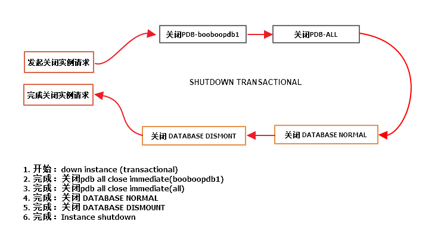

# 实践2:体系结构

> **Practices for Lesson 2: Exploring Oracle Database Architecture**
>
> 2020.01.29 BoobooWei

[TOC]

## 实践2:概览

Practices for Lesson 2: Overview

## 实践2-1:探索Oracle数据库体系结构

Practice 2-1: Exploring the Oracle Database Architecture


## 实践2-2:关闭数据库实例transactional

### Overview

本实验的目的，了解关闭数据库实例的过程，实验中将使用`shutdown transactional`来关闭数据库。

### Task

### Practice

1. 会话1：登陆pdb，执行insert 不提交事务

```sql
[oracle@oracle01 ~]$ sqlplus / as sysdba
SYS@booboo>conn scott/tiger@booboopdb1
Connected.
SCOTT@booboopdb1>desc t02;
 Name						       Null?	Type
 ----------------------------------------------------- -------- ------------------------------------
 X						       NOT NULL NUMBER(38)
 Y								VARCHAR2(20)

SCOTT@booboopdb1>insert into t02 values (1,'superman');

1 row created.

SCOTT@booboopdb1>insert into t02 values (2,'batman');

1 row created.

```

2. 会话2：登陆cdb，执行create user c##test identified by oracle;

```sql
[oracle@oracle01 ~]$ sqlplus / as sysdba

SQL*Plus: Release 12.2.0.1.0 Production on Thu Feb 6 15:56:20 2020

Copyright (c) 1982, 2016, Oracle.  All rights reserved.


Connected to:
Oracle Database 12c Enterprise Edition Release 12.2.0.1.0 - 64bit Production

SYS@booboo>show pdbs;

    CON_ID CON_NAME			  OPEN MODE  RESTRICTED
---------- ------------------------------ ---------- ----------
	 2 PDB$SEED			  READ ONLY  NO
	 3 BOOBOOPDB1			  READ WRITE NO
	 4 BOOBOOPDB2			  MOUNTED
	 5 BOOBOOPDB3			  MOUNTED
	 6 BOOBOOPDB4			  MOUNTED
SYS@booboo>create user c##test identified by oracle;

User created.

```

3. 会话3：登陆cdb，执行 shutdown transactional 观察日志

```sql
[oracle@oracle01 ~]$ sqlplus / as sysdba

SQL*Plus: Release 12.2.0.1.0 Production on Thu Feb 6 16:17:12 2020

Copyright (c) 1982, 2016, Oracle.  All rights reserved.


Connected to:
Oracle Database 12c Enterprise Edition Release 12.2.0.1.0 - 64bit Production

SYS@booboo>shutdown transactional
Database closed.
Database dismounted.
ORACLE instance shut down.
SYS@booboo>!date
Thu Feb  6 16:19:20 CST 2020
```

观察日志
```bash
[oracle@oracle01 ~]$ adrci 

ADRCI: Release 12.2.0.1.0 - Production on Thu Feb 6 16:18:05 2020

Copyright (c) 1982, 2017, Oracle and/or its affiliates.  All rights reserved.

ADR base = "/u01/app/oracle"
adrci> help        

 HELP [topic]
   Available Topics:
        CREATE REPORT
        ECHO
        ESTIMATE
        EXIT
        HELP
        HOST
        IPS
        PURGE
        RUN
        SELECT
        SET BASE
        SET BROWSER
        SET CONTROL
        SET ECHO
        SET EDITOR
        SET HOMES | HOME | HOMEPATH
        SET TERMOUT
        SHOW ALERT
        SHOW BASE
        SHOW CONTROL
        SHOW HM_RUN
        SHOW HOMES | HOME | HOMEPATH
        SHOW INCDIR
        SHOW INCIDENT
        SHOW LOG
        SHOW PROBLEM
        SHOW REPORT
        SHOW TRACEFILE
        SPOOL

 There are other commands intended to be used directly by Oracle, type
 "HELP EXTENDED" to see the list

adrci> show alert

Choose the home from which to view the alert log:

1: diag/rdbms/booboo/booboo
2: diag/clients/user_oracle/host_2874269298_107
3: diag/tnslsnr/oracle01/listener
4: diag/tnslsnr/oracle01/listener2
Q: to quit

Please select option: 1
Output the results to file: /tmp/alert_43088_1406_booboo_1.ado

Please select option: q       
adrci> exit
```

日志分析

```bash
2020-02-06 16:17:14.624000 +08:00
Shutting down instance (transactional) (OS id: 42991)
## 开始：down instance (transactional)


2020-02-06 16:17:15.816000 +08:00
Stopping background process SMCO # 停止后台进程 SMCO
2020-02-06 16:17:17.028000 +08:00
Shutting down instance: further logons disabled #禁用进一步的登录
2020-02-06 16:17:18.147000 +08:00
Stopping background process CJQ0  # 停止后台进程 CJQ0
Stopping background process MMNL  # 停止后台进程 MMNL
2020-02-06 16:17:19.219000 +08:00
Stopping background process MMON  # 停止后台进程 MMON
2020-02-06 16:17:20.900000 +08:00


alter pluggable database all close immediate # 开始关闭pdb【immediate】：只产生检查点，不等待事务结果
JIT: pid 42991 requesting stop
KILL SESSION for sid=(67, 40381):
  Reason = PDB close immediate
  Mode = KILL HARD FORCE -/-/-
  Requestor = USER (orapid = 33, ospid = 42991, inst = 1)
  Owner = Process: USER (orapid = 43, ospid = 41840)
  Result = ORA-0
2020-02-06 16:17:22.565000 +08:00
Pluggable database BOOBOOPDB1 closed # booboopdb1 该PDB已成功关闭。
Completed: alter pluggable database all close immediate # 完成关闭pdb【immediate】
## 完成：关闭pdb all close immediate


JIT: pid 42991 requesting stop
All transactions complete. Performing immediate shutdown # 所有事务完成，开始执行【immediate】 shutdown
License high water mark = 17
Dispatchers and shared servers shutdown # 调度程序和共享服务器关闭
2020-02-06 16:17:24.676000 +08:00
ALTER DATABASE CLOSE NORMAL
Stopping Emon pool # 停止Emon池
alter pluggable database all close immediate # ALL PDB已成功关闭。
Completed: alter pluggable database all close immediate # 完成关闭pdb【immediate】
## 完成：关闭pdb all close immediate


Stopping Emon pool # 停止Emon池
Shutting down archive processes # 【开始】关闭归档过程
TT00: Gap Manager exiting (PID:100073)
OS process OFSD (ospid 100019) idle for 30 seconds, exiting
2020-02-06 16:17:25.809000 +08:00
Archiving is disabled # 【完成】关闭归档过程
Thread 1 closed at log sequence 14
Successful close of redo thread 1
Completed: ALTER DATABASE CLOSE NORMAL
## 完成：关闭 DATABASE NORMAL


ALTER DATABASE DISMOUNT # dismount 数据库
Shutting down archive processes # 关闭归档进程
Archiving is disabled
Completed: ALTER DATABASE DISMOUNT

## 完成：关闭 DATABASE DISMOUNT


2020-02-06 16:17:27.001000 +08:00
ARCH: Archival disabled due to shutdown: 1089
Shutting down archive processes
Archiving is disabled
JIT: pid 42991 requesting stop
2020-02-06 16:17:28.008000 +08:00
ARCH: Archival disabled due to shutdown: 1089
Shutting down archive processes
Archiving is disabled
Stopping background process VKTM
JIT: pid 42991 requesting stop
2020-02-06 16:17:37.473000 +08:00
Instance shutdown complete (OS id: 42991)
## 完成：Instance shutdown
```

1. 开始：down instance (transactional)
2. 完成：关闭pdb all close immediate(booboopdb1)
3. 完成：关闭pdb all close immediate(all)
4. 完成：关闭 DATABASE NORMAL
5. 完成：关闭 DATABASE DISMOUNT
6. 完成：Instance shutdown


重新启动数据库后，发现事务并没有提交

```sql

SYS@booboo>conn scott/tiger@booboopdb1
Connected.
SCOTT@booboopdb1>select * from t02;

no rows selected
```

### KnowledgePoint



注意：虽然发起的关闭是 transactional ，但是在Oracle12c中，关闭PDB时使用的却是`alter pluggable database all close immediate`。因此不会等待PDB的事务提交即立刻关闭数据库。

## 实践2-3：关闭数据库实例abort

### Overview

本实验的目的，了解关闭数据库实例的过程，实验中将使用`shutdown abort`来关闭数据库。

### Task

### Practice

1. 关闭实例

   ```sql
   SYS@booboo>shutdown abort
   ORACLE instance shut down.
   SYS@booboo>!date
   Thu Feb  6 18:13:24 CST 2020
   ```

   

2. 查看日志

   ```bash
   Shutting down instance (abort) (OS id: 44076)
   License high water mark = 6
   USER (ospid: 44076): terminating the instance
   Instance terminated by USER, pid = 44076
   2020-02-06 18:13:18.716000 +08:00
   Instance shutdown complete (OS id: 44076)
   ```

### KnowledgePoint

关闭速度非常快。