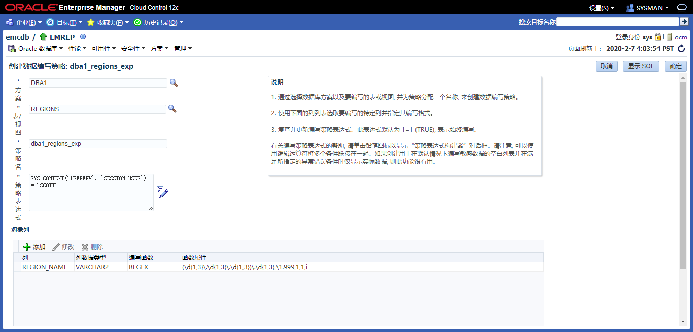
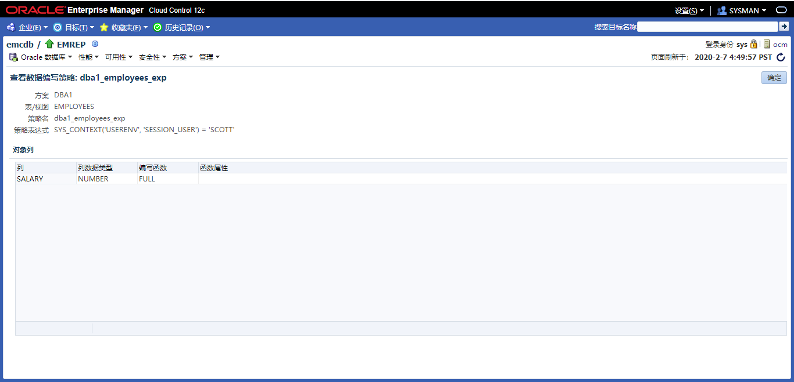

# 实践2:体系结构

> **Practices for Lesson 2: Exploring Oracle Database Architecture**
>
> 2020.01.29 BoobooWei

<!-- MDTOC maxdepth:6 firsth1:1 numbering:0 flatten:0 bullets:1 updateOnSave:1 -->

- [实践2:体系结构](#实践2体系结构)   
   - [实践2:概览](#实践2概览)   
   - [实践2-1:探索Oracle数据库体系结构](#实践2-1探索oracle数据库体系结构)   
   - [实践2-2:关闭数据库实例transactional](#实践2-2关闭数据库实例transactional)   
      - [Overview](#overview)   
      - [Task](#task)   
      - [Practice](#practice)   
      - [KnowledgePoint](#knowledgepoint)   
   - [实践2-3:关闭数据库实例abort](#实践2-3关闭数据库实例abort)   
      - [Overview](#overview)   
      - [Task](#task)   
      - [Practice](#practice)   
      - [KnowledgePoint](#knowledgepoint)   
   - [实践2-4:隐藏列 invisible](#实践2-4隐藏列-invisible)   
   - [实践2-5:存储过程DR和IR](#实践2-5存储过程dr和ir)   
   - [实践2-6:参数DB_8K_CACHE_SIZE](#实践2-6参数db_8k_cache_size)   
   - [实践2-7:参数ENABLE_DDL_LOGGING](#实践2-7参数enable_ddl_logging)   
      - [KnowledgePoint](#knowledgepoint)   
   - [实践2-8:Oracle Data Redaction](#实践2-8oracle-data-redaction)   
      - [Overview](#overview)   
      - [Task](#task)   
      - [Practice](#practice)   
      - [KnowledgePoint](#knowledgepoint)   
   - [实践2-9:REDACTION_VALUES_FOR_TYPE_FULL](#实践2-9redaction_values_for_type_full)   
      - [Overview](#overview)   
      - [Task](#task)   
      - [Practice](#practice)   
      - [KnowledgePoint](#knowledgepoint)   
         - [简介](#简介)   
         - [工作原理](#工作原理)   
         - [DBMS_REDACT.REDACTION_VALUES_FOR_TYPE_FULL](#dbms_redactredaction_values_for_type_full)   
         - [BINARY_DOUBLE_VALUE](#binary_double_value)   
   - [实践2-10:RMAN VALIDATE](#实践2-10rman-validate)   
      - [KnowledgePoint](#knowledgepoint)   
         - [目的](#目的)   
         - [先决条件](#先决条件)   
         - [使用说明](#使用说明)   

<!-- /MDTOC -->

## 实践2:概览

Practices for Lesson 2: Overview

## 实践2-1:探索Oracle数据库体系结构

Practice 2-1: Exploring the Oracle Database Architecture


## 实践2-2:关闭数据库实例transactional

### Overview

本实验的目的，了解关闭数据库实例的过程，实验中将使用`shutdown transactional`来关闭数据库。

### Task

### Practice

1. 会话1：登陆pdb，执行insert 不提交事务

```sql
[oracle@oracle01 ~]$ sqlplus / as sysdba
SYS@booboo>conn scott/tiger@booboopdb1
Connected.
SCOTT@booboopdb1>desc t02;
 Name						       Null?	Type
 ----------------------------------------------------- -------- ------------------------------------
 X						       NOT NULL NUMBER(38)
 Y								VARCHAR2(20)

SCOTT@booboopdb1>insert into t02 values (1,'superman');

1 row created.

SCOTT@booboopdb1>insert into t02 values (2,'batman');

1 row created.

```

2. 会话2：登陆cdb，执行create user c##test identified by oracle;

```sql
[oracle@oracle01 ~]$ sqlplus / as sysdba

SQL*Plus: Release 12.2.0.1.0 Production on Thu Feb 6 15:56:20 2020

Copyright (c) 1982, 2016, Oracle.  All rights reserved.


Connected to:
Oracle Database 12c Enterprise Edition Release 12.2.0.1.0 - 64bit Production

SYS@booboo>show pdbs;

    CON_ID CON_NAME			  OPEN MODE  RESTRICTED
---------- ------------------------------ ---------- ----------
	 2 PDB$SEED			  READ ONLY  NO
	 3 BOOBOOPDB1			  READ WRITE NO
	 4 BOOBOOPDB2			  MOUNTED
	 5 BOOBOOPDB3			  MOUNTED
	 6 BOOBOOPDB4			  MOUNTED
SYS@booboo>create user c##test identified by oracle;

User created.

```

3. 会话3：登陆cdb，执行 shutdown transactional 观察日志

```sql
[oracle@oracle01 ~]$ sqlplus / as sysdba

SQL*Plus: Release 12.2.0.1.0 Production on Thu Feb 6 16:17:12 2020

Copyright (c) 1982, 2016, Oracle.  All rights reserved.


Connected to:
Oracle Database 12c Enterprise Edition Release 12.2.0.1.0 - 64bit Production

SYS@booboo>shutdown transactional
Database closed.
Database dismounted.
ORACLE instance shut down.
SYS@booboo>!date
Thu Feb  6 16:19:20 CST 2020
```

观察日志
```bash
[oracle@oracle01 ~]$ adrci

ADRCI: Release 12.2.0.1.0 - Production on Thu Feb 6 16:18:05 2020

Copyright (c) 1982, 2017, Oracle and/or its affiliates.  All rights reserved.

ADR base = "/u01/app/oracle"
adrci> help        

 HELP [topic]
   Available Topics:
        CREATE REPORT
        ECHO
        ESTIMATE
        EXIT
        HELP
        HOST
        IPS
        PURGE
        RUN
        SELECT
        SET BASE
        SET BROWSER
        SET CONTROL
        SET ECHO
        SET EDITOR
        SET HOMES | HOME | HOMEPATH
        SET TERMOUT
        SHOW ALERT
        SHOW BASE
        SHOW CONTROL
        SHOW HM_RUN
        SHOW HOMES | HOME | HOMEPATH
        SHOW INCDIR
        SHOW INCIDENT
        SHOW LOG
        SHOW PROBLEM
        SHOW REPORT
        SHOW TRACEFILE
        SPOOL

 There are other commands intended to be used directly by Oracle, type
 "HELP EXTENDED" to see the list

adrci> show alert

Choose the home from which to view the alert log:

1: diag/rdbms/booboo/booboo
2: diag/clients/user_oracle/host_2874269298_107
3: diag/tnslsnr/oracle01/listener
4: diag/tnslsnr/oracle01/listener2
Q: to quit

Please select option: 1
Output the results to file: /tmp/alert_43088_1406_booboo_1.ado

Please select option: q       
adrci> exit
```

日志分析

```bash
2020-02-06 16:17:14.624000 +08:00
Shutting down instance (transactional) (OS id: 42991)
## 开始：down instance (transactional)


2020-02-06 16:17:15.816000 +08:00
Stopping background process SMCO # 停止后台进程 SMCO
2020-02-06 16:17:17.028000 +08:00
Shutting down instance: further logons disabled #禁用进一步的登录
2020-02-06 16:17:18.147000 +08:00
Stopping background process CJQ0  # 停止后台进程 CJQ0
Stopping background process MMNL  # 停止后台进程 MMNL
2020-02-06 16:17:19.219000 +08:00
Stopping background process MMON  # 停止后台进程 MMON
2020-02-06 16:17:20.900000 +08:00


alter pluggable database all close immediate # 开始关闭pdb【immediate】：只产生检查点，不等待事务结果
JIT: pid 42991 requesting stop
KILL SESSION for sid=(67, 40381):
  Reason = PDB close immediate
  Mode = KILL HARD FORCE -/-/-
  Requestor = USER (orapid = 33, ospid = 42991, inst = 1)
  Owner = Process: USER (orapid = 43, ospid = 41840)
  Result = ORA-0
2020-02-06 16:17:22.565000 +08:00
Pluggable database BOOBOOPDB1 closed # booboopdb1 该PDB已成功关闭。
Completed: alter pluggable database all close immediate # 完成关闭pdb【immediate】
## 完成：关闭pdb all close immediate


JIT: pid 42991 requesting stop
All transactions complete. Performing immediate shutdown # 所有事务完成，开始执行【immediate】 shutdown
License high water mark = 17
Dispatchers and shared servers shutdown # 调度程序和共享服务器关闭
2020-02-06 16:17:24.676000 +08:00
ALTER DATABASE CLOSE NORMAL
Stopping Emon pool # 停止Emon池
alter pluggable database all close immediate # ALL PDB已成功关闭。
Completed: alter pluggable database all close immediate # 完成关闭pdb【immediate】
## 完成：关闭pdb all close immediate


Stopping Emon pool # 停止Emon池
Shutting down archive processes # 【开始】关闭归档过程
TT00: Gap Manager exiting (PID:100073)
OS process OFSD (ospid 100019) idle for 30 seconds, exiting
2020-02-06 16:17:25.809000 +08:00
Archiving is disabled # 【完成】关闭归档过程
Thread 1 closed at log sequence 14
Successful close of redo thread 1
Completed: ALTER DATABASE CLOSE NORMAL
## 完成：关闭 DATABASE NORMAL


ALTER DATABASE DISMOUNT # dismount 数据库
Shutting down archive processes # 关闭归档进程
Archiving is disabled
Completed: ALTER DATABASE DISMOUNT

## 完成：关闭 DATABASE DISMOUNT


2020-02-06 16:17:27.001000 +08:00
ARCH: Archival disabled due to shutdown: 1089
Shutting down archive processes
Archiving is disabled
JIT: pid 42991 requesting stop
2020-02-06 16:17:28.008000 +08:00
ARCH: Archival disabled due to shutdown: 1089
Shutting down archive processes
Archiving is disabled
Stopping background process VKTM
JIT: pid 42991 requesting stop
2020-02-06 16:17:37.473000 +08:00
Instance shutdown complete (OS id: 42991)
## 完成：Instance shutdown
```

1. 开始：down instance (transactional)
2. 完成：关闭pdb all close immediate(booboopdb1)
3. 完成：关闭pdb all close immediate(all)
4. 完成：关闭 DATABASE NORMAL
5. 完成：关闭 DATABASE DISMOUNT
6. 完成：Instance shutdown


重新启动数据库后，发现事务并没有提交

```sql

SYS@booboo>conn scott/tiger@booboopdb1
Connected.
SCOTT@booboopdb1>select * from t02;

no rows selected
```

### KnowledgePoint


注意：虽然发起的关闭是 transactional ，但是在Oracle12c中，关闭PDB时使用的却是`alter pluggable database all close immediate`。因此不会等待PDB的事务提交即立刻关闭数据库。

## 实践2-3:关闭数据库实例abort

### Overview

本实验的目的，了解关闭数据库实例的过程，实验中将使用`shutdown abort`来关闭数据库。

### Task

### Practice

1. 关闭实例

   ```sql
   SYS@booboo>shutdown abort
   ORACLE instance shut down.
   SYS@booboo>!date
   Thu Feb  6 18:13:24 CST 2020
   ```


2. 查看日志

   ```bash
   Shutting down instance (abort) (OS id: 44076)
   License high water mark = 6
   USER (ospid: 44076): terminating the instance
   Instance terminated by USER, pid = 44076
   2020-02-06 18:13:18.716000 +08:00
   Instance shutdown complete (OS id: 44076)
   ```

### KnowledgePoint

关闭速度非常快。

## 实践2-4:隐藏列 invisible

oracle 12c 新特性之不可见字段

在Oracle 11g R1中，Oracle以不可见索引和虚拟字段的形式引入了一些不错的增强特性。继承前者并发扬光大，Oracle 12c 中引入了不可见字段思想。在之前的版本中，为了隐藏重要的数据字段以避免在通用查询中显示，我们往往会创建一个视图来隐藏所需信息或应用某些安全条件。
在12c中，你可以在表中创建不可见字段。当一个字段定义为不可见时，这一字段就默认不会出现在通用查询中，除非在SQL语句或条件中有显式的提及这一字段，或是在表定义中有DESCRIBED。要添加或是修改一个不可见字段是非常容易的，反之亦然。

```sql
CREATE TABLE test_p (prod_id number(4),
Prod_name varchar2 (20),
Category_id number(30),
Quantity_on_hand number (3) INVISIBLE);

desc test_p
alter table test_p add constraint test_01  unique (Quantity_on_hand);
alter table test_p modify(Quantity_on_hand visible);
alter table test_p modify(Quantity_on_hand sible);
```

## 实践2-5:存储过程DR和IR

如何防止对CREATE_TEST存储过程具有EXECUTE特权的用户将值插入他们没有任何特权的表中？

Create the CREATE_TEST procedure with invoker rights.

oracle存储过程分两种，DR(Definer's Rights ) Procedure和IR(Invoker's Rights ) Procedure。
定义存储过程时，通过指定AUTHID 属性，定义DR Procedure 和IR Procedure

1. 定义者权限：定义者权限PL/SQL程序单元是以这个程序单元拥有者的特权来执行它的，也就是说，任何具有这个PL/SQL程序单元执行权的用户都可以访问程序中的对象。所有具有执行权的用户都有相同的访问权限，在定义者权限下，执行的用户操作的schema为定义者，所操作的对象是定义者在编译时指定的对象。在定义者(definer)权限下，当前用户的权限为角色无效情况下所拥有的权限。

   ```sql
   CREATE OR REPLACE procedure DEMO(ID in NUMBER)
   AUTHID DEFINER as
   ...
   BEGIN
   ...
   ND DEMO
   ```


2. 调用者权限：调用者权限是指当前用户（而不是程序的创建者）执行PL/SQL程序体的权限。这意味着不同的用户对于某个对象具有的权限很可能是不同的，这个思想的提出，解决了不同用户更新不同表的方法。在调用者权限下，执行的用户操作的schema为当前用户，所操作的对象是当前模式下的对象。在调用者(invoker)权限下，当前用户的权限为当前所拥有的权限(含角色)。

   ```sql
   CREATE OR REPLACE procedure DEMO(ID in NUMBER)
   AUTHID CURRENT_USER  as
   ...
   BEGIN
   ...
   ND DEMO
   ```

ORACLE默认为定义者权限，定义者权限在存储过程中ROLE无效，需要显示授权，例如在存储过程中调用其他用户的表，但是定义存储过程的当前用户没有显示访问该表的权限，即使当前用户具有dba角色，编译过程中也会出现权限不足的问题，因为role无效。

## 实践2-6:参数DB_8K_CACHE_SIZE

查看参数

```sql
select * from V$SYSTEM_PARAMETER where name='db_8k_cache_size';

exec print_table(q'[select * from V$SYSTEM_PARAMETER WHERE name='db_8k_cache_size']')
```

执行结果

```sql
NUM			      : 1447
NAME			      : db_8k_cache_size
TYPE			      : 6
VALUE			      : 0
DISPLAY_VALUE		      : 0
DEFAULT_VALUE		      : 0
ISDEFAULT		      : TRUE
ISSES_MODIFIABLE	      : FALSE
ISSYS_MODIFIABLE	      : IMMEDIATE
ISPDB_MODIFIABLE	      : FALSE
ISINSTANCE_MODIFIABLE	      : TRUE
ISMODIFIED		      : FALSE
ISADJUSTED		      : FALSE
ISDEPRECATED		      : FALSE
ISBASIC 		      : FALSE
DESCRIPTION		      : Size of cache for 8K buffers
UPDATE_COMMENT		      :
HASH			      : 1564706367
CON_ID			      : 0
-----------------

PL/SQL procedure successfully completed.
```

* ISSYS_MODIFIABLE	      : IMMEDIATE
* 指示参数是否可以更改`ALTER SYSTEM`以及更改何时生效：`IMMEDIATE`- `ALTER SYSTEM`无论用于启动实例的参数文件的类型如何，都可以更改参数。更改将立即生效。
	 DESCRIPTION		      : Size of cache for 8K buffers 8K缓冲区的缓存大小

## 实践2-7:参数ENABLE_DDL_LOGGING

当需要确定某些ddl操作什么时候发生，确定是表啥时间被动了，可以设置此参数。

```sql
--此参数支持动态调整
alter system set enable_ddl_logging=true scope=both;
show parameter enable_ddl_logging;
drop procedure print_table;
CREATE OR REPLACE PROCEDURE print_table(p_query IN VARCHAR2)
AUTHID CURRENT_USER
IS
 l_thecursor INTEGER DEFAULT dbms_sql.open_cursor;
 l_columnvalue VARCHAR2(4000);
 l_status  INTEGER;
 l_desctbl  dbms_sql.desc_tab;
 l_colcnt  NUMBER;
BEGIN
 EXECUTE IMMEDIATE 'alter session set nls_date_format=''dd-mon-yyyy hh24:mi:ss'' ';

 dbms_sql.parse(l_thecursor, p_query, dbms_sql.native);

 dbms_sql.describe_columns (l_thecursor, l_colcnt, l_desctbl);

 FOR i IN 1 .. l_colcnt LOOP
  dbms_sql.define_column (l_thecursor, i, l_columnvalue, 4000);
 END LOOP;

 l_status := dbms_sql.EXECUTE(l_thecursor);

 WHILE ( dbms_sql.Fetch_rows(l_thecursor) > 0 ) LOOP
  FOR i IN 1 .. l_colcnt LOOP
   dbms_sql.column_value (l_thecursor, i, l_columnvalue);

   dbms_output.Put_line (RPAD(L_desctbl(i).col_name, 30)
         || ': '
         || l_columnvalue);
  END LOOP;

  dbms_output.put_line('-----------------');
 END LOOP;

 EXECUTE IMMEDIATE 'alter session set nls_date_format=''dd-MON-rr'' ';
EXCEPTION
 WHEN OTHERS THEN
    EXECUTE IMMEDIATE
    'alter session set nls_date_format=''dd-MON-rr'' ';

    RAISE;
END;
/
exec print_table('select 1 from dual')
```

运行结果

* DDL日志明细xml格式文件：`less /u01/app/oracle/diag/rdbms/emcdb/emcdb/log/ddl/log.xml`
* DDL日志明细TXT格式文件：`less /u01/app/oracle/diag/rdbms/emcdb/emcdb/log/ddl_emcdb.log`

```sql
[oracle@ocm log]$ pwd
/u01/app/oracle/diag/rdbms/emcdb/emcdb/log
[oracle@ocm log]$ ll
total 8
drwxr-x--- 2 oracle oinstall   21 Feb  7 19:31 ddl
-rw-r----- 1 oracle oinstall 1217 Feb  7 19:32 ddl_emcdb.log
drwxr-x--- 2 oracle oinstall   21 Feb  2 19:57 debug
-rw-r----- 1 oracle oinstall  888 Feb  5 02:57 debug.log
drwxr-x--- 2 oracle oinstall    6 Dec  8 16:30 hcs
drwxr-x--- 2 oracle oinstall    6 Dec  8 16:30 imdb
drwxr-x--- 2 oracle oinstall    6 Dec  8 16:30 test
[oracle@ocm log]$ head ddl_emcdb.log
2020-02-07T19:31:14.248644+08:00
diag_adl:drop procedure print_table
2020-02-07T19:32:01.698631+08:00
diag_adl:CREATE OR REPLACE PROCEDURE print_table(p_query IN VARCHAR2)
AUTHID CURRENT_USER
IS
 l_thecursor INTEGER DEFAULT dbms_sql.open_cursor;
 l_columnvalue VARCHAR2(4000);
 l_status  INTEGER;
 l_desctbl  dbms_sql.desc_tab;
[oracle@ocm log]$ head ddl/log.xml
<msg time='2020-02-07T19:31:14.248+08:00' org_id='oracle' comp_id='rdbms'
 msg_id='opiexe:4695:2946163730' type='UNKNOWN' group='diag_adl'
 level='16' host_id='ocm' host_addr='192.168.14.154'
 pid='20083' version='1' con_uid='1'
 con_id='1' con_name='CDB$ROOT'>
 <txt>drop procedure print_table
 </txt>
</msg>
<msg time='2020-02-07T19:32:01.698+08:00' org_id='oracle' comp_id='rdbms'
 msg_id='opiexe:4695:2946163730' type='UNKNOWN' group='diag_adl'
```


### KnowledgePoint

> ENABLE_DDL_LOGGING

https://docs.oracle.com/en/database/oracle/oracle-database/12.2/refrn/ENABLE_DDL_LOGGING.html

| Property            | Description                     |
| ------------------- | ------------------------------- |
| Parameter type      | Boolean                         |
| Default value       | `false`                         |
| Modifiable          | `ALTER SESSION`, `ALTER SYSTEM` |
| Modifiable in a PDB | Yes                             |
| Range of values     | `true | false`                  |
| Basic               | No                              |

* `ENABLE_DDL_LOGGING` enables or disables the writing of a subset of data definition language (DDL) statements to a DDL log.
* DDL日志是与警报日志具有相同格式和基本行为的文件，但它仅包含数据库发出的DDL语句。仅当RDBMS组件创建DDL日志，并且`ENABLE_DDL_LOGGING`初始化参数设置为`true`。当此参数设置`false`为时，DDL语句不包含在任何日志中。
* 对于数据库发出的每个DDL语句，DDL日志均包含一个日志记录。DDL日志包含在IPS事件包中。
* 有两个DDL日志包含相同的信息。一个是XML文件，另一个是文本文件。DDL日志存储在`log/ddl`ADR主目录的子目录中。

当`ENABLE_DDL_LOGGING`设置`true`为时，将以下DDL语句写入日志：

- `ALTER/CREATE/DROP/TRUNCATE CLUSTER`
- `ALTER/CREATE/DROP FUNCTION`
- `ALTER/CREATE/DROP INDEX`
- `ALTER/CREATE/DROP OUTLINE`
- `ALTER/CREATE/DROP PACKAGE`
- `ALTER/CREATE/DROP PACKAGE BODY`
- `ALTER/CREATE/DROP PROCEDURE`
- `ALTER/CREATE/DROP PROFILE`
- `ALTER/CREATE/DROP SEQUENCE`
- `CREATE/DROP SYNONYM`
- `ALTER/CREATE/DROP/RENAME/TRUNCATE TABLE`
- `ALTER/CREATE/DROP TRIGGER`
- `ALTER/CREATE/DROP TYPE`
- `ALTER/CREATE/DROP TYPE BODY`
- `DROP USER`
- `ALTER/CREATE/DROP VIEW`

## 实践2-8:Oracle Data Redaction

### Overview

Oracle Data Redaction 提供了一种简单方法来快速编写应用程序中显示的敏感信息, 而无需变更磁盘或高速缓存中的基础数据库块。数据根据灵活的多因素策略实时编写。作为 Oracle Advanced Security 的一部分授权数据编写。

本实验将学习如何配置一个数据编写策略并验证。

### Task

1. 使用DBA1用户，创建一个表regions
2. 登陆到企业云管理平台，点击 **安全 > 数据编辑**，新建一个数据编辑策略。
3. 使用scott用户访问dba1的regions表，查看是否生效
4. 使用hr用户访问dba1的regions表，查看是否生效

### Practice

1. 使用DBA1用户，创建一个表regions

   ```sql
   SQL> conn dba1/oracle@emrep
   Connected.
   SQL> desc regions;
    Name					   Null?    Type
    ----------------------------------------- -------- ----------------------------
    REGION_ID				   NOT NULL NUMBER
    REGION_NAME				   NOT NULL VARCHAR2(25)

   SQL> select * from regions;

    REGION_ID REGION_NAME
   ---------- -------------------------
   	 1 Europe
   	 2 Americas
   	 3 Asia
   	 4 Middle East and Africa
   	 5 192.168.1.1

   SQL> grant select on regions to hr;
   SQL> grant select on regions to scott;
   ```


2. 登陆到企业云管理平台，点击 **安全 > 数据编辑 > 创建策略**

   要求，当scott用户访问`dba1.regions`表时策略才会生效，具体策略如下表，含义为：如果region_name列匹配到ip地址，则变更更最后一位为999；否则不显示。

   | col        | value                                            |
   | ---------- | ------------------------------------------------ |
   | schema     | DBA1                                             |
   | 表/视图    | REGIONS                                          |
   | 策略名     | dba1_regions_exp                                 |
   | 策略表达式 | SYS_CONTEXT('USERENV', 'SESSION_USER') = 'SCOTT' |

   | 对象列      | 列数据类型 | 编写函数 | 函数属性                                            |
   | ----------- | ---------- | -------- | --------------------------------------------------- |
   | REGION_NAME | VARCHAR2   | REGEX    | `(\d{1,3}\.\d{1,3}\.\d{1,3})\.\d{1,3},\1.999,1,1,i` |

   

   

   ```sql
   BEGIN

   	 BEGIN  DBMS_REDACT.ADD_POLICY  (OBJECT_SCHEMA => 'DBA1',  object_name => 'REGIONS',  policy_name => 'dba1_regions_exp',  expression => 'SYS_CONTEXT(''USERENV'', ''SESSION_USER'') = ''SCOTT'''); END;

   	BEGIN  DBMS_REDACT.ALTER_POLICY  (OBJECT_SCHEMA => 'DBA1',  object_name => 'REGIONS',  policy_name => 'dba1_regions_exp',  action => DBMS_REDACT.ADD_COLUMN,  column_name => '"REGION_NAME"',  function_type => DBMS_REDACT.REGEXP , regexp_pattern         => (\d{1,3}\.\d{1,3}\.\d{1,3})\.\d{1,3},regexp_replace_string  => \1.999,regexp_position        => 1,regexp_occurrence      => 1,regexp_match_parameter => i);  END;

   END;
   /
   ```


3. 使用scott用户访问dba1的regions表，查看是否生效

   ```sql
   SQL> conn scott/tiger@emrep
   Connected.
   SQL> column region_name format a25
   SQL> select * from dba1.regions;

    REGION_ID REGION_NAME
   ---------- -------------------------
   	 1
   	 2
   	 3
   	 4
   	 5 192.168.1.999
   ```

   id为5的行 region_name只显示了为ip的行，且对最后一个地址做了替换。说明成功了。

4. 使用hr用户访问dba1的regions表，查看是否生效

    ```sql
       SQL> conn hr/hr@emrep;
       Connected.
       SQL> column region_name format a25
       SQL> select * from dba1.regions;

    REGION_ID REGION_NAME
    ```
---------- -------------------------
   	 1 Europe
   	 2 Americas
   	 3 Asia
   	 4 Middle East and Africa
   	 5 192.168.1.1
    ```

   可以看到规则对hr用户没有生效。

### KnowledgePoint

- [Oracle Data Redaction简介](https://docs.oracle.com/en/database/oracle/oracle-database/12.2/asoag/introduction-to-oracle-data-redaction.html#GUID-82EA9712-387C-4D3A-BB72-F64A707C67CA)
  Oracle Data Redaction是实时编辑敏感数据的功能。
- [Oracle Data Redaction特性和功能](https://docs.oracle.com/en/database/oracle/oracle-database/12.2/asoag/oracle-data-redaction-features-and-capabilities.html#GUID-98B40084-EA10-4265-A6E5-D2EAC934E005)
  Oracle Data Redaction提供了多种编辑不同类型数据的方法。
- [配置Oracle数据修订策略](https://docs.oracle.com/en/database/oracle/oracle-database/12.2/asoag/configuring-oracle-data-redaction-policies.html#GUID-78C0ECD1-388C-4E12-87C3-32FBC05F294D)
  Oracle数据修订策略根据表列类型和要使用的修订类型定义如何对列中的数据进行修订。
- [在Oracle Enterprise Manager中管理Oracle Data Redaction策略](https://docs.oracle.com/en/database/oracle/oracle-database/12.2/asoag/using-oracle-data-redaction-in-oracle-enterprise-manager.html#GUID-8267183A-1778-428E-9B6E-AB06D8CC7EAB)
  Oracle Enterprise Manager Cloud Control（云控制）可以管理Oracle Data Redaction策略和格式。
- [将Oracle Data Redaction与Oracle数据库功能](https://docs.oracle.com/en/database/oracle/oracle-database/12.2/asoag/oracle-data-redaction-use-with-oracle-database-features.html#GUID-D0C97997-0F35-42B7-98B1-1DA4197001F0)
  一起使用Oracle Data Redaction可以与其他Oracle功能一起使用，但是某些Oracle功能可能对Oracle Data Redaction有限制。
- [Oracle Data Redaction的安全注意事项](https://docs.oracle.com/en/database/oracle/oracle-database/12.2/asoag/security-considerations-for-using-oracle-data-redaction.html#GUID-1D2850E8-2485-4C3D-BBF2-75E2CFAC3F37)
  Oracle提供了使用Oracle Data Redaction的准则。

## 实践2-9:REDACTION_VALUES_FOR_TYPE_FULL

### Overview

通过DBMS_REDACT.REDACTION_VALUES_FOR_TYPE_FULL 此过程修改“数据修订”策略的数值默认显示值以进行完整修订。

### Task

1. 修改redaction_values_for_type_full的NUMBER_VALUE为-1（pdb中操作）
2. 登陆云管理控制台添加策略，scott用户访问dba1.employees表时，看不到真实的salary。看到的都是-1。
3. 使用scott用户测试是否策略生效。
4. 重启服务
5. 使用scott用户测试是否策略生效。

### Practice

1. 修改redaction_values_for_type_full的NUMBER_VALUE为-1

   ```sql
   SQL> conn / as sysdba
   Connected.
   SQL>SQL> conn / as sysdba
   Connected.
   SQL> alter session set container=emrep;

   Session altered.

   SQL> select number_value from redaction_values_for_type_full;

   NUMBER_VALUE
   ------------
   	   0

   SQL> exec dbms_redact.update_full_redaction_values(-1)

   PL/SQL procedure successfully completed.

   SQL> select number_value from redaction_values_for_type_full;

   NUMBER_VALUE
   ------------
   	  -1

    select number_value from redaction_values_for_type_full;

   NUMBER_VALUE
   ------------
   	   0

   SQL> exec dbms_redact.update_full_redaction_values(-1)

   PL/SQL procedure successfully completed.

   SQL> select number_value from redaction_values_for_type_full;

   NUMBER_VALUE
   ------------
   	  -1
   ```


2. 登陆云管理控制台添加策略

   

   

   ```sql
   BEGIN

   	 BEGIN  DBMS_REDACT.ADD_POLICY  (OBJECT_SCHEMA => 'DBA1',  object_name => 'EMPLOYEES',  policy_name => 'dba1_employees_exp',  expression => 'SYS_CONTEXT(''USERENV'', ''SESSION_USER'') = ''SCOTT'''); END;

   	BEGIN  DBMS_REDACT.ALTER_POLICY  (OBJECT_SCHEMA => 'DBA1',  object_name => 'EMPLOYEES',  policy_name => 'dba1_employees_exp',  action => DBMS_REDACT.ADD_COLUMN,  column_name => '"SALARY"',  function_type => DBMS_REDACT.FULL );  END;

   END;
   ```


3. 使用scott用户测试是否策略生效。

   ```sql
   SQL> conn scott/tiger@emrep;
   Connected.
   SQL> desc dba1.employees;
    Name					   Null?    Type
    ----------------------------------------- -------- ----------------------------
    EMPLOYEE_ID				   NOT NULL NUMBER(6)
    FIRST_NAME					    VARCHAR2(20)
    LAST_NAME				   NOT NULL VARCHAR2(25)
    EMAIL					   NOT NULL VARCHAR2(25)
    PHONE_NUMBER					    VARCHAR2(20)
    HIRE_DATE				   NOT NULL DATE
    JOB_ID 				   NOT NULL VARCHAR2(10)
    SALARY 					    NUMBER(8,2)
    COMMISSION_PCT 				    NUMBER(2,2)
    MANAGER_ID					    NUMBER(6)
    DEPARTMENT_ID					    NUMBER(4)

   SQL> select employee_id,first_name,salary from dba1.employees where rownum < 5;

   EMPLOYEE_ID FIRST_NAME		     SALARY
   ----------- -------------------- ----------
   	198 Donald			  0
   	199 Douglas			  0
   	200 Jennifer			  0
   	201 Michael			  0
   ```

   发现salary显示的时0而不是-1。

4. 重启服务

   ```sql
   SQL> shutdown immediate
   Database closed.
   Database dismounted.
   ORACLE instance shut down.
   SQL> startup
   ORACLE instance started.

   Total System Global Area  838860800 bytes
   Fixed Size		    8798312 bytes
   Variable Size		  490737560 bytes
   Database Buffers	  331350016 bytes
   Redo Buffers		    7974912 bytes
   Database mounted.
   Database opened.

   ```


5. 使用scott用户测试是否策略生效。

   ```sql
   SQL> conn scott/tiger@emrep;
   Connected.
   SQL> select employee_id,first_name,salary from dba1.employees where rownum < 5;

   EMPLOYEE_ID FIRST_NAME		     SALARY
   ----------- -------------------- ----------
   	198 Donald			 -1
   	199 Douglas			 -1
   	200 Jennifer			 -1
   	201 Michael			 -1

   SQL> conn hr/hr@emrep;
   Connected.
   SQL> select employee_id,first_name,salary from dba1.employees where rownum < 5;

   EMPLOYEE_ID FIRST_NAME		     SALARY
   ----------- -------------------- ----------
   	198 Donald		       2600
   	199 Douglas		       2600
   	200 Jennifer		       4400
   	201 Michael		      13000
   ```

   重启后已生效，数字类型的salary列全部显示为 -1。

### KnowledgePoint

[提示与技巧：Oracle Database 12*c* 中的数据编辑](https://www.oracle.com/technetwork/cn/articles/database/data-redaction-odb12c-2331480-zhs.html)

#### 简介

Oracle Data Redaction 是 Oracle Database 12c 引入的一个新特性。这个新特性是 Advanced Security 选件的一部分，可以实时保护显示给用户的数据，无需更改应用。

Oracle Database 12c 在执行查询时应用保护。存储的数据保持不变，要显示的数据则在离开数据库前动态转换。

不要将此特性与自版本 11g 起提供的 Oracle Data Masking 混淆。采用 Oracle Data Masking 时，将以屏蔽形式处理数据，更新后的数据存储在新数据块中。因此，Data Masking 更适合非生产环境。

下面是已有的其他一些有助于提高数据安全性的特性：

- 虚拟专用数据库 (VPD) — 通过向针对数据库执行的 SQL 语句动态添加谓词，控制行级和列级访问。
- Oracle Label Security — 允许向表记录添加用户定义的值。与 VPD 相结合，可以更精细地控制访问用户和访问内容。
- Database Vault — 数据编辑不能防止特权用户（如 DBA）访问受保护的数据。为解决此问题，您可以利用 Database Vault。


从许可角度来说，Oracle Data Masking 仅适用于企业版数据库，且需要 Advanced Security 许可。

#### 工作原理

我们可以创建编辑策略，指定必须满足哪些条件后才能对数据进行编辑并将其返回给用户。定义此类策略期间，DBA 可以指定必须对哪些列应用何种类型的保护。

用于创建保护规则的软件包名为 **DBMS_REDACT**。它包括五个用于管理规则的过程，以及一个用于更改完全编辑策略默认值的过程。

- **DBMS_REDACT.ALTER_POLICY** — 允许更改现有策略。
- **DBMS_REDACT.DISABLE_POLICY** — 禁用现有策略。
- **DBMS_REDACT.DROP_POLICY** — 删除现有策略。
- **DBMS_REDACT.ENABLE_POLICY** — 启用现有策略。
- **DBMS_REDACT.UPDATE_FULL_REDACTION_VALUES** — 更改完全编辑的默认返回值。必须重启数据库才能生效。

#### DBMS_REDACT.REDACTION_VALUES_FOR_TYPE_FULL

* [DBMS_REDACT](https://docs.oracle.com/database/121/ARPLS/d_redact.htm#ARPLS73800)
* [REDACTION_VALUES_FOR_TYPE_FULL](https://docs.oracle.com/en/database/oracle/oracle-database/12.2/refrn/REDACTION_VALUES_FOR_TYPE_FULL.html#GUID-7C9711A8-C3FA-413E-90A4-5E875FFAB870)

DBMS_REDACT.REDACTION_VALUES_FOR_TYPE_FULL 此过程将修改“数据修订”策略的默认显示值以进行完整修订。

句法

```
DBMS_REDACT.UPDATE_FULL_REDACTION_VALUES（
   number_val IN NUMBER：= NULL，
   binfloat_val IN BINARY_FLOAT：= NULL，
   bindouble_val IN BINARY_DOUBLE：= NULL，
   char_val IN CHAR：= NULL，
   varchar_val IN VARCHAR2：= NULL，
   nchar_val IN NCHAR：= NULL，
   nvarchar_val IN NVARCHAR2：= NULL，
   date_val IN DATE：= NULL，
   ts_val IN TIMESTAMP：= NULL，
   tswtz_val在带有时区的TIMESTAMP中：= NULL，
   blob_val IN BLOB：= NULL，
   clob_val IN CLOB：= NULL，
   nclob_val IN NCLOB NULL）;
```

参量

表121-11 UPDATE_FULL_REDACTION_VALUES过程参数

| 参数            | 描述                                             |
| --------------- | ------------------------------------------------ |
| `number_val`    | 修改`NUMBER`数据类型列的默认值                   |
| `binfloat_val`  | 修改`BINARY_FLOAT`数据类型列的默认值             |
| `bindouble_val` | 修改`BINARY_DOUBLE`数据类型列的默认值            |
| `char_val`      | 修改`CHAR`数据类型列的默认值                     |
| `varchar_val`   | 修改`VARCHAR2`数据类型列的默认值                 |
| `nchar_val`     | 修改`NCHAR`数据类型列的默认值                    |
| `nvarchar_val`  | 修改`NVARCHAR2`数据类型列的默认值                |
| `date`          | 修改`DATE`数据类型列的默认值                     |
| `ts_val`        | 修改`TIMESTAMP`数据类型列的默认值                |
| `tswtz_val`     | 修改`TIMESTAMP WITH TIME ZONE`数据类型列的默认值 |
| `blob_val`      | 修改`BLOB`数据类型列的默认值                     |
| `clob_val`      | 修改`CLOB`数据类型列的默认值                     |
| `nclob_val`     | 修改`NCLOB`数据类型列的默认值                    |


例外情况

`ORA-28082`-参数参数是无效的（其中，可能的值是`char_val`，`nchar_val`，`varchar_val`和`nvarchar_val`）

#### BINARY_DOUBLE_VALUE

例如，如果将修订策略应用于类型为的列，`BINARY_DOUBLE`并且修订类型为完全修订，则该列将使用`BINARY_DOUBLE_VALUE`此视图的列中显示的值进行编辑。

| 列                               | 数据类型                      | 空值       | 描述                                               |
| -------------------------------- | ----------------------------- | ---------- | -------------------------------------------------- |
| `NUMBER_VALUE`                   | `NUMBER`                      | `NOT NULL` | 对NUMBER列进行完全修订的修订结果                   |
| `BINARY_FLOAT_VALUE`             | `BINARY_FLOAT`                | `NOT NULL` | 对BINARY_FLOAT列进行完全修订的修订结果             |
| `BINARY_DOUBLE_VALUE`            | `BINARY_DOUBLE`               | `NOT NULL` | 对BINARY_DOUBLE列进行完全修订的修订结果            |
| `CHAR_VALUE`                     | `VARCHAR2(1)`                 |            | 对CHAR列进行完全修订的修订结果                     |
| `VARCHAR_VALUE`                  | `VARCHAR2(1)`                 |            | 对VARCHAR2列进行完全修订的修订结果                 |
| `NCHAR_VALUE`                    | `NCHAR(1)`                    |            | 对NCHAR列进行完全修订的修订结果                    |
| `NVARCHAR_VALUE`                 | `NVARCHAR2(1)`                |            | 用于NVARCHAR2列的完整修订的修订结果                |
| `DATE_VALUE`                     | `DATE`                        | `NOT NULL` | 用于DATE列的完整修订的修订结果                     |
| `TIMESTAMP_VALUE`                | `TIMESTAMP(6)`                | `NOT NULL` | 对TIMESTAMP列进行完全修订的修订结果                |
| `TIMESTAMP_WITH_TIME_ZONE_VALUE` | `TIMESTAMP(6) WITH TIME ZONE` | `NOT NULL` | 对TIMESTAMP WITH TIME ZONE列进行完全修订的修订结果 |
| `BLOB_VALUE`                     | `BLOB`                        |            | 对BLOB列进行完全修订的修订结果                     |
| `CLOB_VALUE`                     | `CLOB`                        |            | 对CLOB列进行完全修订的修订结果                     |
| `NCLOB_VALUE`                    | `NCLOB`                       |            | 对NCLOB列进行完全修订的修订结果                    |

## 实践2-10:RMAN VALIDATE

### Overview

### Task

### Practice

### KnowledgePoint

[VALIDATE](https://docs.oracle.com/en/database/oracle/oracle-database/12.2/rcmrf/VALIDATE.html#GUID-ECE57997-40CE-4029-A434-320441D2AD1E)

#### 目的

使用该`VALIDATE`命令检查损坏的块和丢失的文件，或确定是否可以还原备份集。

如果`VALIDATE`在验证期间检测到问题，则RMAN会显示该问题并触发执行故障评估。如果检测到故障，则RMAN将其记录到自动化诊断系统信息库。您可以`LIST` `FAILURE`用来查看失败。

#### 先决条件

目标数据库必须已安装或打开。

#### 使用说明

`VALIDATE`命令中的选项在语义上等效于命令中的选项`BACKUP` `VALIDATE`。`BACKUP VALIDATE`但是，与`VALIDATE`可以不同的是，它可以检查单个备份集和数据块。

该`VALIDATE`命令在验证期间不会跳过任何块。如果RMAN由于未使用的块压缩而未读取块，并且如果该块已损坏，则RMAN不会检测到损坏。损坏的未使用块无害。

在物理损坏中，数据库根本无法识别该块。在逻辑损坏中，块的内容在逻辑上不一致。默认情况下，该`VALIDATE`命令仅检查物理损坏。您也可以指定`CHECK LOGICAL`检查逻辑损坏。RMAN填充`V$DATABASE_BLOCK_CORRUPTION` 查看其发现。

块损坏可分为块间损坏和块内损坏。在块内损坏中，损坏发生在块本身内，并且可以是物理或逻辑损坏。在块间损坏中，损坏发生在块之间，并且只能是逻辑损坏。该`VALIDATE`命令仅检查块内损坏。


## 实践2-11:V$RSRC_CONSUMER_GROUP

### Overview

### Task

### Practice

```sql
select name,active_sessions,queue_length,consumed_cpu_time,cpu_waits,cpu_wait_time from v$rsrc_consumer_group;
```

* name：消费群体名称
* active_sessions：消费者组中当前活动的会话数
* queue_length：队列中等待的会话数
* consumed_cpu_time：使用者组中所有会话消耗的CPU时间累积量（以毫秒为单位）
* cpu_waits：由于资源管理，使用者组中所有会话必须等待CPU的累积次数。这不包括由于闩锁或排队争用而引起的等待，I / O等待等。当不主动管理CPU资源时，此值设置为零。
* cpu_wait_time：由于资源管理，会话等待CPU的累计时间。这不包括由于闩锁或排队争用而引起的等待，I / O等待等。当不主动管理CPU资源时，此值设置为零。

### KnowledgePoint

[V$RSRC_CONSUMER_GROUP](https://docs.oracle.com/en/database/oracle/oracle-database/12.2/refrn/V-RSRC_CONSUMER_GROUP.html#GUID-78EEDB39-2F56-4D6B-8878-5840E95EAFB5)

`V$RSRC_CONSUMER_GROUP` 显示与当前活动的资源使用者组有关的数据。

将`STATISTICS_LEVEL`设置为`TYPICAL`或时`ALL`，即使未设置Resource Manager计划或Resource Manager计划不监视CPU或会话资源，此视图也包含有关CPU利用率和等待时间的信息。

`V$RSRC_CONSUMER_GROUP`当可插拔数据库（PDB）更改其资源计划时，将重置统计信息。它们不受多租户容器数据库（CDB）资源计划更改的影响。

由于可以在不同的PDB之间独立设置PDB计划，`V$RSRC_CONSUMER_GROUP`因此不会在不同的PDB中覆盖相同的时间段。因此，此视图对于比较不同PDB之间的统计信息没有用。

| 柱                          | 数据类型       | 描述                                                         |
| --------------------------- | -------------- | ------------------------------------------------------------ |
| `ID`                        | `NUMBER`       | 使用者组对象ID（唯一的数字，在数据库关闭和启动期间保持一致） |
| `NAME`                      | `VARCHAR2(32)` | 消费群体名称                                                 |
| `ACTIVE_SESSIONS`           | `NUMBER`       | 消费者组中当前活动的会话数                                   |
| `EXECUTION_WAITERS`         | `NUMBER`       | 等待执行时间片的当前活动会话数，在这些时间段中将可以使用CPU  |
| `REQUESTS`                  | `NUMBER`       | 在使用者组中执行的累计请求数                                 |
| `CPU_WAIT_TIME`             | `NUMBER`       | 由于资源管理，会话等待CPU的累计时间。这不包括由于闩锁或排队争用而引起的等待，I / O等待等。当不主动管理CPU资源时，此值设置为零。 |
| `CPU_WAITS`                 | `NUMBER`       | 由于资源管理，使用者组中所有会话必须等待CPU的累积次数。这不包括由于闩锁或排队争用而引起的等待，I / O等待等。当不主动管理CPU资源时，此值设置为零。 |
| `CONSUMED_CPU_TIME`         | `NUMBER`       | 使用者组中所有会话消耗的CPU时间累积量（以毫秒为单位）        |
| `YIELDS`                    | `NUMBER`       | 由于数量到期，使用者组中的会话必须让CPU放弃其他会话的累积次数。当不主动管理CPU资源时，此值设置为零。 |
| `CPU_DECISIONS`             | `NUMBER`       | 使用者组所在的CPU决策百分比。当不主动管理CPU资源时，此值设置为零。 |
| `CPU_DECISIONS_EXCLUSIVE`   | `NUMBER`       | 存在使用者组并且是唯一的使用者组的CPU决策百分比。当不主动管理CPU资源时，此值设置为零。 |
| `CPU_DECISIONS_WON`         | `NUMBER`       | 消费者组赢得的CPU决策百分比。当不主动管理CPU资源时，此值设置为零。 |
| `QUEUE_LENGTH`              | `NUMBER`       | 队列中等待的会话数                                           |
| `CURRENT_UNDO_CONSUMPTION`  | `NUMBER`       | 消费者组当前消耗的撤消量（以KB为单位）                       |
| `ACTIVE_SESSION_LIMIT_HIT`  | `NUMBER`       | 由于使用者组达到其活动会话限制，使用者组中的会话排队的次数   |
| `UNDO_LIMIT_HIT`            | `NUMBER`       | 由于使用者组达到其`UNDO_POOL`限制 而取消了使用者组中的查询的次数 |
| `SWITCHES_IN_CPU_TIME`      | `NUMBER`       | 由于资源管理器计划的`SWITCH_TIME`限制， 进入使用者组的切换数 |
| `SWITCHES_OUT_CPU_TIME`     | `NUMBER`       | 由于资源管理器计划的`SWITCH_TIME`限制 ，不在使用者组中的交换机数量 |
| `SWITCHES_IN_IO_MEGABYTES`  | `NUMBER`       | 由于资源管理器计划的`SWITCH_IO_MEGABYTES`限制， 进入使用者组的切换数 |
| `SWITCHES_OUT_IO_MEGABYTES` | `NUMBER`       | 由于资源管理器计划的`SWITCH_IO_MEGABYTES`限制 ，不在使用者组中的交换机数量 |
| `SWITCHES_IN_IO_REQUESTS`   | `NUMBER`       | 由于资源管理器计划的`SWITCH_IO_REQS`限制， 进入使用者组的切换数 |
| `SWITCHES_OUT_IO_REQUESTS`  | `NUMBER`       | 由于资源管理器计划的`SWITCH_IO_REQS`限制 ，不在使用者组中的交换机数量 |
| `SWITCHES_IN_IO_LOGICAL`    | `NUMBER`       | 由于资源管理器计划的`SWITCH_IO_LOGICAL`限制， 进入使用者组的切换数 |
| `SWITCHES_OUT_IO_LOGICAL`   | `NUMBER`       | 由于资源管理器计划的`SWITCH_IO_LOGICAL`限制 ，不在使用者组中的交换机数量 |
| `SWITCHES_IN_ELAPSED_TIME`  | `NUMBER`       | 由于资源管理器计划的`SWITCH_ELAPSED_TIME`限制， 进入使用者组的切换数 |
| `SWITCHES_OUT_ELAPSED_TIME` | `NUMBER`       | 由于资源管理器计划的`SWITCH_ELAPSED_TIME`限制 ，不在使用者组中的交换机数量 |
| `SQL_CANCELED`              | `NUMBER`       | 在使用者组中运行的SQL查询由于超出资源管理器计划的`SWITCH_TIME`限制`CANCEL_SQL`并被指定为资源管理器计划的中止而被中止的次数`SWITCH_GROUP` |
| `ACTIVE_SESSIONS_KILLED`    | `NUMBER`       | 在使用者组中运行的会话由于超出资源管理器计划的`SWITCH_TIME`限制`KILL_SESSION`并被指定为资源管理器计划的会话而被终止的次数`SWITCH_GROUP` |
| `IDLE_SESSIONS_KILLED`      | `NUMBER`       | 消费者组中的会话由于空闲时间太长（达到`MAX_IDLE_TIME`）而 被杀死的次数 |
| `IDLE_BLKR_SESSIONS_KILLED` | `NUMBER`       | 消费者组中的会话因空闲时间太长（达到`MAX_IDLE_BLOCKER_TIME`）并阻止其他会话而被杀死的次数 |
| `QUEUED_TIME`               | `NUMBER`       | 由于活动会话限制，使用者组中的会话在“排队”状态下所花费的总时间（以毫秒为单位） |
| `QUEUE_TIME_OUTS`           | `NUMBER`       | 消费者组中的会话请求排队时间过长（达到`QUEUEING_P1`）而 超时的次数 |
| `IO_SERVICE_TIME`           | `NUMBER`       | 累积I / O等待时间（以毫秒为单位）                            |
| `IO_SERVICE_WAITS`          | `NUMBER`       | 等待请求总数                                                 |
| `SMALL_READ_MEGABYTES`      | `NUMBER`       | 读取的单块兆字节数                                           |
| `SMALL_WRITE_MEGABYTES`     | `NUMBER`       | 写入的单块兆字节数                                           |
| `LARGE_READ_MEGABYTES`      | `NUMBER`       | 读取的多块兆字节数                                           |
| `LARGE_WRITE_MEGABYTES`     | `NUMBER`       | 写入的多块兆字节数                                           |
| `SMALL_READ_REQUESTS`       | `NUMBER`       | 单块读取请求数                                               |
| `SMALL_WRITE_REQUESTS`      | `NUMBER`       | 单块写入请求数                                               |
| `LARGE_READ_REQUESTS`       | `NUMBER`       | 多块读取请求数                                               |
| `LARGE_WRITE_REQUESTS`      | `NUMBER`       | 多块写入请求数                                               |
| `CURRENT_PQS_ACTIVE`        | `NUMBER`       | 使用者组中活动并行语句的数量。此值不包括永不排队的并行语句，例如GV $查询。 |
| `CURRENT_PQ_SERVERS_ACTIVE` | `NUMBER`       | 使用者组中活动并行服务器的数量。此值不包括运行从未排队的并行语句的服务器，例如GV $查询。 |
| `PQS_QUEUED`                | `NUMBER`       | 尝试运行并行语句时，使用者组中的会话排队的次数               |
| `PQS_COMPLETED`             | `NUMBER`       | 使用者组中已完成的并行语句总数                               |
| `PQ_SERVERS_USED`           | `NUMBER`       | 使用者组中已完成的并行语句使用的并行服务器总数               |
| `PQ_ACTIVE_TIME`            | `NUMBER`       | 使用者组中所有已完成的并行语句的并行活动时间的累积总和（以毫秒为单位） |
| `CURRENT_PQS_QUEUED`        | `NUMBER`       | 使用者组中正在尝试运行并行语句的并行语句队列中正在等待的会话数 |
| `PQ_QUEUED_TIME`            | `NUMBER`       | 尝试运行并行语句时，使用者组中的会话排队的总时间（以毫秒为单位） |
| `PQ_QUEUE_TIME_OUTS`        | `NUMBER`       | 消费方组中的会话的并行语句由于队列时间超出资源管理器计划的`PARALLEL_QUEUE_TIMEOUT`限制而 超时的次数 |
| `CON_ID`                    | `NUMBER`       | 数据所属的容器的ID。可能的值包括：`0`：此值用于包含与整个CDB有关的数据的行。此值也用于非CDB中的行。`1`：此值用于包含仅与根相关的数据的行n：其中n是包含数据的行的适用容器ID |

也可以看看：

- “ [STATISTICS_LEVEL](https://docs.oracle.com/en/database/oracle/oracle-database/12.2/refrn/STATISTICS_LEVEL.html#GUID-16B23F95-8644-407A-A6C8-E85CADFA61FF) ”
- “ [V $ RSRC_PDB](https://docs.oracle.com/en/database/oracle/oracle-database/12.2/refrn/V-RSRC_PDB.html#GUID-8658D0A2-3822-429B-BB3B-79ABEAC70A3D) ”
- [《 Oracle数据库管理员指南》](https://www.oracle.com/pls/topic/lookup?ctx=en/database/oracle/oracle-database/12.2/refrn&id=ADMIN11881)中有关资源组的信息
- [《 Oracle数据库PL / SQL软件包和类型参考》，](https://www.oracle.com/pls/topic/lookup?ctx=en/database/oracle/oracle-database/12.2/refrn&id=ARPLS050)以获取有关使用`DBMS_RESOURCE_MANAGER`软件包 创建资源组的信息

## 实践2-12:使用升级前信息工具 

### Overview

### Task

### Practice

### KnowledgePoint

[使用升级前信息工具](https://docs.oracle.com/cd/E11882_01/server.112/e23633/upgrade.htm#UPGRD12395)

在安装了适用于Oracle Database 11 g第2版（11.2）的软件和所有必需的修补程序之后，Oracle建议您分析数据库，然后再将其升级到新版本。这是通过在要升级的数据库环境中运行“升级前信息工具”来完成的。升级前信息工具是Oracle数据库11 g第2版（11.2）软件随附的SQL脚本。如果您要手动升级，则这是必需的步骤。否则，`catupgrd.sql`脚本将以错误终止。如果要使用DBUA进行升级，还建议运行“升级前信息工具”，以便可以预览DBUA检查的项目。

这些主题包含有关升级前信息工具的其他信息：

- [关于升级前信息工具的输出](https://docs.oracle.com/cd/E11882_01/server.112/e23633/upgrade.htm#CHDJGEDB)
- [升级前信息工具的其他警告](https://docs.oracle.com/cd/E11882_01/server.112/e23633/upgrade.htm#BABDBDCD)

## 实践2-13:`STATISTICS_LEVEL`指定数据库和操作系统统计信息的收集级别 

### Overview

### Task

1. 查看你环境中该参数的值

   ```sql
   SQL> conn dba1/oracle@emrep
   
   SQL> show parameter STATISTICS_LEVEL
   
   NAME				     TYPE	 VALUE
   ------------------------------------ ----------- ------------------------------
   statistics_level		     string	 TYPICAL
   SQL> 
   ```

   

2. 说出参数的含义

### Practice

### KnowledgePoint

[STATISTICS_LEVEL](https://docs.oracle.com/en/database/oracle/oracle-database/12.2/refrn/STATISTICS_LEVEL.html#GUID-16B23F95-8644-407A-A6C8-E85CADFA61FF)

`STATISTICS_LEVEL`指定数据库和操作系统统计信息的收集级别。Oracle数据库出于各种目的收集这些统计信息，包括制定自我管理决策。

| 属性          | 描述                                           |
| ------------- | ---------------------------------------------- |
| 参数类型      | 串                                             |
| 句法          | `STATISTICS_LEVEL = { ALL | TYPICAL | BASIC }` |
| 默认值        | `TYPICAL`                                      |
| 可修改的      | `ALTER SESSION`， `ALTER SYSTEM`               |
| 可在PDB中修改 | 是                                             |
| 基本的        | 没有                                           |

默认设置`TYPICAL`确保确保收集数据库自我管理功能所需的所有主要统计信息，并提供最佳的整体性能。对于大多数环境，默认值应该足够。

当`STATISTICS_LEVEL`参数设置为时`ALL`，其他统计信息将添加到使用该设置收集的统计信息集中`TYPICAL`。其他统计信息是定时操作系统统计信息和计划执行统计信息。

将`STATISTICS_LEVEL`参数设置为`BASIC`禁用会禁用Oracle数据库功能所需的许多重要统计信息的收集，包括：

- 自动工作量存储库（AWR）快照
- 自动数据库诊断监视器（ADDM）
- 所有服务器生成的警报
- 自动SGA内存管理
- 自动优化器统计信息收集
- 对象级统计
- 端到端应用程序跟踪（`V$CLIENT_STATS`）
- 数据库时间分布统计（`V$SESS_TIME_MODEL`和`V$SYS_TIME_MODEL`）
- 服务水平统计
- 缓冲区高速缓存咨询
- MTTR咨询
- 共享池大小调整咨询
- 段级别统计
- PGA目标咨询
- 定时统计
- 监测统计

注意：

Oracle强烈建议您不要禁用这些重要的功能。

通过`STATISTICS_LEVEL`修改参数后`ALTER SYSTEM`，根据的新值，所有建议或统计信息都会动态打开或关闭`STATISTICS_LEVEL`。当被修改时`ALTER SESSION`，以下咨询或统计信息仅在本地会话中打开或关闭。它们在系统范围内的状态不变：

- 定时统计
- 定时操作系统统计信息
- 计划执行统计

该`V$STATISTICS_LEVEL`视图显示有关由`STATISTICS_LEVEL`参数控制的统计信息或咨询状态的信息。请参见“ [V $ STATISTICS_LEVEL](https://docs.oracle.com/en/database/oracle/oracle-database/12.2/refrn/V-STATISTICS_LEVEL.html#GUID-8A215D2B-4A6A-455F-81A9-66D6350A867A) ”。

也可以看看：

[Oracle Database Performance Tuning Guide](https://www.oracle.com/pls/topic/lookup?ctx=en/database/oracle/oracle-database/12.2/refrn&id=TGDBA153)有关此参数的更多信息


## 实践2-14:Automatic Memory Management 

### Overview

### Task

### Practice

```sql
SQL> select COMPONENT from V$MEMORY_DYNAMIC_COMPONENTS;

COMPONENT
----------------------------------------------------------------
shared pool
large pool
java pool
streams pool
SGA Target
DEFAULT buffer cache
KEEP buffer cache
RECYCLE buffer cache
DEFAULT 2K buffer cache
DEFAULT 4K buffer cache
DEFAULT 8K buffer cache
DEFAULT 16K buffer cache
DEFAULT 32K buffer cache
Shared IO Pool
Data Transfer Cache
In-Memory Area
In Memory RW Extension Area
In Memory RO Extension Area
PGA Target
ASM Buffer Cache

20 rows selected.

```

### KnowledgePoint

[关于自动内存管理](<https://docs.oracle.com/en/database/oracle/oracle-database/12.2/admin/managing-memory.html>)
管理实例内存的最简单方法是允许Oracle数据库实例为您自动管理和调整它。为此（在大多数平台上），您只需设置目标内存大小初始化参数（MEMORY_TARGET）和可选的最大内存大小初始化参数（MEMORY_MAX_TARGET）。
动态性能视图V$MEMORY_DYNAMIC_COMPONENTS显示所有动态调整的内存组件的当前大小，包括SGA和实例PGA的总大小。

## 实践2-15:Automatic Shared Memory Management

### Overview

### Task

### Practice

### KnowledgePoint

自动共享内存管理简化了SGA内存管理。

- [关于自动共享内存管理](https://docs.oracle.com/en/database/oracle/oracle-database/12.2/admin/managing-memory.html#GUID-B8B8923C-4213-42A9-8ED3-4ABE48C23914)
  使用自动共享内存管理，您可以使用`SGA_TARGET`初始化参数指定实例可用的SGA内存总量，并且Oracle数据库会自动在各种SGA组件之间分配此内存，以确保最有效的内存利用率。
- [SGA中](https://docs.oracle.com/en/database/oracle/oracle-database/12.2/admin/managing-memory.html#GUID-F07D8DE0-C756-4E3D-ABFC-27A0D3B45F4B)
  的[组件和颗粒](https://docs.oracle.com/en/database/oracle/oracle-database/12.2/admin/managing-memory.html#GUID-F07D8DE0-C756-4E3D-ABFC-27A0D3B45F4B) SGA包含几个内存组件，它们是用于满足特定类别的内存分配请求的内存池。
- [设置最大SGA大小](https://docs.oracle.com/en/database/oracle/oracle-database/12.2/admin/managing-memory.html#GUID-DFDA2DAA-B15D-4EC9-B7B1-A32304D7BEF9)
  的`SGA_MAX_SIZE`初始化参数指定系统全局区的该实例的生命周期的最大尺寸。
- [设置SGA目标大小](https://docs.oracle.com/en/database/oracle/oracle-database/12.2/admin/managing-memory.html#GUID-3F0255D6-CE7F-4581-80D1-BE23362A99CF)
  您可以通过将`SGA_TARGET`初始化参数设置为非零值来启用自动共享内存管理功能。此参数设置SGA的总大小。它替换了控制为一组特定的单个组件分配的内存的参数，这些参数现在可以根据需要自动动态调整大小（调整）。
- [启用自动共享内存管理](https://docs.oracle.com/en/database/oracle/oracle-database/12.2/admin/managing-memory.html#GUID-0E0EBCD5-6134-492B-9232-3F76D92B1900)
  启用自动共享内存管理（ASMM）的过程取决于您是从手动共享内存管理还是从自动内存管理更改为ASMM。
- [设置](https://docs.oracle.com/en/database/oracle/oracle-database/12.2/admin/managing-memory.html#GUID-3DB194B9-1F36-4522-91A1-EC8304FF9DA7)
  自动调整大小的SGA组件的最小值您可以通过为与这些大小相对应的参数指定最小值来对自动调整大小的SGA组件的大小进行一些控制。如果您知道没有特定组件中的最小内存，应用程序将无法正常运行，则这样做很有用。
- [SGA_TARGET](https://docs.oracle.com/en/database/oracle/oracle-database/12.2/admin/managing-memory.html#GUID-CB7EE1F0-B6A0-4118-A0DD-5A3CC32A8ECA)
  的[动态修改](https://docs.oracle.com/en/database/oracle/oracle-database/12.2/admin/managing-memory.html#GUID-CB7EE1F0-B6A0-4118-A0DD-5A3CC32A8ECA)`SGA_TARGET`可以将参数动态增加到为该`SGA_MAX_SIZE`参数指定的值，也可以减少该参数。
- [修改自动调整大小的组件的参数](https://docs.oracle.com/en/database/oracle/oracle-database/12.2/admin/managing-memory.html#GUID-17DE9E10-3066-4908-A295-B27DD94EF2CB)
  启用自动共享内存管理后，手动指定的自动调整大小的组件大小将作为组件大小的下限。您可以通过更改相应参数的值来动态修改此限制。
- [修改手动调整大小的零部件的](https://docs.oracle.com/en/database/oracle/oracle-database/12.2/admin/managing-memory.html#GUID-EBA07C5C-A639-4B6A-A2BF-E3F1176F80D0)
  参数手动调整大小的[零部件的](https://docs.oracle.com/en/database/oracle/oracle-database/12.2/admin/managing-memory.html#GUID-EBA07C5C-A639-4B6A-A2BF-E3F1176F80D0)参数也可以动态更改。但是，该参数的值不是设置最小大小，而是指定相应组件的精确大小。

也可以看看：

- [《 Oracle数据库性能调优指南》](https://www.oracle.com/pls/topic/lookup?ctx=en/database/oracle/oracle-database/12.2/admin&id=TGDBA291)中有关调优SGA组件的信息