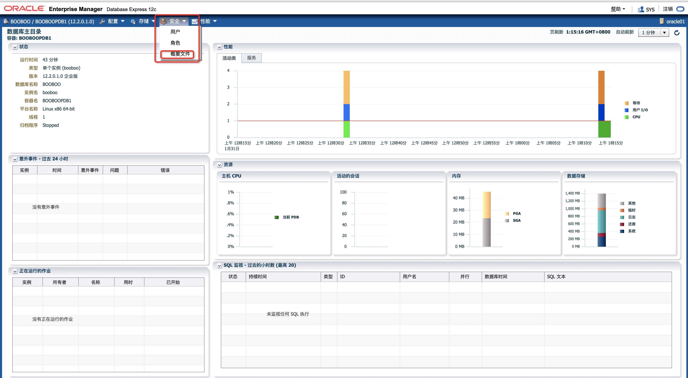
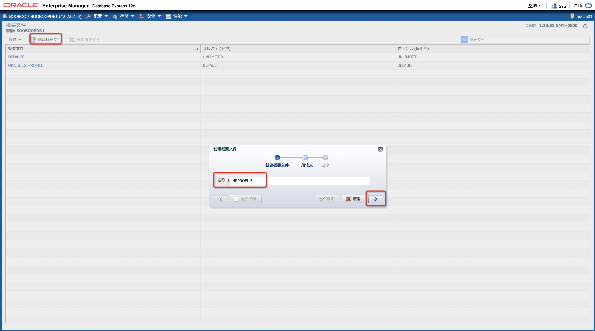
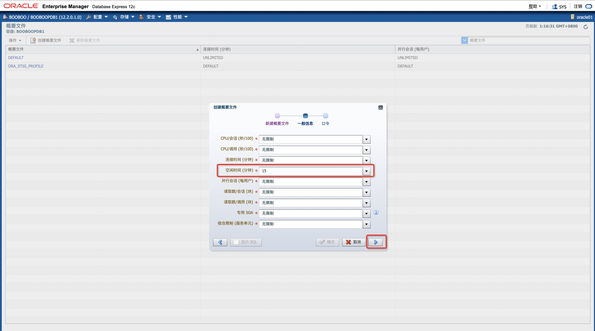
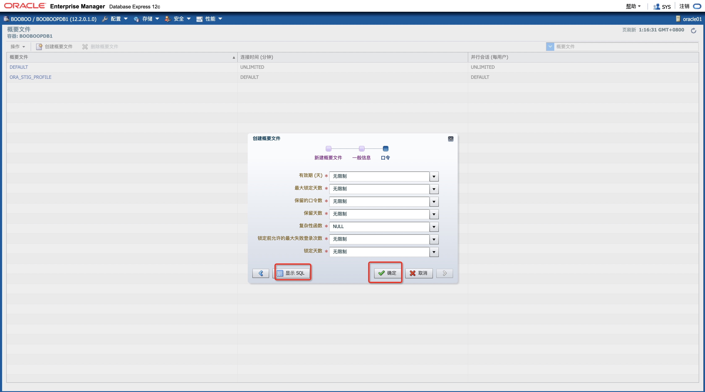
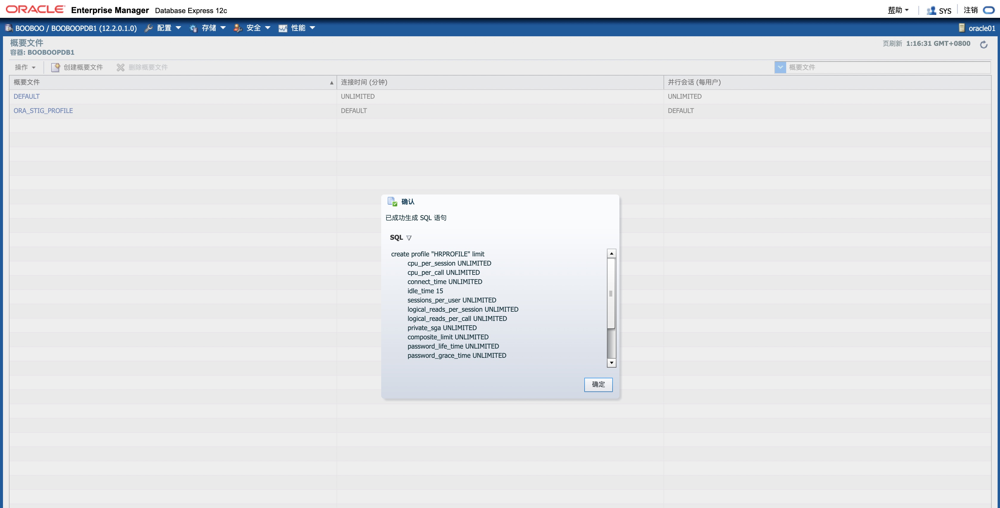
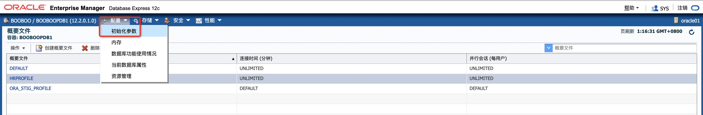
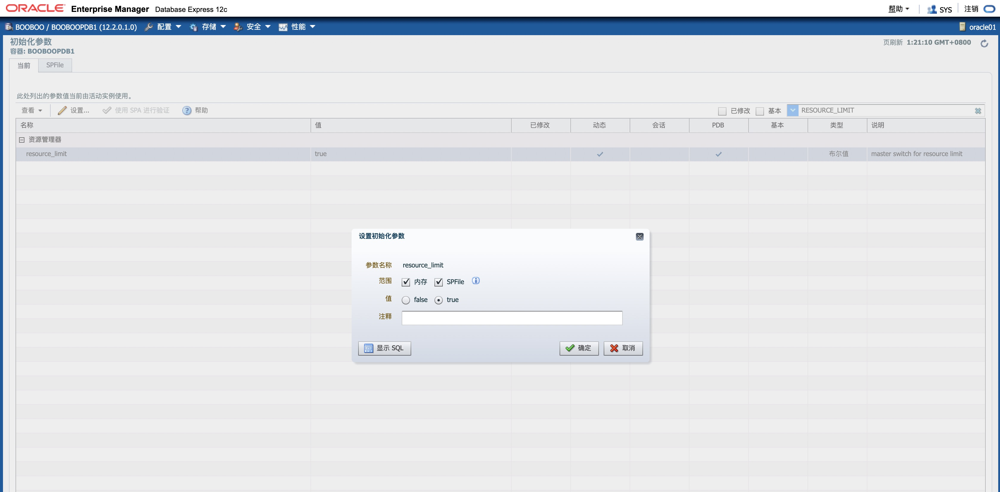

# 实践6:管理用户

> **Practices for Lesson 6: Administering User**
>
> 2020.01.29 BoobooWei

<!-- MDTOC maxdepth:6 firsth1:1 numbering:0 flatten:0 bullets:0 updateOnSave:1 -->

[实践6:管理用户](#实践6管理用户)   
&emsp;[实践6:概览](#实践6概览)   
&emsp;[实践6-1:创建用户和配置文件](#实践6-1创建用户和配置文件)   
&emsp;&emsp;[Overview](#overview)   
&emsp;&emsp;[Task](#task)   
&emsp;&emsp;[Practice](#practice)   
&emsp;&emsp;[KnowledgePoint](#knowledgepoint)   
&emsp;[实践6-2:创建角色](#实践6-2创建角色)   
&emsp;&emsp;[Overview](#overview)   
&emsp;&emsp;[Task](#task)   
&emsp;&emsp;[Practice](#practice)   
&emsp;&emsp;[KnowledgePoint](#knowledgepoint)   
&emsp;[实践6-3:创建和配置用户](#实践6-3创建和配置用户)   
&emsp;&emsp;[Overview](#overview)   
&emsp;&emsp;[Task](#task)   
&emsp;&emsp;[Practice](#practice)   
&emsp;&emsp;[KnowledgePoint](#knowledgepoint)   
&emsp;&emsp;&emsp;[EM Express 创建和管理用户帐户](#em-express-创建和管理用户帐户)   
&emsp;&emsp;&emsp;[数据库安全指南](#数据库安全指南)   

<!-- /MDTOC -->


## 实践6:概览

Practices for Lesson 6: Overview

Background: You need to create a user account for Jenny Goodman, the new human resources department manager. There are also two new clerks in the human resources department, David Hamby and Rachel Pandya. All three must be able to log in to the orcl database and to select data from, and update records in, all the HR schema tables. The manager also needs to be able to insert and delete new HR records. Ensure that if the new users forget to log out at the end of the day, they are automatically logged out after 15 minutes. You also need to create a new user account for the inventory application that you are installing.

背景:

1.您需要为以下人员创建用户帐户：
  * 新上任的人力资源部经理 Jenny Goodman
  * 人力资源部两位新职员 David Hamby 和 Rachel Pandya

  权限如下：
  * 所有人能够登录到数据库
  * 所有人能访问 HR schema中的所有表，并有更新权限
  * 经理需要能够插入和删除新的HR记录
  * 如果新用户在一天结束时忘记登出，他们将在15分钟后自动登出。

2.您还需要为正在安装的inventory应用程序创建一个新的用户帐户。

## 实践6-1:创建用户和配置文件

Practice 6-1: Creating a User and a Profile

### Overview

In this practice, you create the INVENTORY user to own the new Inventory application. You create a profile to limit the idle time of users. If a user is idle or forgets to log out after 15 minutes, the user session is ended.

### Task

1.	Mandatory task: Create the INVENTORY user with a password of oracle_4U.
2.  Create a profile named HRPROFILE that allows only 15 minutes idle time.
3.	Set the RESOURCE_LIMIT initialization parameter to TRUE so that your profile limits are enforced.

### Practice

1. 强制任务:创建用户 `INVENTORY` 密码 `oracle_4U`

  ```sql
  # sqlplus / as sysdba
  alter session set container=booboopdb1;
  create user inventory identified by oracle_4U
    default tablespace users
    quota unlimited on users;
  grant connect to inventory;  
  ```

2. 创建一个仅允许15分钟空闲时间的名为 `HRPROFILE` 的配置文件。

   访问  Enterprise Manager Database Express，使用**SYSDBA**用户身份登录，然后执行以下步骤:

   访问 http://localhsot:5505/em/login

   | **Step** | **Window/Page Description**         | **Choices or Values**                                        |
   | -------- | ----------------------------------- | ------------------------------------------------------------ |
   | a.       | EM Express                          | Select **Security** > **Profiles**                           |
   | b.       | Profiles                            | Select **Create Profile**.                                   |
   | c.       | Create Profile Dialog:  New Profile | Enter **HRPROFILE** in the Name  field. Click the **Next** icon                                                                       . |
   | d.       | Create Profile Dialog:  General     | Select **15** in  the Idle Time  (Minutes) menu. Leave all the other  fields set to the default  value of Unlimited.  Click the **Next** icon      . |
   | e.       | Create Profile Dialog:  Password    | Review the Password options. All should  be set to default  values of Unlimited or Null.  Click **Show SQL** to review the SQL command for this task. |
   | f.       | Confirmation                     | Click **OK**.         |
   | g.       | Create Profile Dialog:  Password | Click **OK**.         |
   | h.       | Confirmation                     | Click **OK**.         |


   

   

   

   

   

   

   


   ```sql
   create profile "HRPROFILE" limit
           cpu_per_session UNLIMITED
           cpu_per_call UNLIMITED
           connect_time UNLIMITED
           idle_time 15
           sessions_per_user UNLIMITED
           logical_reads_per_session UNLIMITED
           logical_reads_per_call UNLIMITED
           private_sga UNLIMITED
           composite_limit UNLIMITED
           password_life_time UNLIMITED
           password_grace_time UNLIMITED
           password_reuse_max UNLIMITED
           password_reuse_time UNLIMITED
           password_verify_function NULL
           failed_login_attempts UNLIMITED
           password_lock_time UNLIMITED;
   ```


3. 将 `RESOURCE_LIMIT` 初始化参数设置为 `TRUE` ，以便执行配置文件限制。

   | **Step** | **Window/Page Description**   | **Choices or Values**                                        |
   | -------- | ----------------------------- | ------------------------------------------------------------ |
   | a.       |                               | Select **Configuration** > **Initialization**  **Parameters** |
   | b.       | Initialization Parameters     | Enter **resource_limit** in the Name  field.                 |
   | c.       | Initialization Parameters     | Confirm that resource_limit is set to  **true**. If it is not set  to true, perform steps  d–f. |
   | d.       | Initialization Parameters     | Select **resource_limit**  Click **Set**.                    |
   | e.       | Set Initialization  Parameter | Set Value **true**. Click **OK**.                            |
   | f.       | Confirmation                  | Click **OK**.                                                |

   

   

   

   

	```sql
	alter system set "resource_limit"=true scope=both sid='*';
	```


### KnowledgePoint

[使用EM Express管理PDB](https://docs.oracle.com/en/database/oracle/oracle-database/19/admqs/managing-pdbs-with-em-express.html#GUID-24A7DC45-7A14-47A1-B14A-E1A7093CE6D9)


## 实践6-2:创建角色

Practice 6-2: Creating Roles

### Overview

In this practice, you create the HRCLERK and HRMANAGER roles that will be used in the next practice.

### Task

1.	Create the role named HRCLERK with SELECT and UPDATE permissions on all the HR schema tables.
2.	Create the role named HRMANAGER with INSERT and DELETE permissions on all the HR tables. Grant the HRCLERK role to the HRMANAGER role.

### Practice

在此实践中，您将创建将在下一个实践中使用的HRCLERK和HRMANAGER角色。
1. 创建角色 `HRCLERK` : 对 `HR schema` 有 `select` 和 `update` 权限。

  ```sql
  create role "HRCLERK" NOT IDENTIFIED;
    grant SELECT,UPDATE on "HR"."EMPLOYEES" to "HRCLERK";
    grant SELECT,UPDATE on "HR"."T02" to "HRCLERK";
    grant SELECT,UPDATE on "HR"."REGIONS" to "HRCLERK";
    grant SELECT,UPDATE on "HR"."LOCATIONS" to "HRCLERK";
    grant SELECT,UPDATE on "HR"."DEPARTMENTS" to "HRCLERK";
    grant SELECT,UPDATE on "HR"."JOBS" to "HRCLERK";
    grant SELECT,UPDATE on "HR"."COUNTRIES" to "HRCLERK";
    grant SELECT,UPDATE on "HR"."JOB_HISTORY" to "HRCLERK";
  ```

2. 创建角色 `HRMANAGER` : 对 `HR schema` 有 `insert` 和 `delete` 权限，并将角色 `HRCLERK` 授权给角色 `HRCLERK`。

  ```sql
  create role "HRMANAGER" NOT IDENTIFIED;
  grant INSERT,DELETE on "HR"."EMPLOYEES" to "HRMANAGER";
  grant INSERT,DELETE on "HR"."T02" to "HRMANAGER";
  grant INSERT,DELETE on "HR"."REGIONS" to "HRMANAGER";
  grant INSERT,DELETE on "HR"."LOCATIONS" to "HRMANAGER";
  grant INSERT,DELETE on "HR"."DEPARTMENTS" to "HRMANAGER";
  grant INSERT,DELETE on "HR"."JOBS" to "HRMANAGER";
  grant INSERT,DELETE on "HR"."COUNTRIES" to "HRMANAGER";
  grant INSERT,DELETE on "HR"."JOB_HISTORY" to "HRMANAGER";
  grant HRCLERK to "HRMANAGER";
  ```

### KnowledgePoint

使用图形化界面管理确实方便；

如果使用命令行，如何快速生成授权命令？

```sql
declare
cursor c1 is select owner,table_name from dba_tables where owner='HR';
v1 c1%rowtype;
n1 number(2);
username varchar(255) := 'HRCLERK';
p1 varchar(255) := 'select';
begin
for v1 in c1 loop
   dbms_output.put_line('grant '||p1||' on "' ||v1.owner||'"."'||v1.table_name||'" to "'||username||'" ;');
   n1:=c1%rowcount;
 end loop;
 /*dbms_output.put_line(n1);*/
 END;
 /
```

## 实践6-3:创建和配置用户

Practice 6-3: Creating and Configuring Users

### Overview

In this practice, you create the following users and assign appropriate profiles and roles to these users:

| **Name**      | **Username** | **Description**  |
| ------------- | ------------ | ---------------- |
| David Hamby   | DHAMBY       | A new HR Clerk   |
| Rachel Pandya | RPANDYA      | A new HR Clerk   |
| Jenny Goodman | JGOODMAN     | A new HR Manager |

### Task

1. Create an account for David Hamby, a new HR clerk.

2. Create an account for Rachel Pandya, another new HR clerk. Modify the `P6script.sql` script to create the RPANDYA user.

3. Create an account for Jenny Goodman, the new HR manager. Modify the `P6script.sql` script to take parameters for the username and role. Execute the script to create the **JGOODMAN** user with the **HRMANAGER** role.

4. Test the new users in SQL*Plus. Connect to the orcl database as the DHAMBY user. Use **oracle_4U** as the new password. Select the row with **EMPLOYEE_ID=197** from the **HR.EMPLOYEES** table. Then attempt to delete it. You should get the “insufficient privileges” error.

5. Repeat the test as the **J****GOODMAN** user. Use **oracle_4U** as the new password. After deleting the row, issue a rollback, so that you still have the original 107 rows.

6. Use SQL*Plus to connect to the **orcl** database as the **RPANDYA** user. Change the password to **oracle_4U**. (You must change the password, because this is the first connection as RPANDYA.) Leave RPANDYA connected during the next lesson or at the end of the day. HRPROFILE specifies that users whose sessions are inactive for more than 15 minutes will automatically be logged out. Verify that the user was automatically logged out by trying to select from the **HR.EMPLOYEES** table again.


### Practice

在此实践中，您将创建以下用户并为这些用户分配适当的配置文件和角色:

| **姓名**      | **用户名** | **描述**         |
| ------------- | ---------- | ---------------- |
| David Hamby   | DHAMBY     | A new HR Clerk   |
| Rachel Pandya | RPANDYA    | A new HR Clerk   |
| Jenny Goodman | JGOODMAN   | A new HR Manager |

1. 使用EM，为David Hamby，一个新的人力资源职员创建一个帐户。

   | **Step** | **Window/Page Description**            | **Choices or Values**                                        |
   | -------- | -------------------------------------- | ------------------------------------------------------------ |
   | a.       | EM Express                             | Select **Security** > **Users**                              |
   | b.       | Users                                  | Click **Create User**.                                       |
   | c.       | Create User: User  Account             | Name: **DHAMBY**  Authentication: Select **Password**  Password: **newuser**  Profile: **HRPROFILE** Select **Password expired**  Click the **Next** icon.  **Note:** This user will  have to change  the password. |
   | d.       | Create User: Tablespace                | Verify  Default Tablespace: **USERS** Temporary Tablespace: **TEMP** Click the **Next** icon. |
   | e.       | Create User: Privilege                 | Select **Connect** and move it to the right  pane. Click **Show SQL**. |
   | f.       | Confirmation                           | Click **OK**.                                                |
   | g.       | Create User: Privilege                 | Select **HRCLERK**  and move it to the right  pane. Hint: Enter HR in the search/filter box.  Click **Show SQL**. |
   | h.       | Confirmation                           | Copy and paste the  SQL statements into  a gedit window.     |
   | i.       | Linux Desktop  (see screenshot  below) | Click **Applications**  > **Accessories** > **gedit Text**  **Editor**  In gedit, click  **File** > **Save as**  Enter **P6script.sql** as the file  name.  Save in the default location of **/home/oracle**. Click **Save**.  Click **File** > **Quit** |
   | j.       | Confirmation                | Click **OK**.         |
   | k.       | Create User: Privilege      | Click **OK**.         |
   | l.       | Confirmation                | Click **OK**.         |

   

   

   ```sql
   create user "DHAMBY" identified by "newuser"
   profile "HRPROFILE"
   password expire
   account unlock
   default tablespace  "USERS"
   temporary tablespace "TEMP";

   grant "CONNECT" to "DHAMBY";
   grant "HRCLERK" to "DHAMBY";
   ```


2. 通过SQL脚本``P6script.sql``为另一位新的人力资源职员Rachel Pandya创建一个账户`RPANDYA`。

```bash
  cat > /home/oracle/P6script.sql << ENDF
  create user "RPANDYA" identified by "newuser"
  profile "HRPROFILE"
  password expire
  account unlock
  default tablespace  "USERS"
  temporary tablespace "TEMP";

  grant "CONNECT" to "RPANDYA";
  grant "HRCLERK" to "RPANDYA";
  ENDF

  sqlplus sys/oracle@booboopdb1 as sysdba @/home/oracle/P6script.sql
  ```

  

3. 通过修改脚本`P6script.sql`为新上任的人力资源经理`JGOODMAN`开设一个账户，该脚本需要输入用户名和角色参数。执行脚本创建具有**HRMANAGER**角色的**JGOODMAN**用户。

  ```bash
  cat > /home/oracle/P6script.sql << ENDF
  create user "&&username" identified by "newuser"
  profile "HRPROFILE"
  password expire
  account unlock
  default tablespace  "USERS"
  temporary tablespace "TEMP";

  grant "CONNECT" to "&&username";
  grant "&&role" to "&&username";
  ENDF

  sqlplus sys/oracle@booboopdb1 as sysdba @/home/oracle/P6script.sql
  ```

  执行结果：

  ```sql
  [oracle@oracle01 ~]$ sqlplus sys/oracle@booboopdb1 as sysdba @/home/oracle/P6script.sql

  SQL*Plus: Release 12.2.0.1.0 Production on Fri Jan 31 03:01:10 2020

  Copyright (c) 1982, 2016, Oracle.  All rights reserved.


  Connected to:
  Oracle Database 12c Enterprise Edition Release 12.2.0.1.0 - 64bit Production

  Enter value for username: JGOODMAN
  old   1: create user "&&username" identified by "newuser"
  new   1: create user "JGOODMAN" identified by "newuser"

  User created.

  old   1: grant "CONNECT" to "&&username"
  new   1: grant "CONNECT" to "JGOODMAN"

  Grant succeeded.

  Enter value for role: HRMANAGER
  old   1: grant "&&role" to "&&username"
  new   1: grant "HRMANAGER" to "JGOODMAN"

  Grant succeeded.

  SYS@booboopdb1>exit
  Disconnected from Oracle Database 12c Enterprise Edition Release 12.2.0.1.0 - 64bit Production
  ```

  

4. 在SQL * Plus 中测试新用户，使用 DHAMBY 用户连接到数据库，使用**oracle_4U**作为新密码尝试从`"HR"."EMPLOYEES"`中选择具有`EMPLOYEE_ID=197`的行，然后尝试删除它。您应该得到“权限不足“错误。

   ```sql
   [oracle@oracle01 ~]$ sqlplus DHAMBY/newuser@booboopdb1

   SQL*Plus: Release 12.2.0.1.0 Production on Fri Jan 31 03:08:01 2020

   Copyright (c) 1982, 2016, Oracle.  All rights reserved.

   ERROR:
   ORA-28001: the password has expired


   Changing password for DHAMBY
   New password:
   Retype new password:
   Password changed

   Connected to:
   Oracle Database 12c Enterprise Edition Release 12.2.0.1.0 - 64bit Production

   DHAMBY@booboopdb1>select * from tab;

   no rows selected

   DHAMBY@booboopdb1>select * from hr.EMPLOYEES where EMPLOYEE_ID=197;

   EMPLOYEE_ID FIRST_NAME		 LAST_NAME		   EMAIL
   ----------- -------------------- ------------------------- -------------------------
   PHONE_NUMBER	     HIRE_DATE JOB_ID	      SALARY COMMISSION_PCT MANAGER_ID DEPARTMENT_ID
   -------------------- --------- ---------- ---------- -------------- ---------- -------------
   	197 Kevin		 Feeney 		   KFEENEY
   650.507.9822	     23-MAY-06 SH_CLERK 	3000			   124		  50


   DHAMBY@booboopdb1>delete from hr.EMPLOYEES where EMPLOYEE_ID=197;
   delete from hr.EMPLOYEES where EMPLOYEE_ID=197
                  *
   ERROR at line 1:
   ORA-01031: insufficient privileges
   ```


5. 在SQL * Plus 中测试新用户，使用 JGOODMAN 用户连接到数据库，使用**oracle_4U**作为新密码尝试从`"HR"."EMPLOYEES"`中选择具有`EMPLOYEE_ID=197`的行，然后尝试删除它，删除行后，执行回滚，以便您仍然保留原来的107行。

   ```sql
   [oracle@oracle01 ~]$ sqlplus JGOODMAN/newuser@booboopdb1

   SQL*Plus: Release 12.2.0.1.0 Production on Fri Jan 31 03:11:29 2020

   Copyright (c) 1982, 2016, Oracle.  All rights reserved.

   ERROR:
   ORA-28001: the password has expired


   Changing password for JGOODMAN
   New password:
   Retype new password:
   Password changed

   Connected to:
   Oracle Database 12c Enterprise Edition Release 12.2.0.1.0 - 64bit Production

   JGOODMAN@booboopdb1>select * from hr.EMPLOYEES where EMPLOYEE_ID=197;

   EMPLOYEE_ID FIRST_NAME		 LAST_NAME		   EMAIL
   ----------- -------------------- ------------------------- -------------------------
   PHONE_NUMBER	     HIRE_DATE JOB_ID	      SALARY COMMISSION_PCT MANAGER_ID DEPARTMENT_ID
   -------------------- --------- ---------- ---------- -------------- ---------- -------------
   	197 Kevin		 Feeney 		   KFEENEY
   650.507.9822	     23-MAY-06 SH_CLERK 	3000			   124		  50


   JGOODMAN@booboopdb1>delete from hr.EMPLOYEES where EMPLOYEE_ID=197;

   1 row deleted.

   JGOODMAN@booboopdb1>select * from hr.EMPLOYEES where EMPLOYEE_ID=197;

   no rows selected

   JGOODMAN@booboopdb1>rollback;

   Rollback complete.

   JGOODMAN@booboopdb1>select * from hr.EMPLOYEES where EMPLOYEE_ID=197;

   EMPLOYEE_ID FIRST_NAME		 LAST_NAME		   EMAIL
   ----------- -------------------- ------------------------- -------------------------
   PHONE_NUMBER	     HIRE_DATE JOB_ID	      SALARY COMMISSION_PCT MANAGER_ID DEPARTMENT_ID
   -------------------- --------- ---------- ---------- -------------- ---------- -------------
   	197 Kevin		 Feeney 		   KFEENEY
   650.507.9822	     23-MAY-06 SH_CLERK 	3000			   124		  50
   ```


6. 在SQL * Plus 中测试新用户，使用 RPANDYA 用户连接到数据库，使用**oracle_4U**作为新密码。验证概要文件配置中的空闲时间15分钟的含义。

   HRPROFILE指定会话不活动超过15分钟的用户将自动注销。

   ```sql
   [oracle@oracle01 ~]$ sqlplus RPANDYA/newuser@booboopdb1

   SQL*Plus: Release 12.2.0.1.0 Production on Fri Jan 31 03:18:08 2020

   Copyright (c) 1982, 2016, Oracle.  All rights reserved.

   ERROR:
   ORA-28001: the password has expired


   Changing password for RPANDYA
   New password:
   Retype new password:
   Password changed

   Connected to:
   Oracle Database 12c Enterprise Edition Release 12.2.0.1.0 - 64bit Production

   RPANDYA@booboopdb1>SELECT salary FROM hr.employees WHERE EMPLOYEE_ID=197;

       SALARY
   ----------
         3000

   RPANDYA@booboopdb1>select to_char(sysdate,'YYYY-MM-DD HH:mm:ss') from dual;

   TO_CHAR(SYSDATE,'YY
   -------------------
   2020-01-31 03:01:42

   --等待15分钟
   RPANDYA@booboopdb1>SELECT salary FROM hr.employees WHERE EMPLOYEE_ID=197;
   ERROR at line 1:
   ORA-02396: exceeded maximum idle time, please connect again

   ```


### KnowledgePoint

#### EM Express 创建和管理用户帐户

[管理用户帐户和安全性](https://docs.oracle.com/en/database/oracle/oracle-database/19/admqs/administering-user-accounts-and-security.html#GUID-7FC1D8BE-4BB9-4642-A4CE-29CD2B8A5F23)

如何使用Oracle Enterprise Manager Database Express（EM Express）创建和管理用户帐户。它包含以下部分：

- [关于用户帐户](https://docs.oracle.com/en/database/oracle/oracle-database/19/admqs/administering-user-accounts-and-security.html#GUID-434BA586-DDFC-4C37-B442-C9348C2853AE)
- [关于用户权限和角色](https://docs.oracle.com/en/database/oracle/oracle-database/19/admqs/administering-user-accounts-and-security.html#GUID-289A4BF6-F703-4ED5-8357-89F651A6D1DE)
- [关于行政帐户和特权](https://docs.oracle.com/en/database/oracle/oracle-database/19/admqs/administering-user-accounts-and-security.html#GUID-3C78F89D-3616-48FA-B2B8-CE6988D78939)
- [管理角色](https://docs.oracle.com/en/database/oracle/oracle-database/19/admqs/administering-user-accounts-and-security.html#GUID-3E6BB467-5BCC-4757-A3FC-B38644B20CD7)
- [管理数据库用户帐户](https://docs.oracle.com/en/database/oracle/oracle-database/19/admqs/administering-user-accounts-and-security.html#GUID-190C93F1-B4CD-4E88-836F-CCD79AA910CD)
- [设置数据库密码策略](https://docs.oracle.com/en/database/oracle/oracle-database/19/admqs/administering-user-accounts-and-security.html#GUID-8A884463-CD5E-4344-849E-59730E6AB5AF)
- [管理用户帐户和安全性：Oracle示例系列](https://docs.oracle.com/en/database/oracle/oracle-database/19/admqs/administering-user-accounts-and-security.html#GUID-09F303AD-4869-47B1-9264-24A14979FF8E)

#### 数据库安全指南

[数据库安全指南](https://docs.oracle.com/en/database/oracle/oracle-database/12.2/dbseg/release-changes.html#GUID-256DEEBF-8FBE-4641-BAE3-D23D53ADFB44)
