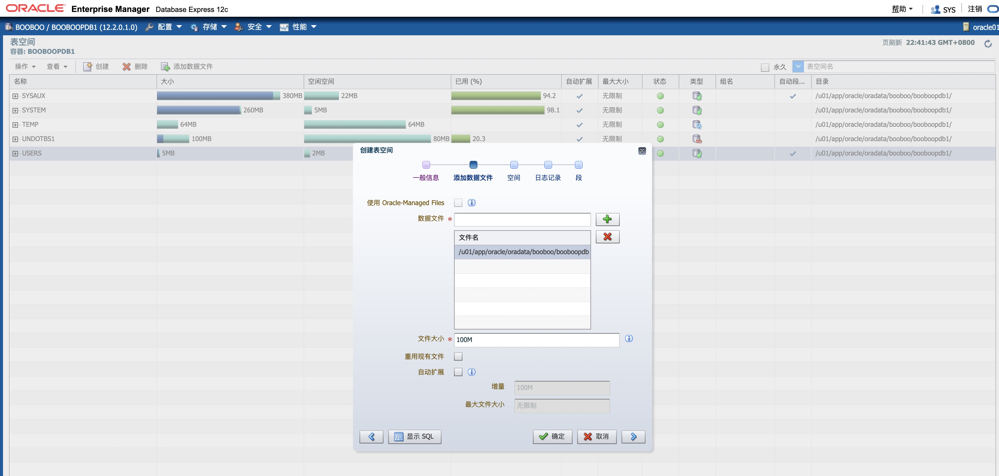
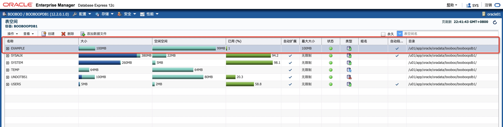
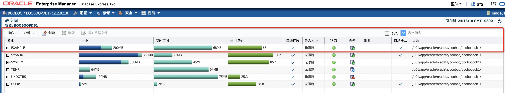
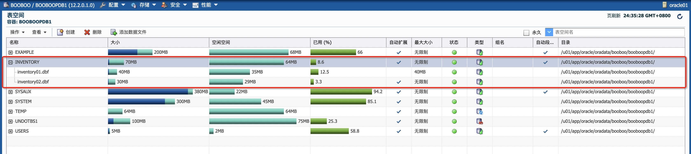

# 实践7:管理存储

> **Practices for Lesson 7: Managing Database Storage Structures**
>
> 2020.01.29 BoobooWei

<!-- MDTOC maxdepth:6 firsth1:1 numbering:0 flatten:0 bullets:0 updateOnSave:1 -->

[实践7:管理存储](#实践7管理存储)   
&emsp;[实践7:概览](#实践7概览)   
&emsp;[实践7-1:查看数据库存储结构信息](#实践7-1查看数据库存储结构信息)   
&emsp;&emsp;[Overview](#overview)   
&emsp;&emsp;[Task](#task)   
&emsp;&emsp;[Practice](#practice)   
&emsp;&emsp;&emsp;[问题1:**EXAMPLE**表空间几乎满了。在不采取任何操作的情况下，表空间的大小是否可以增加](#问题1example表空间几乎满了。在不采取任何操作的情况下，表空间的大小是否可以增加)   
&emsp;&emsp;&emsp;[问题2:**EXAMPLE**表空间中有多少段？](#问题2example表空间中有多少段？)   
&emsp;&emsp;&emsp;[问题3:**EXAMPLE**表空间中，哪个索引占用了最多的空间?](#问题3example表空间中，哪个索引占用了最多的空间)   
&emsp;&emsp;[KnowledgePoint](#knowledgepoint)   
&emsp;[实践7-2:创建一个表空间](#实践7-2创建一个表空间)   
&emsp;&emsp;[Overview](#overview)   
&emsp;&emsp;[Task](#task)   
&emsp;&emsp;[Practice](#practice)   
&emsp;&emsp;[KnowledgePoint](#knowledgepoint)   

<!-- /MDTOC -->

 ## 实践7:概览

Practices for Lesson 7: Overview

You need to view existing storage structure information and create a new tablespace for the INVENTORY application. You also need to create a database user to perform all administrative tasks without using the SYS and SYSTEM accounts.

您需要查看现有的存储结构信息，并为INVENTORY应用程序创建一个新的表空间。您还需要创建一个数据库用户来执行所有管理任务，而不需要使用SYS和SYSTEM帐户。

## 实践7-1:查看数据库存储结构信息

Practice 7-1: Viewing Database Storage Structure Information

### Overview

In this practice, you examine existing storage structure information for your database.

**Assumptions:** The lab_03_03_01.sh script has already been executed to create a user named DBA1 in the database. This user has SYSDBA privileges.

 在这个实践中，您将检查数据库的现有存储结构信息。

假设:`lab_03_03_01.sh`脚本已经执行，以便在PDB数据库中创建一个名为`DBA1`的用户。该用户具有`SYSDBA`特权。

```bash
[oracle@oracle01 labs]$ pwd
/home/oracle/labs
[oracle@oracle01 labs]$ ll
总用量 24
-rw-r--r-- 1 oracle oinstall  237 1月  31 22:04 course_env.sh
-rw-r--r-- 1 oracle oinstall  366 11月  2 2012 lab_headr.sh
-rw-r--r-- 1 oracle oinstall  959 11月  5 2012 lab.sh
drwxr-xr-x 2 oracle oinstall   54 11月  6 2014 P15
drwxr-xr-x 2 oracle oinstall  129 1月  31 2013 P16
drwxr-xr-x 2 oracle oinstall  191 1月  28 2013 P17
drwxr-xr-x 2 oracle oinstall 4096 2月   1 2013 P18
drwxr-xr-x 2 oracle oinstall  306 1月  22 2013 P19
drwxr-xr-x 2 oracle oinstall   90 2月   1 2013 P20
drwxr-xr-x 2 oracle oinstall   69 1月  22 2013 P21
drwxr-xr-x 2 oracle oinstall   77 1月  18 2013 P3
drwxr-xr-x 2 oracle oinstall   54 1月  18 2013 P7
drwxr-xr-x 2 oracle oinstall   60 1月  14 2013 P8
-rw-r--r-- 1 oracle oinstall   58 1月  31 22:06 set_db.sh
-rw-r--r-- 1 oracle oinstall 2618 11月 20 2012 wkfctrfunc
[oracle@oracle01 labs]$ cat course_env.sh
export LABS=/home/oracle/labs
export DB1=booboo
export LOGS=/home/oracle/labs/ALCA/logs
export SOLN=/home/oracle/labs/solns
export CODE_EX=/home/oracle/labs/code_ex
export DEMO=/home/oracle/labs/demo
export SETUP=/home/oracle/labssetup

[oracle@oracle01 labs]$ head -n 15 lab.sh
#!/bin/bash
# Oracle Database 12c: Administration Workshop
# Oracle Server Technologies - Curriculum Development
#
# ***Training purposes only***
#***Not appropriate for production use***
#
# calls a script that
# that runs a sql script
# Usage: $LABS/lab.sh lab_number
# Example: $LABS/lab.sh $LABS/P3/lab_03_01_02

[oracle@oracle01 labs]$ mkdir -p /home/oracle/labs/ALCA/logs
[oracle@oracle01 labs]$ mkdir -p /home/oracle/labs/solns
[oracle@oracle01 labs]$ mkdir -p /home/oracle/labs/code_ex
[oracle@oracle01 labs]$ mkdir -p /home/oracle/labs/demo
[oracle@oracle01 labs]$ mkdir -p /home/oracle/labssetup

[oracle@oracle01 labs]$ find ./ -name '*.sh' -exec chmod a+x {} \;
[oracle@oracle01 labs]$ source course_env.sh
[oracle@oracle01 labs]$ echo $LABS
/home/oracle/labs
[oracle@oracle01 labs]$ ll P3/
总用量 12
-rw-r--r-- 1 oracle oinstall 832 1月  10 2013 lab_03_03_01.sh
-rw-r--r-- 1 oracle oinstall 852 1月  10 2013 lab_03_03_01.sql
-rw-r--r-- 1 oracle oinstall 300 5月   6 2018 lab_03_03_02.sql

[oracle@oracle01 labs]$ $LABS/lab.sh $LABS/P3/lab_03_03_01
/home/oracle/labs/P3/lab_03_03_01:
	dir  = "/home/oracle/labs/P3/"
	base = "lab_03_03_01"
	ext  = ""
sqlplus -S /nolog @/home/oracle/labs/P3//lab_03_03_01.sql

[oracle@oracle01 labs]$ sqlplus -S /nolog @/home/oracle/labs/P3//lab_03_03_01.sql
Enter value for 1: dba1
Enter value for 1:
completed. You may now login as:
dba1/oracle_4U

sqlplus dba1/oracle_4U@booboopdb1 as sysdba
Connected.
SYS@booboopdb1>show pdbs

    CON_ID CON_NAME			  OPEN MODE  RESTRICTED
---------- ------------------------------ ---------- ----------
	 3 BOOBOOPDB1			  READ WRITE NO
```

这里注意，根据自己的实际情况去修改环境变量中的值，以及脚本。

### Task

1. Launch Enterprise Manager Cloud Control and log in as ADMIN.

2. Navigate to the orcl Database Home page.
3. The orcl Database Home page appears.
4. Using Cloud Control, view information about the **EXAMPLE** tablespace and answer the given questions.

*Question 1: The* *EXAMPLE* *tablespace is nearly full. Can the tablespace size increase without you having to take any action?*

*Question 2: How many segments are there in the* *EXAMPLE* *tablespace?*

*Question 3: Which index in the* *EXAMPLE* *tablespace takes up the most space?*

### Practice

任务要求使用云管理器，此处我们修改为使用EM。

1. 登陆到EM中，访问PDB数据库。

2. 创建实验用的表空间`EXAMLE`。

   

   

   ```sql
   CREATE SMALLFILE TABLESPACE "EXAMPLE"
    DATAFILE
    '/u01/app/oracle/oradata/booboo/booboopdb1/example.dbf' SIZE 100M AUTOEXTEND OFF
    LOGGING
    DEFAULT NOCOMPRESS NO INMEMORY
    ONLINE
    EXTENT MANAGEMENT LOCAL AUTOALLOCATE
    SEGMENT SPACE MANAGEMENT AUTO;
   ```

   

3. 创建使用用的表，将该表空间已使用占比超过95%。

   ```sql
   SCOTT@booboopdb1>conn dba1/oracle_4U@booboopdb1 as sysdba;

   CREATE TABLE SCOTT.test
      (    EMPNO NUMBER(4,0),
       ENAME VARCHAR2(10),
       JOB VARCHAR2(9),
       MGR NUMBER(4,0),
       HIREDATE DATE,
       SAL NUMBER(7,2),
       COMM NUMBER(7,2),
       DEPTNO NUMBER(2,0)
       )
   TABLESPACE example;

   insert into scott.test select * from  scott.emp;
   insert into scott.test select * from  scott.test;
   --重复上一条16次
   SYS@booboopdb1>select count(*) from scott.test;

     COUNT(*)
   ----------
      2228224
   ```

4. 使用EM，查看关于**EXAMPLE**表空间的信息，并回答给出的问题。

   

#### 问题1:**EXAMPLE**表空间几乎满了。在不采取任何操作的情况下，表空间的大小是否可以增加

不会，因为创建时，我选择了不自动扩展。

#### 问题2:**EXAMPLE**表空间中有多少段？

```sql
YS@booboopdb1>select tablespace_name,count(*) from dba_segments where tablespace_name like '%EXAMPLE%' group by tablespace_name;

TABLESPACE_NAME 		 COUNT(*)
------------------------------ ----------
EXAMPLE 				1
SYS@booboopdb1>exec print_table(q'[select * from dba_segments where tablespace_name like '%EXAMPLE%']')
OWNER			      : SCOTT
SEGMENT_NAME		      : TEST
PARTITION_NAME		      :
SEGMENT_TYPE		      : TABLE
SEGMENT_SUBTYPE 	      : ASSM
TABLESPACE_NAME 	      : EXAMPLE
HEADER_FILE		      : 25
HEADER_BLOCK		      : 130
BYTES			      : 100663296
BLOCKS			      : 12288
EXTENTS 		      : 83
INITIAL_EXTENT		      : 65536
NEXT_EXTENT		      : 1048576
MIN_EXTENTS		      : 1
MAX_EXTENTS		      : 2147483645
MAX_SIZE		      : 2147483645
RETENTION		      :
MINRETENTION		      :
PCT_INCREASE		      :
FREELISTS		      :
FREELIST_GROUPS 	      :
RELATIVE_FNO		      : 25
BUFFER_POOL		      : DEFAULT
FLASH_CACHE		      : DEFAULT
CELL_FLASH_CACHE	      : DEFAULT
INMEMORY		      : DISABLED
INMEMORY_PRIORITY	      :
INMEMORY_DISTRIBUTE	      :
INMEMORY_DUPLICATE	      :
INMEMORY_COMPRESSION	      :
CELLMEMORY		      :
```


#### 问题3:**EXAMPLE**表空间中，哪个索引占用了最多的空间?

```sql
SYS@booboopdb1>create index idx_empno on scott.test (empno) TABLESPACE example;
create index idx_empno on scott.test (empno) TABLESPACE example
                                *
ERROR at line 1:
ORA-01652: unable to extend temp segment by 128 in tablespace EXAMPLE

--报错表空间不够了，将表空间设置为自动拓展。
ALTER DATABASE DATAFILE '/u01/app/oracle/oradata/booboo/booboopdb1/example.dbf' AUTOEXTEND ON NEXT 100M;

create index idx_empno on scott.test (empno) TABLESPACE example;
```




查询结果

```sql
SYS@booboopdb1>exec print_table(q'[select tablespace_name,segment_name ,sum(bytes)/1024/1024 from dba_segments where segment_type ='INDEX' and tablespace_name='EXAMPLE' group by tablespace_name,segment_name]')
TABLESPACE_NAME 	      : EXAMPLE
SEGMENT_NAME		      : IDX_EMPNO
SUM(BYTES)/1024/1024	      : 35
-----------------
```

### KnowledgePoint


```sql
表占用空间：
select segment_name, sum(bytes)/1024/1024 Mbytese from dba_segments where segment_type='TABLE' group by segment_name;

索引占用空间：
select segment_name ,sum(bytes)/1024/1024 from dba_segments where segment_type ='INDEX' group by segment_name;
指定表空间的索引占用空间：
select tablespace_name,segment_name ,sum(bytes)/1024/1024 from dba_segments where segment_type ='INDEX' and tablespace_name='EXAMPLE' group by tablespace_name,segment_name;


分区表TABLE PARTITION占用空间：
select segment_name,sum(bytes)/1024/1024 Mbytes from dba_segments where segment_type='TABLE PARTITION' group by segment_name;
```


## 实践7-2:创建一个表空间

Practice 7-2: Creating a Tablespace

### Overview

In this practice, you create a script to create the INVENTORY tablespace that will be used in a later practice.

### Task

1. Create a new locally managed tablespace (LMT) called **INVENTORY** of size **5 MB**
2. Execute the P7script.sql script you just created.
3. As the **DBA1** user, run the **lab_07_02_03.sql** script to create and populate a table (called X) in the INVENTORY tablespace. What error do you eventually see?
4. In Cloud Control, go to the Tablespaces page for the orcl database and increase the amount of space available for the **INVENTORY** tablespace. For educational purposes, you will accomplish this by using two different methods. First, increase the size of the current data file to **40 MB**. Then, add a second data file by using file system storage. This second data file should be **30 MB** in size. For both techniques, use the show SQL functionality to view the supporting SQL statements.
5. Log out of Enterprise Manager Cloud Control.
6. Go back to the terminal window and run the **lab_07_02_03.sql** script again. It drops the table and re-executes the original script that previously returned the space error.
7. In a terminal window, run the **$LABS/P7/lab_07_02_06.sql** script in SQL*Plus as the **dba1** user to clean up the tablespace for later practice sessions.

### Practice

在这个实践中，您将通过创建一个脚本来创建INVENTORY表空间，该脚本将在以后的实践中使用。

1. 创建一个新的本地管理表空间(LMT)，名为`INVENTORY`大小`5MB`。

   ```sql
   cat > /home/oracle/labs/P7script.sql << ENDF
   CREATE SMALLFILE TABLESPACE "INVENTORY"
    DATAFILE
    '/u01/app/oracle/oradata/booboo/booboopdb1/inventory01.dbf' SIZE 5M AUTOEXTEND OFF
    LOGGING
    DEFAULT NOCOMPRESS NO INMEMORY
    ONLINE
    EXTENT MANAGEMENT LOCAL AUTOALLOCATE
    SEGMENT SPACE MANAGEMENT AUTO;
   ENDF
   ```

2. 创建一个名为`P7script.sql`的脚本文件，并执行。

   ```bash
   sqlplus dba1/oracle_4U@booboopdb1 as sysdba @/home/oracle/labs/P7script.sql
   ```

3. 使用`DBA1`用户登陆并运行`lab_07_02_03.sql`，在`INVENTORY`表空间中创建和填充表`X`，你将看到什么报错？

   ```bash
   sqlplus dba1/oracle_4U@booboopdb1 as sysdba @/home/oracle/labs/P7/lab_07_02_03.sql
   ```

   运行结果：

   ```sql
   [oracle@oracle01 labs]$ sqlplus dba1/oracle_4U@booboopdb1 as sysdba @/home/oracle/labs/P7/lab_07_02_03.sql

   SQL*Plus: Release 12.2.0.1.0 Production on Sat Feb 1 00:34:47 2020

   Copyright (c) 1982, 2016, Oracle.  All rights reserved.


   Connected to:
   Oracle Database 12c Enterprise Edition Release 12.2.0.1.0 - 64bit Production


   PL/SQL procedure successfully completed.

   SYS@booboopdb1>CREATE TABLE x
     2    (a CHAR(1000)
     3    ) TABLESPACE inventory;

   Table created.

   SYS@booboopdb1>INSERT INTO x
     2    VALUES ('a');

   1 row created.

   SYS@booboopdb1>INSERT INTO x
     2  SELECT * FROM x;

   1 row created.

   SYS@booboopdb1>INSERT INTO x
     2  SELECT * FROM x;

   2 rows created.

   SYS@booboopdb1>INSERT INTO x
     2  SELECT * FROM x;

   4 rows created.

   SYS@booboopdb1>INSERT INTO x
     2  SELECT * FROM x ;

   8 rows created.

   SYS@booboopdb1>INSERT INTO x
     2  SELECT * FROM x ;

   16 rows created.

   SYS@booboopdb1>INSERT INTO x
     2  SELECT * FROM x ;

   32 rows created.

   SYS@booboopdb1>INSERT INTO x
     2  SELECT * FROM x ;

   64 rows created.

   SYS@booboopdb1>INSERT INTO x
     2  SELECT * FROM x ;

   128 rows created.

   SYS@booboopdb1>INSERT INTO x
     2  SELECT * FROM x ;

   256 rows created.

   SYS@booboopdb1>INSERT INTO x
     2  SELECT * FROM x ;

   512 rows created.

   SYS@booboopdb1>INSERT INTO x
     2  SELECT * FROM x ;

   1024 rows created.

   SYS@booboopdb1>INSERT INTO x
     2  SELECT * FROM x ;
   INSERT INTO x
   *
   ERROR at line 1:
   ORA-01653: unable to extend table SYS.X by 128 in tablespace INVENTORY


   SYS@booboopdb1>COMMIT;

   Commit complete.

   SYS@booboopdb1>quit
   Disconnected from Oracle Database 12c Enterprise Edition Release 12.2.0.1.0 - 64bit Production
   ```


4. 您将使用两种不同的方法来完成此任务。1）将当前数据文件的大小增加到`40MB` ；2）使用添加第二个大小为`30MB`的数据文件。

   ```sql
   --将当前数据文件的大小增加到`40MB`
   ALTER DATABASE DATAFILE '/u01/app/oracle/oradata/booboo/booboopdb1/inventory01.dbf' RESIZE 40M;
   --使用添加第二个大小为`30MB`的数据文件
   ALTER TABLESPACE "INVENTORY" ADD DATAFILE '/u01/app/oracle/oradata/booboo/booboopdb1/inventory02.dbf' SIZE 30M AUTOEXTEND ON NEXT 100M;
   ```

   

5. 继续运行`lab_07_02_03.sql`，在`INVENTORY`表空间中创建和填充表`X`。

   ```sql
   [oracle@oracle01 labs]$ sqlplus dba1/oracle_4U@booboopdb1 as sysdba @/home/oracle/labs/P7/lab_07_02_03.sql

   SQL*Plus: Release 12.2.0.1.0 Production on Sat Feb 1 00:37:42 2020

   Copyright (c) 1982, 2016, Oracle.  All rights reserved.


   Connected to:
   Oracle Database 12c Enterprise Edition Release 12.2.0.1.0 - 64bit Production


   PL/SQL procedure successfully completed.

   SYS@booboopdb1>CREATE TABLE x
     2    (a CHAR(1000)
     3    ) TABLESPACE inventory;

   Table created.

   SYS@booboopdb1>INSERT INTO x
     2    VALUES ('a');

   1 row created.

   SYS@booboopdb1>INSERT INTO x
     2  SELECT * FROM x;

   1 row created.

   SYS@booboopdb1>INSERT INTO x
     2  SELECT * FROM x;

   2 rows created.

   SYS@booboopdb1>INSERT INTO x
     2  SELECT * FROM x;

   4 rows created.

   SYS@booboopdb1>INSERT INTO x
     2  SELECT * FROM x ;

   8 rows created.

   SYS@booboopdb1>INSERT INTO x
     2  SELECT * FROM x ;

   16 rows created.

   SYS@booboopdb1>INSERT INTO x
     2  SELECT * FROM x ;

   32 rows created.

   SYS@booboopdb1>INSERT INTO x
     2  SELECT * FROM x ;

   64 rows created.

   SYS@booboopdb1>INSERT INTO x
     2  SELECT * FROM x ;

   128 rows created.

   SYS@booboopdb1>INSERT INTO x
     2  SELECT * FROM x ;

   256 rows created.

   SYS@booboopdb1>INSERT INTO x
     2  SELECT * FROM x ;

   512 rows created.

   SYS@booboopdb1>INSERT INTO x
     2  SELECT * FROM x ;

   1024 rows created.

   SYS@booboopdb1>INSERT INTO x
     2  SELECT * FROM x ;

   2048 rows created.

   SYS@booboopdb1>COMMIT;

   Commit complete.

   SYS@booboopdb1>quit
   Disconnected from Oracle Database 12c Enterprise Edition Release 12.2.0.1.0 - 64bit Production
   ```


6. 使用`DBA1`用户登陆并运行`$LABS/P7/lab_07_02_06.sql`来清理表空间，方便以后的练习。

   ```bash
   [oracle@oracle01 labs]$ sqlplus dba1/oracle_4U@booboopdb1 as sysdba @/home/oracle/labs/P7/lab_07_02_06.sql
   SQL*Plus: Release 12.2.0.1.0 Production on Sat Feb 1 00:39:28 2020
   Copyright (c) 1982, 2016, Oracle.  All rights reserved.
   Connected to:
   Oracle Database 12c Enterprise Edition Release 12.2.0.1.0 - 64bit Production
   Table dropped.
   SYS@booboopdb1>exit
   Disconnected from Oracle Database 12c Enterprise Edition Release 12.2.0.1.0 - 64bit Production
   ```


### KnowledgePoint

[管理表空间](https://docs.oracle.com/en/database/oracle/oracle-database/12.2/admin/managing-tablespaces.html#GUID-1C162C60-6698-44F2-B2A9-F3E2D2958D88)

表空间是将相关逻辑结构分组在一起的数据库存储单元。数据库数据文件存储在表空间中。

- [管理表空间的](https://docs.oracle.com/en/database/oracle/oracle-database/12.2/admin/managing-tablespaces.html#GUID-5E395CA6-A7AF-4E05-B9C1-E85DE0EA235A)
  准则您可以遵循有关使用表空间的准则。
- [创建表空间](https://docs.oracle.com/en/database/oracle/oracle-database/12.2/admin/managing-tablespaces.html#GUID-9A3CE861-80FE-4813-B496-287B69A79C46)
  您可以创建一个表空间来将相关的逻辑结构（例如表和索引）组合在一起。数据库数据文件存储在表空间中。
- [考虑将表空间存储在内存中列存储中](https://docs.oracle.com/en/database/oracle/oracle-database/12.2/admin/managing-tablespaces.html#GUID-6880021F-F8C3-4DE5-AA62-8536186B7016)
  您可以在表空间创建过程中或通过更改表空间来为[内存中列存储](https://docs.oracle.com/en/database/oracle/oracle-database/12.2/admin/managing-tablespaces.html#GUID-6880021F-F8C3-4DE5-AA62-8536186B7016)启用表空间。当这为内存中列存储启用表空间时，默认情况下为该内存中列存储启用表空间中的所有表。
- [为表空间指定非标准块大小](https://docs.oracle.com/en/database/oracle/oracle-database/12.2/admin/managing-tablespaces.html#GUID-A789CECE-226C-4280-8BC4-39F064036965)
  您可以创建表空间，其表块大小不同于由`DB_BLOCK_SIZE`初始化参数指定的标准数据库块大小。此功能使您可以在数据库之间传输具有不同块大小的表空间。
- [控制重做记录的写入](https://docs.oracle.com/en/database/oracle/oracle-database/12.2/admin/managing-tablespaces.html#GUID-A1939693-60AC-4009-B37C-A1D8D1360D49)
  对于某些数据库操作，您可以控制数据库是否生成重做记录。
- [更改表空间可用性](https://docs.oracle.com/en/database/oracle/oracle-database/12.2/admin/managing-tablespaces.html#GUID-B1D83CF4-9404-4689-8716-A0E2918ACE91)
  您可以使联机表空间脱机，以使其暂时不可用以供一般使用。数据库的其余部分保持打开状态，可供用户访问数据。相反，您可以使脱机表空间联机，以使表空间中的模式对象可供数据库用户使用。必须打开数据库才能更改表空间的可用性。
- [使用只读表](https://docs.oracle.com/en/database/oracle/oracle-database/12.2/admin/managing-tablespaces.html#GUID-4E714569-F95D-4742-8CEF-3A12769C870F)
  空间可以将[表](https://docs.oracle.com/en/database/oracle/oracle-database/12.2/admin/managing-tablespaces.html#GUID-4E714569-F95D-4742-8CEF-3A12769C870F)空间置于只读模式。这样可以防止存储在其中的任何数据被更新。
- [更改和维护表空间](https://docs.oracle.com/en/database/oracle/oracle-database/12.2/admin/managing-tablespaces.html#GUID-C207AC96-0F99-4F05-B3DD-E4A4FA17F98C)
  您可以通过执行诸如添加数据文件和临时文件之类的任务来更改和维护表空间。
- [重命名表空间](https://docs.oracle.com/en/database/oracle/oracle-database/12.2/admin/managing-tablespaces.html#GUID-C0FEF3C9-3877-40F4-97C8-592A3BAEE522)
  使用的`RENAME TO`子句`ALTER TABLESPACE`，您可以重命名永久或临时表空间。
- [删除表空间](https://docs.oracle.com/en/database/oracle/oracle-database/12.2/admin/managing-tablespaces.html#GUID-4EB483A2-2E04-4047-8885-F5396876D0EB)
  如果不再需要表空间及其内容，则可以从数据库中[删除表](https://docs.oracle.com/en/database/oracle/oracle-database/12.2/admin/managing-tablespaces.html#GUID-4EB483A2-2E04-4047-8885-F5396876D0EB)空间及其内容（表空间中包含的段）。
- [管理SYSAUX表](https://docs.oracle.com/en/database/oracle/oracle-database/12.2/admin/managing-tablespaces.html#GUID-30942290-88DD-4D62-816F-F7EDCE661710)空间创建数据库时
  ，`SYSAUX`表空间已作为表空间的辅助表空间安装`SYSTEM`。以前创建并使用单独的表空间的某些数据库组件现在占用该`SYSAUX`表空间。
- [纠正本地管理的表空间的问题](https://docs.oracle.com/en/database/oracle/oracle-database/12.2/admin/managing-tablespaces.html#GUID-D6D25640-D278-4379-A502-6BCA3FC7C12D)
  Oracle数据库包括用于纠正本地管理的表空间的问题的辅助工具。
- [将SYSTEM表空间迁移到本地管理的表空间](https://docs.oracle.com/en/database/oracle/oracle-database/12.2/admin/managing-tablespaces.html#GUID-C961302C-E712-48C2-A938-2509DB4404ED)
  使用此`DBMS_SPACE_ADMIN.TABLESPACE_MIGRATE_TO_LOCAL`过程将`SYSTEM`表空间从字典管理的迁移到本地管理的表。
- [查看有关表空间的信息](https://docs.oracle.com/en/database/oracle/oracle-database/12.2/admin/managing-tablespaces.html#GUID-638D5411-5C88-40C8-A888-3D9B21A551D1)
  Oracle数据库包含数据字典视图，您可以查询有关表空间的信息。
