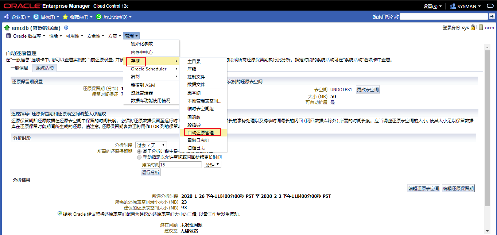
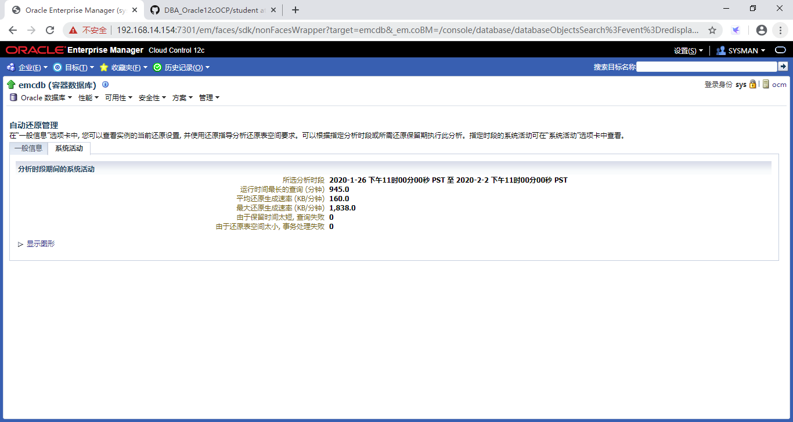
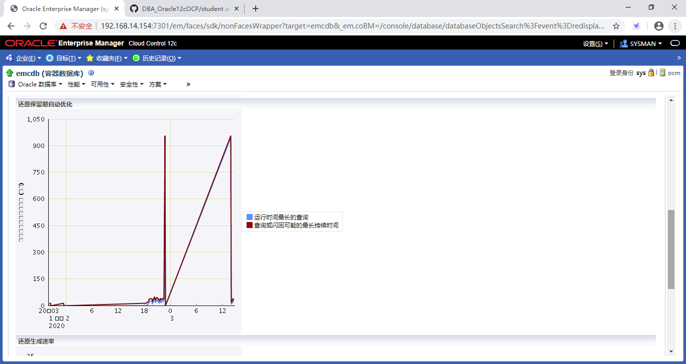
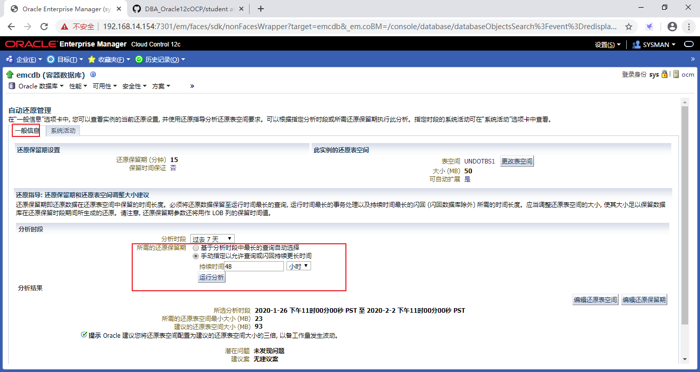
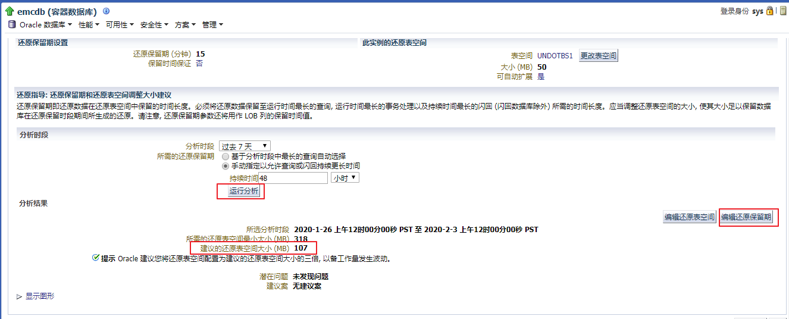
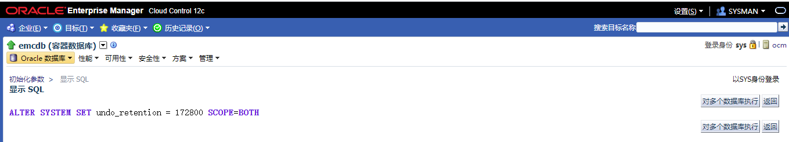
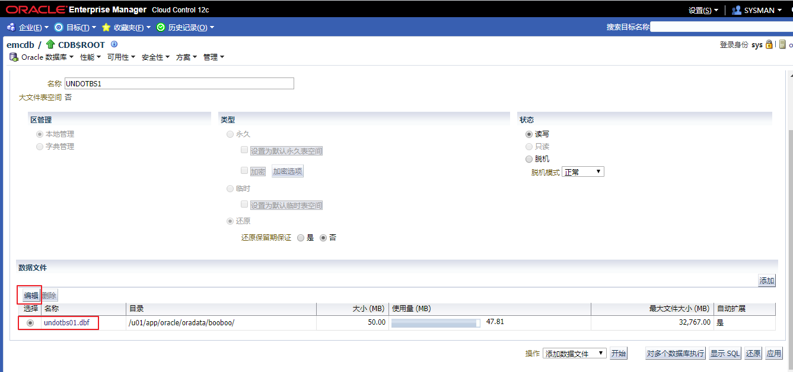

# 实践9:管理回滚

> **Practices for Lesson 9: Managing Undo Data**
>
> 2020.01.29 BoobooWei

<!-- MDTOC maxdepth:6 firsth1:1 numbering:0 flatten:0 bullets:1 updateOnSave:1 -->

- [实践9:管理回滚](#实践9管理回滚)   
   - [实践9:概览](#实践9概览)   
   - [实践9-1:管理Undo数据](#实践9-1管理undo数据)   
      - [Overview](#overview)   
      - [Task](#task)   
      - [Practice](#practice)   
      - [KnowledgePoint](#knowledgepoint)   
         - [配置数据库以支持48小时保留闪回操作](#配置数据库以支持48小时保留闪回操作)   
         - [如何估算Oracle数据库所需的UNDO表空间的大小](#如何估算oracle数据库所需的undo表空间的大小)   

<!-- /MDTOC -->

## 实践9:概览

Practices for Lesson 9: Overview

**Background:** The business users and management in your organization decide that they need to have 48-hour retention of undo in the Oracle database to support their flashback needs. Your task is to configure the orcl database to support this requirement.

背景:您的组织中的业务用户和管理层决定，他们需要在Oracle数据库中保留48小时的undo以支持他们的闪回需求。您的任务是配置数据库来支持这个需求。

## 实践9-1:管理Undo数据

Practice 9-1: Managing Undo Data

### Overview

In this practice, you first view your system activity regarding undo, and then you configure the orcl database to support 48-hour retention for flashback operations. Enterprise Manager Database Express enables you to change the undo tablespaces and perform undo analysis. For this practice you will use Oracle Enterprise Manager Cloud Control.

在这个实践中，使用Oracle Enterprise Manager Cloud Control

* 首先查看关于undo的系统活动

* 然后配置数据库以支持48小时保留闪回操作。

> Enterprise Manager Database Express也可以更改undo表空间并执行undo分析，但本实验要求使用Oracle Enterprise Manager Cloud Control

### Task

1. In Cloud Control, as the **ADMIN** user, navigate to the orcl database and view the undo related system activity.
2. Modify the undo retention time and calculate the undo tablespace size to support the requested 48-hour retention.
3. Go back to the **Automatic Undo Management** page to see the results of the changes that you just made. You see that the undo retention time has increased to support the 48 hours requirement. Your undo tablespace size has also increased based on the changes that you made to the size of the data file for the undo tablespace.

### Practice

> 由于练习过程中如果开启两个Linux服务器容易宕机，因此从这个练习开始不再使用booboopdb1，该用emrep。

1. 在`Cloud Control`中，登陆到`emrep`数据库并查看与撤消相关的系统活动。

   登陆后，选择 `管理 > 存储 > 自动还原管理`

   

   

   

   问题：看看前面的截图，这个系统遇到了多少错误?

   回答：没有。当undo表空间设置为auto-extend时，不应该有任何由于undo表空间错误而导致的失败事务。

   问题：看看前面的截图，运行时间最长的查询的持续时间是多长?

   回答：945 分钟。

   点击 `显示图形`

   

   

   

   问题：看看前面的Undo Retention自动调优图，这个系统能支持闪回吗?

   回答：是的，(但很可能不足以支持所需的48小时)。

2. 修改撤消保留时间并计算撤消表空间大小，以支持请求的48小时保留。

   选择 `一般信息 > 手动指定以允许查询或闪回持续更长时间 > 48小时`

   

   运行 `运行分析 > 编辑还原保留期`,更改`UNDO_RETENTION`值为 `172800` seconds.

   

   

   

   ```sql
   alter system set undo_retention = 172800 scope=both;
   ```

   选择`管理 > 存储 > 自动还原管理 > 编辑还原表空间`

   

   选择数据文件`undotbs01.dbf > 编辑`

   

   修改数据文件大小为推荐空间大小

   

3. 回到**自动撤销管理**页，查看您刚才所做更改的结果。您可以看到撤消保留时间已经增加，以支持48小时的要求。根据对undo表空间的数据文件大小的更改，undo表空间的大小也增加了。

   问题：哪些闪回操作可能会受到这个变化的影响?

   回答：闪回查询，闪回事务，闪回表。

   问题：数据库关闭后，撤消数据是否仍然存在?

   回答：是的，撤销是持久性的。

### KnowledgePoint

#### 配置数据库以支持48小时保留闪回操作

1. 修改参数`alter system set undo_retention = 172800 scope=both;`

2. 评估还原表空间大小并修改，这一步是否可以通过SQL实现？可以，和图形化界面一键分析相比较复杂。

#### 如何估算Oracle数据库所需的UNDO表空间的大小
How To Size UNDO Tablespace For Automatic Undo Management (文档 ID 262066.1)

[评估undo 表空间大小](https://blog.csdn.net/congjiu2607/article/details/100364186)
