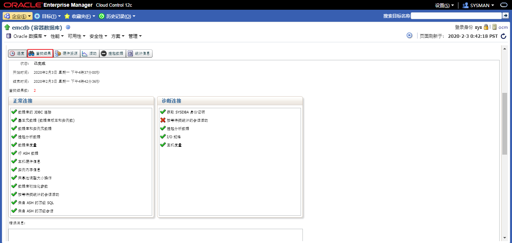
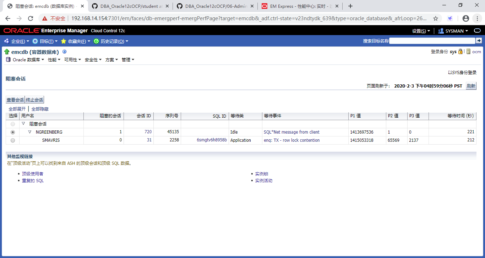
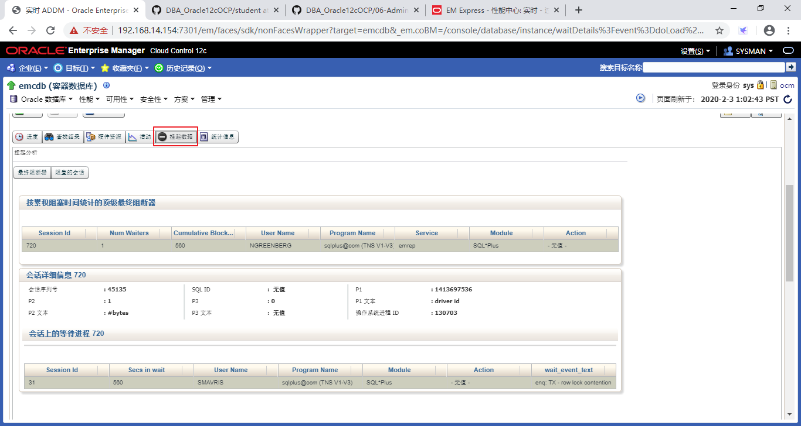

# 实践10:管理并发

> **Practices for Lesson 10: Managing Data Concurrency**
>
> 2020.01.29 BoobooWei

<!-- MDTOC maxdepth:6 firsth1:1 numbering:0 flatten:0 bullets:1 updateOnSave:1 -->

- [实践10:管理并发](#实践10管理并发)   
   - [实践10:概览](#实践10概览)   
   - [实践10-1:解决锁冲突](#实践10-1解决锁冲突)   
      - [Overview](#overview)   
      - [Task](#task)   
      - [Practice](#practice)   
      - [KnowledgePoint](#knowledgepoint)   

<!-- /MDTOC -->

## 实践10:概览

Practices for Lesson 10: Overview.

**Background:** The Help desk just received a call from Susan Mavris, an HR representative, complaining that the database is “frozen.” Upon questioning the user, you find that she was trying to update John Chen’s personnel record with his new phone number, but when she entered the new data, her session froze and she could not do anything else.

背景:客服刚刚接到了人力资源代表Susan Mavris的电话，她抱怨说数据库“被冻结了”。在询问用户时，你会发现她试图用她的新电话号码更新John Chen的人事记录，但当她输入新数据时，她的会话冻结了，她不能做任何其他事情。

## 实践10-1:解决锁冲突

Practice 10-1: Resolving Lock Conflicts

### Overview

In this practice, you use two separate SQL*Plus sessions to cause a lock conflict.

Using Enterprise Manager, you detect the cause of the lock conflict, and then resolve the conflict.

在这个实践中，您使用两个单独的SQL*Plus会话来引起锁冲突。

使用Enterprise Manager，您可以检测锁冲突的原因，然后解决冲突。

### Task

1. Users NGREENBERG and SMAVRIS already exist in your database. User NGREENBERG makes an uncommitted update to a row in the HR.EMPLOYEES table. Then user SMAVRIS attempts to update the same row.
2. In a separate terminal window, attempt to update the same row in a separate session by executing the SQL statement shown below. Do not worry if the session seems to “hang”— this is the condition that you are trying to create.
3. Using EM Express, navigate to the Current Findings tab of the Performance Hub page and determine which session is causing the locking conflict.
4. Using Cloud Control, find the details of the blocking session.
5. What was the last SQL statement that the blocking session executed?
6. Resolve the conflict in favor of the user who complained, by killing the *blocking* session.
7. Return to the SQL*Plus command window, and note that SMAVRIS’s update has now completed successfully. Issue a ROLLBACK command in this session and exit.
8. Try issuing a SQL select statement in the NGREENBERG session. What do you see?
9. Close all open SQL sessions by entering exit, and then close the terminal windows.

### Practice

> 请提前创建好用户ngreenberg 和 smavris；授予 **HRMANAGER** 角色权限。具体创建用户的步骤可参考[06-AdministeringUserSecurity-管理用户.md](06-AdministeringUserSecurity-管理用户.md)

1. 用户NGREENBERG和SMAVRIS已经存在于您的数据库中。用户NGREENBERG对HR中的员工表一行进行未提交的更新，然后用户SMAVRIS尝试更新相同的行。

   会话1

   ```sql
   sqlplus ngreenberg/oracle_4U@emrep
   show user
   select employee_id,salary,phone_number from hr.employees where employee_id = 110;
   update hr.employees set phone_number='650.555.1212' where employee_id = 110;
   ```
	会话2
   ```sql
   sqlplus smavris/oracle_4U@emrep
   show user
   select employee_id,salary,phone_number from hr.employees where employee_id = 110;
   update hr.employees set salary=8300 where employee_id = 110;
   ```


2. 在单独的终端窗口中，通过执行如下所示的SQL语句，尝试在单独的会话中更新相同的行。不要担心会话似乎“挂起”——这是您试图创建的条件。

3. 使用云控制运行实时ADDM，并确定是哪个会话导致了锁定冲突。

   

   


4. 使用云控制，查找阻塞会话的详细信息。

   

5. 选择 `性能 > 阻塞会话` ，查看阻塞会话执行的最后一条SQL语句是什么?

   

6. 通过终止“阻塞”会话，为抱怨的用户解决冲突。

   

   

   

   如果使用SQL命令kill阻塞会话，命令如下：

   ```sql
   sqlplus sys/WLS3Gg5_2@emrep as sysdba
   ALTER SYSTEM KILL SESSION '720,45135' immediate;
   ```


7. 返回到SQL*Plus命令窗口，注意SMAVRIS的更新现在已经成功完成。

   ```sql
   [oracle@ocm ~]$ sqlplus smavris/oracle_4U@emrep

   SQL*Plus: Release 12.2.0.1.0 Production on Mon Feb 3 16:55:27 2020

   Copyright (c) 1982, 2016, Oracle.  All rights reserved.

   Last Successful login time: Mon Feb 03 2020 16:25:05 +08:00

   Connected to:
   Oracle Database 12c Enterprise Edition Release 12.2.0.1.0 - 64bit Production

   SQL> select employee_id,salary,phone_number from hr.employees where employee_id = 110;

   EMPLOYEE_ID	SALARY PHONE_NUMBER
   ----------- ---------- --------------------
   	110	  8300 515.124.4269

   SQL> update hr.employees set phone_number='650.555.1212' where employee_id = 110;

   1 row updated.

   SQL> select employee_id,salary,phone_number from hr.employees where employee_id = 110;

   EMPLOYEE_ID	SALARY PHONE_NUMBER
   ----------- ---------- --------------------
   	110	  8300 650.555.1212
   ```


8. 尝试在NGREENBERG会话中发出SQL select语句。你看到了什么?

   ```sql
   [oracle@ocm ~]$ sqlplus ngreenberg/oracle_4U@emrep

   SQL*Plus: Release 12.2.0.1.0 Production on Mon Feb 3 16:55:18 2020

   Copyright (c) 1982, 2016, Oracle.  All rights reserved.

   Last Successful login time: Mon Feb 03 2020 16:25:18 +08:00

   Connected to:
   Oracle Database 12c Enterprise Edition Release 12.2.0.1.0 - 64bit Production

   SQL> update hr.employees set phone_number='650.555.1212' where employee_id = 110;

   1 row updated.

   SQL> select employee_id,salary,phone_number from hr.employees where employee_id = 110;
   select employee_id,salary,phone_number from hr.employees where employee_id = 110
             *
   ERROR at line 1:
   ORA-03113: end-of-file on communication channel
   Process ID: 130703
   Session ID: 720 Serial number: 45135
   ```

   会话1被kill掉了。

9. 通过输入exit关闭所有打开的SQL会话，然后关闭终端窗口。

### KnowledgePoint

1. 通过使用Enterprise Manager cloud control 检测锁冲突的原因，然后解决冲突。

2. 如何通过命令行获取当前的锁冲突，并自动生成kill命令。

   ```sql
   sqlplus sys/WLS3Gg5_2@emrep as sysdba

   --查看阻塞会话和被阻塞会话
   select object_name,machine,s.sid,s.serial#,s.username from v$locked_object l,dba_objects o ,v$session s where l.object_id=o.object_id and l.session_id=s.sid;

   exec print_table('select object_name,machine,s.* from v$locked_object l,dba_objects o ,v$session s where l.object_id=o.object_id and l.session_id=s.sid')

   --生成kill阻塞会话的语句
   select 'ALTER SYSTEM KILL SESSION '||chr(39)||s.sid||','||s.serial#||chr(39)|| ' immediate;' from v$locked_object l,dba_objects o ,v$session s where l.object_id=o.object_id and l.session_id=s.sid;

   --被阻塞会话的事件特征
   EVENT#			      : 284
   EVENT			      : enq: TX - row lock contention
   ```

   执行结果

   ```sql
   SQL> exec print_table('select object_name,machine,s.* from v$locked_object l,dba_objects o ,v$session s where l.object_id=o.object_id and l.session_id=s.sid')
   OBJECT_NAME		      : EMPLOYEES
   MACHINE 		      : ocm
   SADDR			      : 000000006898DB30
   SID			      : 729
   SERIAL# 		      : 21153
   AUDSID			      : 2770490
   PADDR			      : 00000000696DF4B0
   USER#			      : 122
   USERNAME		      : SMAVRIS
   COMMAND 		      : 6
   OWNERID 		      : 2147483644
   TADDR			      : 000000006371DFB0
   LOCKWAIT		      : 0000000067C39418
   STATUS			      : ACTIVE
   SERVER			      : DEDICATED
   SCHEMA# 		      : 122
   SCHEMANAME		      : SMAVRIS
   OSUSER			      : oracle
   PROCESS 		      : 3766
   MACHINE 		      : ocm
   PORT			      : 46053
   TERMINAL		      : pts/4
   PROGRAM 		      : sqlplus@ocm (TNS V1-V3)
   TYPE			      : USER
   SQL_ADDRESS		      : 000000008DF20ED8
   SQL_HASH_VALUE		      : 2693043467
   SQL_ID			      : 6smgtv6h8958b
   SQL_CHILD_NUMBER	      : 0
   SQL_EXEC_START		      : 03-feb-2020 17:08:59
   SQL_EXEC_ID		      : 16777219
   PREV_SQL_ADDR		      : 00000000830C9530
   PREV_HASH_VALUE 	      : 2659790539
   PREV_SQL_ID		      : 2s9mmb6g8kbqb
   PREV_CHILD_NUMBER	      : 0
   PREV_EXEC_START 	      : 03-feb-2020 17:08:57
   PREV_EXEC_ID		      : 16777224
   PLSQL_ENTRY_OBJECT_ID	      :
   PLSQL_ENTRY_SUBPROGRAM_ID     :
   PLSQL_OBJECT_ID 	      :
   PLSQL_SUBPROGRAM_ID	      :
   MODULE			      : SQL*Plus
   MODULE_HASH		      : 3669949024
   ACTION			      :
   ACTION_HASH		      : 0
   CLIENT_INFO		      :
   FIXED_TABLE_SEQUENCE	      : 1350674
   ROW_WAIT_OBJ#		      : 73219
   ROW_WAIT_FILE#		      : 12
   ROW_WAIT_BLOCK# 	      : 207
   ROW_WAIT_ROW#		      : 10
   TOP_LEVEL_CALL# 	      : 94
   LOGON_TIME		      : 03-feb-2020 17:08:58
   LAST_CALL_ET		      : 362
   PDML_ENABLED		      : NO
   FAILOVER_TYPE		      : NONE
   FAILOVER_METHOD 	      : NONE
   FAILED_OVER		      : NO
   RESOURCE_CONSUMER_GROUP       : OTHER_GROUPS
   PDML_STATUS		      : DISABLED
   PDDL_STATUS		      : ENABLED
   PQ_STATUS		      : ENABLED
   CURRENT_QUEUE_DURATION	      : 0
   CLIENT_IDENTIFIER	      :
   BLOCKING_SESSION_STATUS       : VALID
   BLOCKING_INSTANCE	      : 1
   BLOCKING_SESSION	      : 16
   FINAL_BLOCKING_SESSION_STATUS : VALID
   FINAL_BLOCKING_INSTANCE       : 1
   FINAL_BLOCKING_SESSION	      : 16
   SEQ#			      : 46
   EVENT#			      : 284
   EVENT			      : enq: TX - row lock contention
   P1TEXT			      : name|mode
   P1			      : 1415053318
   P1RAW			      : 0000000054580006
   P2TEXT			      : usn<<16 | slot
   P2			      : 393223
   P2RAW			      : 0000000000060007
   P3TEXT			      : sequence
   P3			      : 2089
   P3RAW			      : 0000000000000829
   WAIT_CLASS_ID		      : 4217450380
   WAIT_CLASS#		      : 1
   WAIT_CLASS		      : Application
   WAIT_TIME		      : 0
   SECONDS_IN_WAIT 	      : 361
   STATE			      : WAITING
   WAIT_TIME_MICRO 	      : 361203435
   TIME_REMAINING_MICRO	      : -1
   TIME_SINCE_LAST_WAIT_MICRO    : 0
   SERVICE_NAME		      : emrep
   SQL_TRACE		      : DISABLED
   SQL_TRACE_WAITS 	      : FALSE
   SQL_TRACE_BINDS 	      : FALSE
   SQL_TRACE_PLAN_STATS	      : FIRST EXEC
   SESSION_EDITION_ID	      : 133
   CREATOR_ADDR		      : 00000000696DF4B0
   CREATOR_SERIAL# 	      : 9
   ECID			      :
   SQL_TRANSLATION_PROFILE_ID    : 0
   PGA_TUNABLE_MEM 	      : 0
   SHARD_DDL_STATUS	      : DISABLED
   CON_ID			      : 3
   EXTERNAL_NAME		      :
   PLSQL_DEBUGGER_CONNECTED      : FALSE
   -----------------
   OBJECT_NAME		      : EMPLOYEES
   MACHINE 		      : ocm
   SADDR			      : 000000006934FB98
   SID			      : 16
   SERIAL# 		      : 44199
   AUDSID			      : 2770489
   PADDR			      : 00000000696B2C80
   USER#			      : 121
   USERNAME		      : NGREENBERG
   COMMAND 		      : 0
   OWNERID 		      : 2147483644
   TADDR			      : 000000006318F840
   LOCKWAIT		      :
   STATUS			      : INACTIVE
   SERVER			      : DEDICATED
   SCHEMA# 		      : 121
   SCHEMANAME		      : NGREENBERG
   OSUSER			      : oracle
   PROCESS 		      : 3745
   MACHINE 		      : ocm
   PORT			      : 46031
   TERMINAL		      : pts/2
   PROGRAM 		      : sqlplus@ocm (TNS V1-V3)
   TYPE			      : USER
   SQL_ADDRESS		      : 00
   SQL_HASH_VALUE		      : 0
   SQL_ID			      :
   SQL_CHILD_NUMBER	      :
   SQL_EXEC_START		      :
   SQL_EXEC_ID		      :
   PREV_SQL_ADDR		      : 000000008DF20ED8
   PREV_HASH_VALUE 	      : 2693043467
   PREV_SQL_ID		      : 6smgtv6h8958b
   PREV_CHILD_NUMBER	      : 0
   PREV_EXEC_START 	      : 03-feb-2020 17:08:53
   PREV_EXEC_ID		      : 16777218
   PLSQL_ENTRY_OBJECT_ID	      :
   PLSQL_ENTRY_SUBPROGRAM_ID     :
   PLSQL_OBJECT_ID 	      :
   PLSQL_SUBPROGRAM_ID	      :
   MODULE			      : SQL*Plus
   MODULE_HASH		      : 3669949024
   ACTION			      :
   ACTION_HASH		      : 0
   CLIENT_INFO		      :
   FIXED_TABLE_SEQUENCE	      : 1345978
   ROW_WAIT_OBJ#		      : -1
   ROW_WAIT_FILE#		      : 0
   ROW_WAIT_BLOCK# 	      : 0
   ROW_WAIT_ROW#		      : 0
   TOP_LEVEL_CALL# 	      : 94
   LOGON_TIME		      : 03-feb-2020 17:08:52
   LAST_CALL_ET		      : 368
   PDML_ENABLED		      : NO
   FAILOVER_TYPE		      : NONE
   FAILOVER_METHOD 	      : NONE
   FAILED_OVER		      : NO
   RESOURCE_CONSUMER_GROUP       : OTHER_GROUPS
   PDML_STATUS		      : DISABLED
   PDDL_STATUS		      : ENABLED
   PQ_STATUS		      : ENABLED
   CURRENT_QUEUE_DURATION	      : 0
   CLIENT_IDENTIFIER	      :
   BLOCKING_SESSION_STATUS       : NO HOLDER
   BLOCKING_INSTANCE	      :
   BLOCKING_SESSION	      :
   FINAL_BLOCKING_SESSION_STATUS : UNKNOWN
   FINAL_BLOCKING_INSTANCE       :
   FINAL_BLOCKING_SESSION	      :
   SEQ#			      : 71
   EVENT#			      : 418
   EVENT			      : SQL*Net message from client
   P1TEXT			      : driver id
   P1			      : 1413697536
   P1RAW			      : 0000000054435000
   P2TEXT			      : #bytes
   P2			      : 1
   P2RAW			      : 0000000000000001
   P3TEXT			      :
   P3			      : 0
   P3RAW			      : 00
   WAIT_CLASS_ID		      : 2723168908
   WAIT_CLASS#		      : 6
   WAIT_CLASS		      : Idle
   WAIT_TIME		      : 0
   SECONDS_IN_WAIT 	      : 367
   STATE			      : WAITING
   WAIT_TIME_MICRO 	      : 366874066
   TIME_REMAINING_MICRO	      : -1
   TIME_SINCE_LAST_WAIT_MICRO    : 0
   SERVICE_NAME		      : emrep
   SQL_TRACE		      : DISABLED
   SQL_TRACE_WAITS 	      : FALSE
   SQL_TRACE_BINDS 	      : FALSE
   SQL_TRACE_PLAN_STATS	      : FIRST EXEC
   SESSION_EDITION_ID	      : 133
   CREATOR_ADDR		      : 00000000696B2C80
   CREATOR_SERIAL# 	      : 253
   ECID			      :
   SQL_TRANSLATION_PROFILE_ID    : 0
   PGA_TUNABLE_MEM 	      : 0
   SHARD_DDL_STATUS	      : DISABLED
   CON_ID			      : 3
   EXTERNAL_NAME		      :
   PLSQL_DEBUGGER_CONNECTED      : FALSE
   ```
