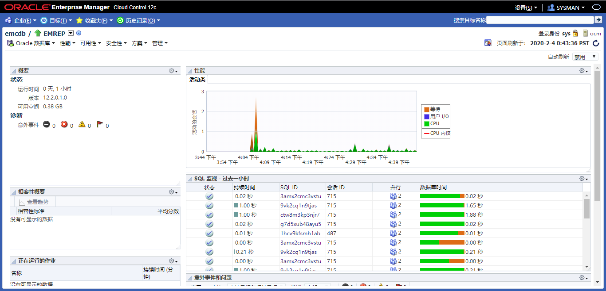
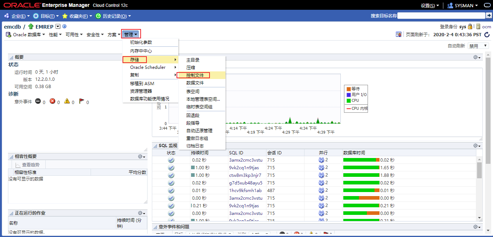
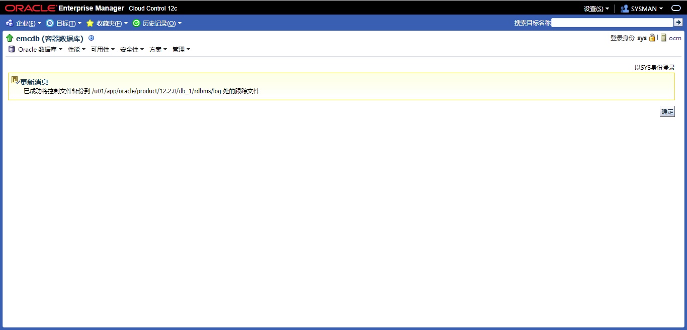
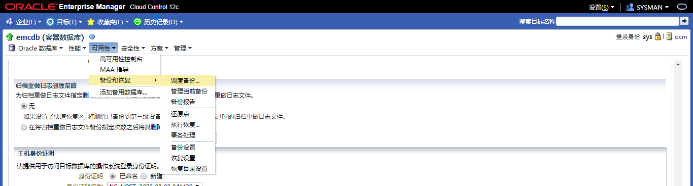
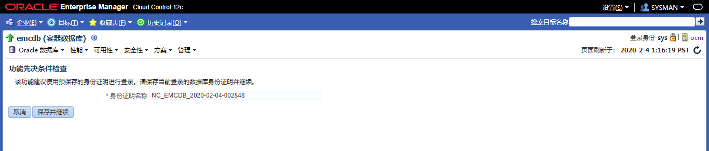
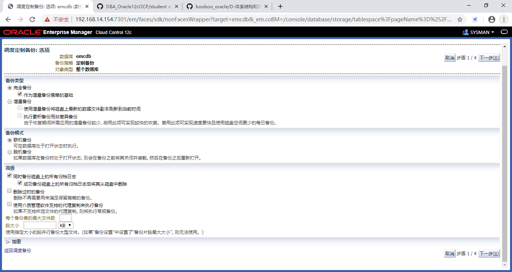
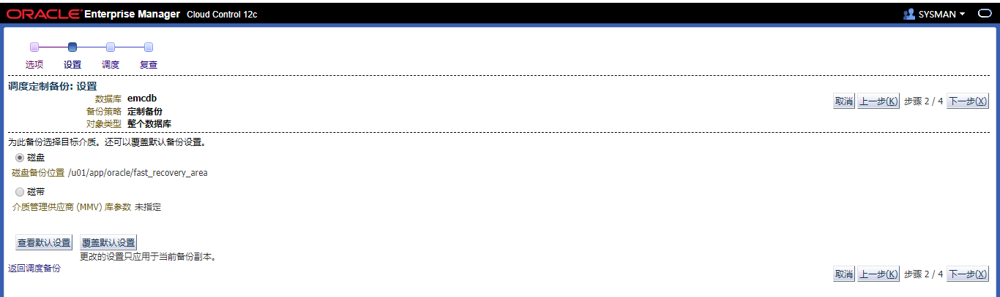
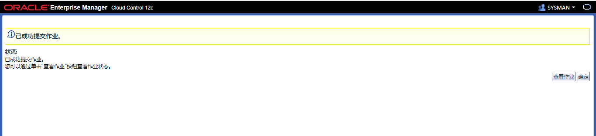
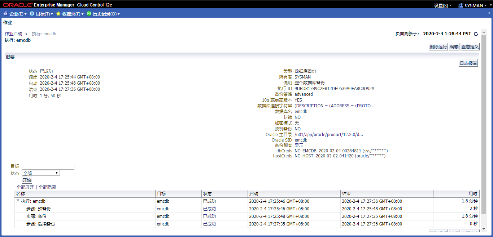
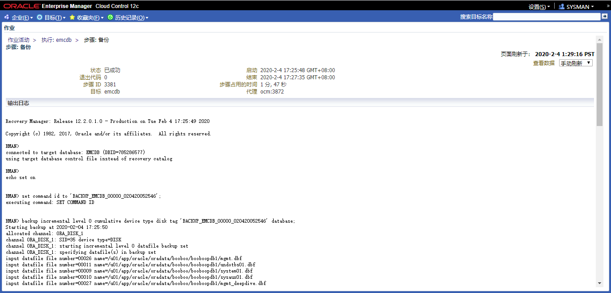

# 实践14:执行备份

> **Practices for Lesson 14: Performing Database Backups**
>
> 2020.01.29 BoobooWei

[TOC]

## 实践14:概览

Practices for Lesson 14: Overview

In these practices, you will create backups of your database so that you can recover from various types of failures.

在这些实践中，您将创建数据库备份，以便从各种类型的故障中恢复。

## 实践14-1:备份控制文件

Practice 14-1: Backing Up the Control File

### Overview

In this practice, you back up your control file to a trace file, creating a file of SQL commands that can be used to re-create the control file.

**Assumptions**

Practices for lesson 13 have been successfully completed.

在这种实践中，您将控制文件备份到一个跟踪文件，创建一个SQL命令文件，可用于重新创建控制文件。

假设：第13课的练习已经成功完成。

### Task

1. Launch Enterprise Manager Cloud Control and log in as the **ADMIN** user.

2. Navigate to the orcl database home page.

3. Select **Administration > Storage > Control Files**.

4. Log in to the **orcl** database with your named credential.

5. On the Control Files page, click **Backup to Trace**.
6. An update message is displayed. Click **OK**.
7. You can also perform a control file back up to trace by executing a SQL command. Log in to SQL*Plus as the **DBA1** user and execute the **ALTER** **DATABASE** **BACKUP** **CONTROLFILE TO TRACE** command. Exit from SQL*Plus.
8. Navigate to the /u01/app/oracle/diag/rdbms/orcl/orcl/trace directory and view the end of the alert log to verify the creation of the trace files and the names of the files.

### Practice

1. 启动企业管理器云控制，以**ADMIN**用户登录。

2. 导航到数据库主页。

   

3. 选择**管理>存储>控制文件**。

   

4. 使用指定的凭据登录到数据库。

5. 在控制文件页面，单击**备份到跟踪文件**。

   

6. 将显示一条更新消息。点击**确定**。

   

7. 您还可以通过执行SQL命令来执行一个控制文件。以**DBA1**用户身份登录SQL*Plus，执行**ALTER** **DATABASE** **BACKUP** **CONTROLFILE跟踪**命令。

   ```sql
   alter database backup controlfile to trace;
   ```

8. 导航到`/u01/app/oracle/diag/rdbms/emcdb/emcdb/trace`目录，查看警报日志的结尾，以验证跟踪文件的创建和文件的名称。

   ```bash
   cd /u01/app/oracle/diag/rdbms/emcdb/emcdb/trace
   tail alert_orcl.log
   
   2020-02-04T17:07:31.995723+08:00
   alter database backup controlfile to trace
   2020-02-04T17:07:32.055314+08:00
   Backup controlfile written to trace file /u01/app/oracle/diag/rdbms/emcdb/emcdb/trace/emcdb_ora_32205.trc
   Completed: alter database backup controlfile to trace
   ```

   

### KnowledgePoint

## 实践14-2:配置控制文件和SPFILE的自动备份

Practice 14-2: Configuring Automatic Backups of the Control File and SPFILE

### Overview

In this practice you configure automatic backups of the control file and server parameter file (SPFILE) when a backup of the database is made and when there is a structural change to the database.

在此实践中，在数据库备份和数据库结构更改时配置控制文件和服务器参数文件(SPFILE)的自动备份。

### Task

1. Return to the **orcl** database home page in Enterprise Manager Cloud Control.
2. Select **Availability > Backup & Recovery > Backup Settings**.
3. On the Backup Settings page, click the **Policy** tab.
4. Select “**Automatically backup the control file and server parameter file (SPFILE) with every backup and database structural change**.”
5. Scroll to the bottom of the page. In the Host Credentials section, select **New**. Enter **oracle** in the User Name field. Enter your OS password in the Password and Confirm Password fields. Click **Test** to ensure that you entered the values properly.
6. Click **Apply**.

### Practice

1. 返回企业管理器云控制中的数据库主页。

2. 选择**可用性>备份和恢复>备份设置**。

   

3. 在备份设置页面，单击**策略**选项卡。

   

4. 选择**随着每个备份和数据库结构更改自动备份控制文件和服务器参数文件(SPFILE) **。

   

5. 滚动到页面底部。在**主机身份证明**部分，选择**新建**。在用户名字段中输入**oracle**。在password中输入操作系统密码并确认密码字段。单击**Test**以确保正确输入了值。（如果已经配置过了，就选择**已命名**）

   

   

6. 点击**应用**。

### KnowledgePoint

## 实践14-3:创建一个完整的数据库备份

Practice 14-3: Creating a Whole Database Backup

### Overview

In this practice, you back up your entire database, including the archived redo log files. The backup should be the base for an incremental backup strategy.

在这个实践中，需要备份整个数据库，包括归档的重做日志文件。备份应该是增量备份策略的基础。

### Task

1. In Enterprise Manager Cloud Control, select **Availability** > **Backup & Recovery** > **Schedule Backup**.
2. In the Customized Backup section, select **Whole Database**. Confirm that the host credentials are set with oracle as the user name and password. Click **Schedule Customized Backup**.
3. In the Backup Type section, select **Full Backup** and “**Use as the base of an incremental backup strategy**.”
4. In the Backup Mode section, select **Online Backup**.
5. In the Advanced section, select “**Also back up all archived logs on disk**” and “**Delete all archived logs from disk after they are successfully backed up**.” Click **Next**.
6. On the Settings page, select **Disk** as the backup destination. Click **Next**.
7. On the Schedule page, accept the defaults. Click **Next**.
8. On the Review page, review the RMAN script and then click **Submit Job**.
9. A confirmation message is displayed. Click **View Job**.
10. Click the Refresh icon on the right side of page until you see that the job has completed successfully.

### Practice

1. 在Enterprise Manager Cloud Control中，选择**可用性 > 备份和恢复 > 调度备份**。

   

   

2. 在自定义备份部分，选择**整个数据库**。确认主机凭据已设置为oracle用户名和密码。单击**调度定制备份**。

   

3. 在备份类型部分，选择**完全备份**和 **作为增量备份策略的基础**。

4. 在备份模式部分，选择**联机备份**。

5. 在高级部分，选择**同时备份磁盘上的所有归档日志**和 **成功备份磁盘上的所有归档日志后将其从磁盘删除**，点击**下一步**。

   

6. 在设置页面，选择**磁盘**作为备份目的地。点击**下一步**。

   

7. 在调度页面上，接受默认设置。点击**下一步**。

   

8. 在复查页面上，审查RMAN脚本，然后单击**提交作业**。

   

9. 将显示一条确认消息。单击**查看作业**。

   

10. 单击页面右侧的Refresh图标，直到看到任务成功完成。

    

    

    ```bash
    RMAN>  list backup;
    
    
    List of Backup Sets
    ===================
    
    
    BS Key  Type LV Size       Device Type Elapsed Time Completion Time
    ------- ---- -- ---------- ----------- ------------ ---------------
    1       Incr 0  1.75G      DISK        00:00:46     04-FEB-20      
            BP Key: 1   Status: AVAILABLE  Compressed: NO  Tag: BACKUP_EMCDB_00000_020420052546
            Piece Name: /u01/app/oracle/fast_recovery_area/EMCDB/96710507BCB024C7E0553CE49B3EAF97/backupset/2020_02_04/o1_mf_nnnd0_BACKUP_EMCDB_00000_0_h3lg4z3h_.bkp
      List of Datafiles in backup set 1
      Container ID: 3, PDB Name: EMREP
      File LV Type Ckp SCN    Ckp Time  Abs Fuz SCN Sparse Name
      ---- -- ---- ---------- --------- ----------- ------ ----
      9    0  Incr 3452953    04-FEB-20              NO    /u01/app/oracle/oradata/booboo/booboopdb1/system01.dbf
      10   0  Incr 3452953    04-FEB-20              NO    /u01/app/oracle/oradata/booboo/booboopdb1/sysaux01.dbf
      11   0  Incr 3452953    04-FEB-20              NO    /u01/app/oracle/oradata/booboo/booboopdb1/undotbs01.dbf
      12   0  Incr 3452953    04-FEB-20              NO    /u01/app/oracle/oradata/booboo/booboopdb1/users01.dbf
      25   0  Incr 3452953    04-FEB-20              NO    /u01/app/oracle/oradata/booboo/booboopdb1/mgmt_ecm_depot1.dbf
      26   0  Incr 3452953    04-FEB-20 3452975      NO    /u01/app/oracle/oradata/booboo/booboopdb1/mgmt.dbf
      27   0  Incr 3452953    04-FEB-20              NO    /u01/app/oracle/oradata/booboo/booboopdb1/mgmt_deepdive.dbf
    
    BS Key  Type LV Size       Device Type Elapsed Time Completion Time
    ------- ---- -- ---------- ----------- ------------ ---------------
    2       Incr 0  1.13G      DISK        00:00:22     04-FEB-20      
            BP Key: 2   Status: AVAILABLE  Compressed: NO  Tag: BACKUP_EMCDB_00000_020420052546
            Piece Name: /u01/app/oracle/fast_recovery_area/EMCDB/backupset/2020_02_04/o1_mf_nnnd0_BACKUP_EMCDB_00000_0_h3lg6po0_.bkp
      List of Datafiles in backup set 2
      File LV Type Ckp SCN    Ckp Time  Abs Fuz SCN Sparse Name
      ---- -- ---- ---------- --------- ----------- ------ ----
      1    0  Incr 3453177    04-FEB-20              NO    /u01/app/oracle/oradata/booboo/system01.dbf
      3    0  Incr 3453177    04-FEB-20              NO    /u01/app/oracle/oradata/booboo/sysaux01.dbf
      4    0  Incr 3453177    04-FEB-20              NO    /u01/app/oracle/oradata/booboo/undotbs01.dbf
      7    0  Incr 3453177    04-FEB-20              NO    /u01/app/oracle/oradata/booboo/users01.dbf
    
    BS Key  Type LV Size       Device Type Elapsed Time Completion Time
    ------- ---- -- ---------- ----------- ------------ ---------------
    3       Incr 0  512.22M    DISK        00:00:11     04-FEB-20      
            BP Key: 3   Status: AVAILABLE  Compressed: NO  Tag: BACKUP_EMCDB_00000_020420052546
            Piece Name: /u01/app/oracle/fast_recovery_area/EMCDB/93219DF8F4031975E0553CE49B3EAF97/backupset/2020_02_04/o1_mf_nnnd0_BACKUP_EMCDB_00000_0_h3lg7htl_.bkp
      List of Datafiles in backup set 3
      Container ID: 2, PDB Name: PDB$SEED
      File LV Type Ckp SCN    Ckp Time  Abs Fuz SCN Sparse Name
      ---- -- ---- ---------- --------- ----------- ------ ----
      5    0  Incr 1441296    03-NOV-19              NO    /u01/app/oracle/oradata/booboo/pdbseed/system01.dbf
      6    0  Incr 1441296    03-NOV-19              NO    /u01/app/oracle/oradata/booboo/pdbseed/sysaux01.dbf
      8    0  Incr 1441296    03-NOV-19              NO    /u01/app/oracle/oradata/booboo/pdbseed/undotbs01.dbf
    
    BS Key  Type LV Size       Device Type Elapsed Time Completion Time
    ------- ---- -- ---------- ----------- ------------ ---------------
    4       Full    17.94M     DISK        00:00:01     04-FEB-20      
            BP Key: 4   Status: AVAILABLE  Compressed: NO  Tag: TAG20200204T172727
            Piece Name: /u01/app/oracle/fast_recovery_area/EMCDB/autobackup/2020_02_04/o1_mf_s_1031506047_h3lg805t_.bkp
      SPFILE Included: Modification time: 04-FEB-20
      SPFILE db_unique_name: EMCDB
      Control File Included: Ckp SCN: 3453270      Ckp time: 04-FEB-20
    
    BS Key  Size       Device Type Elapsed Time Completion Time
    ------- ---------- ----------- ------------ ---------------
    5       91.75M     DISK        00:00:00     04-FEB-20      
            BP Key: 5   Status: AVAILABLE  Compressed: NO  Tag: BACKUP_EMCDB_00000_020420052546
            Piece Name: /u01/app/oracle/fast_recovery_area/EMCDB/backupset/2020_02_04/o1_mf_annnn_BACKUP_EMCDB_00000_0_h3lg8359_.bkp
    
      List of Archived Logs in backup set 5
      Thrd Seq     Low SCN    Low Time  Next SCN   Next Time
      ---- ------- ---------- --------- ---------- ---------
      1    32      3399092    04-FEB-20 3415518    04-FEB-20
      1    33      3415518    04-FEB-20 3415523    04-FEB-20
      1    34      3415523    04-FEB-20 3415528    04-FEB-20
      1    35      3415528    04-FEB-20 3415533    04-FEB-20
      1    36      3415533    04-FEB-20 3415538    04-FEB-20
      1    37      3415538    04-FEB-20 3453307    04-FEB-20
    
    BS Key  Type LV Size       Device Type Elapsed Time Completion Time
    ------- ---- -- ---------- ----------- ------------ ---------------
    6       Full    17.94M     DISK        00:00:00     04-FEB-20      
            BP Key: 6   Status: AVAILABLE  Compressed: NO  Tag: TAG20200204T172732
            Piece Name: /u01/app/oracle/fast_recovery_area/EMCDB/autobackup/2020_02_04/o1_mf_s_1031506052_h3lg84pn_.bkp
      SPFILE Included: Modification time: 04-FEB-20
      SPFILE db_unique_name: EMCDB
      Control File Included: Ckp SCN: 3453372      Ckp time: 04-FEB-20
    
    ```

    

### KnowledgePoint

在Enterprise Manager Cloud Control中，通过调度备份进行数据库在线热备之全库备份

## 总结

Enterprise Manager Cloud Control中关于备份的操作个人理解为是RMAN的图形化界面。

1. 备份控制文件`alter database backup controlfile to trace;`

2. 配置控制文件和SPFILE的自动备份`CONFIGURE CONTROLFILE AUTOBACKUP ON;`

3. 创建一个完整的数据库备份

   ```sql
   backup incremental level 0 cumulative device type disk tag '%TAG' database;
   backup device type disk tag '%TAG' archivelog all not backed up delete all input;
   ```

   [**AutoGetRmanBackupScripts.sh**](https://github.com/BoobooWei/booboo_oracle/blob/master/scripts/AutoGetRmanBackupScripts.sh)

