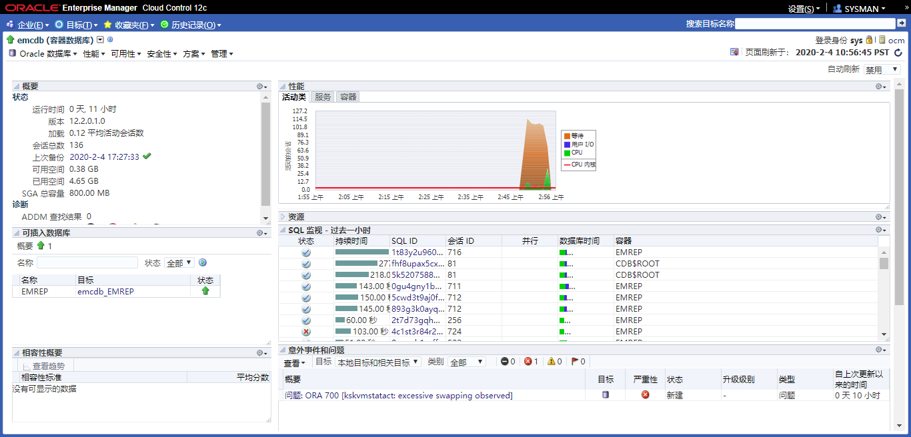
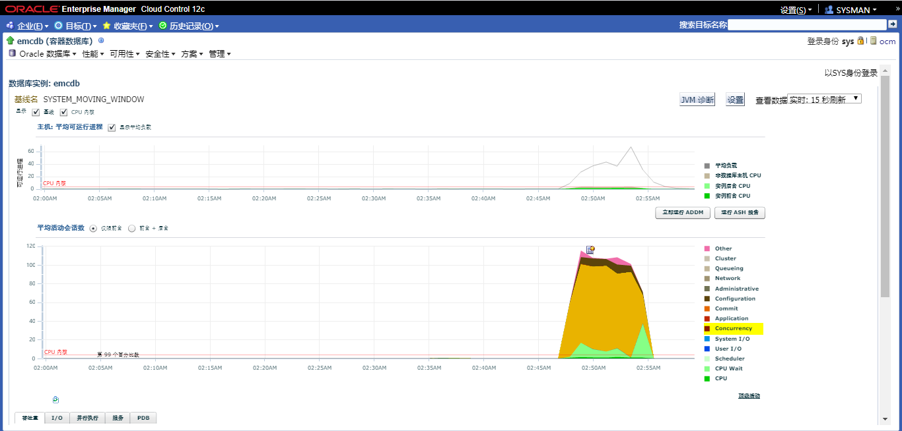
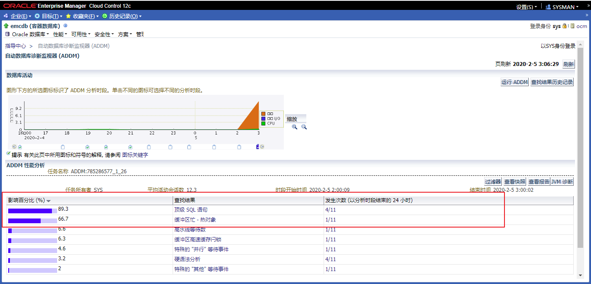
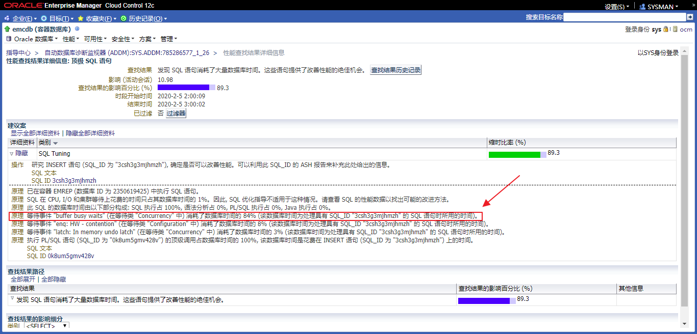
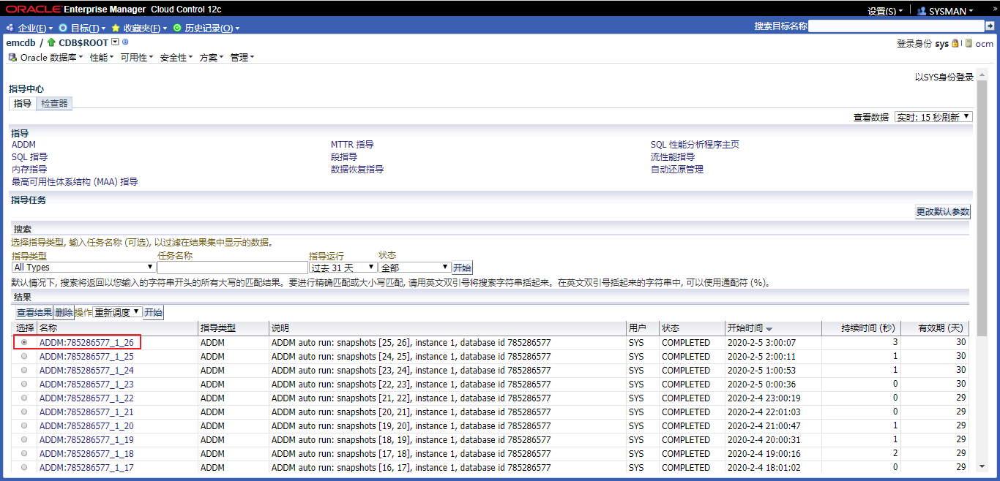

# 实践17:数据库维护

> **Practices for Lesson 17: Database Maintenance**
>
> 2020.01.29 BoobooWei

[TOC]

## 实践17:概览

Practices for Lesson 17: Overview

**Background:** You want to proactively monitor your orcl database so that common problems can be fixed before they affect users. Users, developers, and unanticipated changes in the way applications are used can bring serious performance problems. As DBA you are seldom informed about what changed, you are instead told there is a generic problem. At that point you must find the problem based often on misleading information from users.

In this scenario, a developer is providing scripts for you to run to provision changes to an application. These supplied scripts create a problem so that you can familiarize yourself with the tools that are available. Examine each script to satisfy yourself that the script is doing what you have been told.

These practices have been scripted because delays in performing the tasks can have a large effect on the results you see due to the short time that the workload runs.

背景:您希望主动监控数据库，以便在常见问题影响用户之前修复它们。用户、开发人员和应用程序使用方式的意外变化可能带来严重的性能问题。作为DBA，您很少被告知发生了什么变化，而是被告知存在一个通用问题。此时，您必须根据来自用户的误导信息发现问题。
在此场景中，开发人员为您提供脚本，以运行对应用程序的供应更改。这些提供的脚本会产生一个问题，以便您能够熟悉可用的工具。检查每个脚本，以确保脚本正在执行所告知的操作。
这些实践已经编写了脚本，因为由于工作负载运行的时间很短，执行任务的延迟会对您看到的结果产生很大的影响。

## 实践17-1:数据库维护

Practice 17-1: Database Maintenance

### Overview

### Task

1. A new tablespace is being added to hold the new tables. The first script creates a new locally managed tablespace called TBSSPC with a data file named`/u01/app/oracle/oradata/orcl/tbsspc01.dbf `of 50 MB. Ensure that the TBSSPC tablespace does not use Automatic Segment Space Management (ASSM). The **lab_17_01_01.sh** script performs these tasks. Examine the script and then execute it. 

2. The `lab_17_01_02.sh` script adds a new user. The script creates the `SPCT` user, identified by `oracle_4U`, assigns the TBSSPC tablespace as the default tablespace, assigns the TEMP tablespace as the temporary tablespace, and grants the CONNECT, RESOURCE, and DBA roles to the SPCT user. Execute the **lab_17_01_02.sh** script to perform these tasks. 

3. The test workload that is provided runs only a few minutes. In order to get meaningful data, the time between Automatic Workload Repository (AWR) snapshots should be reduced. Use the `DBMS_ADVISOR` package to set the database activity time to 30 minutes. The test script, running as the SPCT user, drops and creates the SPCT table and gathers statistics for this table. It also creates a snapshot in AWR. Execute the **lab_17_01_03.sh** script to perform these tasks.

4. Run the workload script. This creates an activity to be analyzed. Execute the **lab_17_01_04.sh** script to perform these tasks. DO NOT wait for the script to finish continue to the next step.

5. Watch the activity in the Active Session Graph on the Cloud Control Performance Home page until the script completes.

   | **Step** | **Window/Page Description** | **Choices or Values**                                        |
   | -------- | --------------------------- | ------------------------------------------------------------ |
   | a.       | Cloud Control               | Login  User: **ADMIN**  Password: **oracle_4U**              |
   | b.       | Summary                     | Navigate to the **orcl** database home page.                 |
   | c.       | orcl database home          | Click **Performance** > **Performance Home.**                |
   | d.       | Database Login              | Credentials: Select **Preferred.**  Preferred Credential Name: **SYSDBA Database Credentials**  Click **Login.** |
   | e.       | Database Instance: orcl     | Verify that the refresh rate is set to Real  Time:  15 Second Refresh  Watch the **Average Active Session** graph until It has peaked and returned to the previous low level. |

6. After the spike has finished, return to the terminal window to execute the

   lab_17_01_05.sh script.

7.  Find and examine the ADDM Performance Analysis and findings.

| **Step** | **Window/Page Description**                   | **Choices or Values**                                        |
| -------- | --------------------------------------------- | ------------------------------------------------------------ |
| a.       | Database Instance: orcl                       | Click **Performance >  Advisors Home**                       |
| b.       | Advisors Central                              | In the result  section, click the latest ADDM  report.       |
| c.       | Automatic Database Diagnostic  Monitor (ADDM) | Notice the findings. Click each finding.  Review the Detail  findings. |

   d.  Look at the **Performance Analysis** findings in order of their impact. There are several access paths to this information. 

   e.  Looking at the Performance Analysis section, you see that the first finding has a high percentage (in this example, 98.9 percent) impact on the system. So your first step is to look at this finding in more detail. Click the link in the Finding column. In the Recommendations Rationale, you find a statement “waiting for event ‘Buffer Busy Waits’”.

   f.   Return to the ADDM Performance Analysis page and investigate the other ADDM findings in order of severity. Look at the **Buffer Busy** findings in particular by clicking the link in the Finding column. For one of the Buffer Busy results, you should see that there is read-and-write contention on your SPCT table. The recommended action is to use the Automatic Segment Space Management (ASSM) feature for your SPCT table. The Rationale shows that there is a hot data block that belongs to the SPCT.SPCT table.

   The findings may appear in a different order than shown. If you do not see results similar to the ones outlined in the preceding screenshot, you may need to restart this practice. If you still do not see the expected results, you may need to adjust the load by modifying the lab_17_01_04.sh and lab_17_01_04.sql scripts. Ask your instructor for assistance if this is the case. Take care not to increase the load too much or you will slow your system down too much.

8. decide to implement the recommendation to use Automated Segment Space Management. To do this, you must re-create the object. Create a new, locally managed tablespace, called TBSSPC2 with a 50 MB data file. Ensure that the TBSSPC2 tablespace uses the Automatic Segment Space Management feature. Then execute the **lab_17_01_07.sh** script to drop the SPCT table, re-create the table in the new tablespace, gather statistics, and to take a new snapshot.

   | **Step** | **Window/Page**  **Description** | **Choices or Values**                                        |
   | -------- | -------------------------------- | ------------------------------------------------------------ |
   | a.       | Cloud Control                    | Click **Administration > Storage >  Tablespaces**            |
   | b.       | Tablespaces                      | Click **Create.**                                            |
   | c.       | Create Tablespace                | Enter  Name: **TBSSPC2**  In the Datafiles section, click  **Add.** |
   | d.       | Add Datafile                     | Enter  File Name: **tbsspc02.dbf**  File Size: **50  MB**  Verify Automatically extend data  file when full  is NOT  checked  Click **Continue.** |
   | e.       | Create Tablespace                | Click the **Storage** tab.                                   |
   | f.       | Create Tablespace: Storage tab   | Verify  Extent Allocation: **Automatic**                     |
   |          |                                  | Segment Space Management: **Automatic**  Click **Show SQL**. |
   | g.       | Show SQL                         | Examine the  SQL Statement.  It should be:  CREATE SMALLFILE TABLESPACE "TBSSPC2"  DATAFILE  '/u01/app/oracle/oradata/orcl/tbsspc02.dbf'  SIZE 50M LOGGING EXTENT  MANAGEMENT LOCAL SEGMENT SPACE  MANAGEMENT AUTO  Click **Return**. |
   | h.       | Create Tablespace: Storage tab   | Click **OK**.                                                |
   | i.       | Tablespaces                      |                                                              |

9. Execute your workload again. (Use the **lab_17_01_04.sh** script.) DO NOT wait for the script to complete continue to next task.

10.  Return to Enterprise Manager Cloud Control. On the orcl Performance Home page, review the Average Active Session graph. View performance data in real time with a 15- second refresh cycle. After a while, you should see a spike on the Average Active Sessions graph. **Hint:** This is that same procedure that you used in Task 5.

   After the spike is finished, execute the **lab_17_01_05.sh** script again. This script forces the creation of a new snapshot and gathers statistics on the table in the workload test.

   a.  Invoke Enterprise Manager as the **D****BA1** user in the **SYSDBA** role for your **orcl**

   database.

   b.  Select **Performance Home** in the **Performance** menu. Watch for the spike in the Active Sessions chart to complete.

   c.  After the spike is finished, run the **lab_17_01_05.sh** script to force the creation of a new snapshot and gather statistics on your SPCT table.

   **Note:** You may have to press Enter after the PL/SQL procedures from step 9 have completed in order to see the command prompt again.

11. Review the ADDM from the **Advisor Home** link.

    | **Step** | **Window/Page Description**                   | **Choices or Values**                          |
    | -------- | --------------------------------------------- | ---------------------------------------------- |
    | a.       | Cloud Control                                 | Click **Performance >  Advisors Home.**        |
    | b.       | Advisor Central                               | Click the latest ADDM  report.                 |
    | c.       | Automatic Database Diagnostic  Monitor (ADDM) | Review the ADDM Performance  Analysis section. |

    You see that the impact value for the Buffer Busy finding (indicating read-and-write contention) has been greatly reduced or is no longer there. By moving the ADDM table to the locally managed TBSSPC2 tablespace, which uses the Automatic Autoextend Segment feature, you obviously fixed the root cause of the contention problem.

    **Note:** You may see additional Buffer Busy findings (at a lower impact percentage) and other further recommendations that could improve performance, but you are not going to pursue them at this time.

12. Execute the **lab_17_01_11.sh** script to clean up your environment so that this practice will not affect other practices.

### Practice

1. 添加了一个新的表空间来容纳新表。第一个脚本使用一个名为/u01/app/oracle/oradata/orcl/tbsspc01的数据文件创建一个名为TBSSPC的新本地管理表空间。确保TBSSPC表空间不使用自动段空间管理(ASSM)。lab_17_01_01.sh脚本执行这些任务。检查脚本，然后执行它。

   ```bash
   [oracle@ocm P17]$ pwd
   /u01/software/labs/P17
   [oracle@ocm P17]$ ll
   total 32
   -rw-r--r-- 1 oracle oinstall 603 Jan 22  2013 lab_17_01_01.sh
   -rw-r--r-- 1 oracle oinstall 521 Jan 22  2013 lab_17_01_02.sh
   -rw-r--r-- 1 oracle oinstall 694 Jan 22  2013 lab_17_01_03.sh
   -rw-r--r-- 1 oracle oinstall 483 Jan 23  2013 lab_17_01_04.sh
   -rw-r--r-- 1 oracle oinstall 345 Jan 22  2013 lab_17_01_04.sql
   -rw-r--r-- 1 oracle oinstall 522 Jan 22  2013 lab_17_01_05.sh
   -rw-r--r-- 1 oracle oinstall 616 Jan 22  2013 lab_17_01_07.sh
   -rw-r--r-- 1 oracle oinstall 476 Jan 22  2013 lab_17_01_11.sh
   
   [oracle@ocm P17]$ cat P17/lab_17_01_01.sh
   cd $LABS/P17
   
   . $LABS/set_db.sh
   sqlplus dba1/oracle@emrep as sysdba << END
   
   set echo on
   
   drop tablespace TBSSPC including contents and datafiles;
   
   CREATE SMALLFILE TABLESPACE "TBSSPC"
   DATAFILE '/u01/app/oracle/oradata/booboo/tbsspc01.dbf' SIZE 50M
   AUTOEXTEND ON NEXT 10M MAXSIZE 200M
   LOGGING
   EXTENT MANAGEMENT LOCAL
   SEGMENT SPACE MANAGEMENT MANUAL;
   
   exit;
   END
   
   [oracle@ocm labs]$ export LABS=/u01/software/labs
   [oracle@ocm labs]$ bash P17/lab_17_01_01.sh
   The Oracle base remains unchanged with value /u01/app/oracle
   
   SQL*Plus: Release 12.2.0.1.0 Production on Wed Feb 5 02:36:50 2020
   
   Copyright (c) 1982, 2016, Oracle.  All rights reserved.
   
   Last Successful login time: Wed Feb 05 2020 02:34:23 +08:00
   
   Connected to:
   Oracle Database 12c Enterprise Edition Release 12.2.0.1.0 - 64bit Production
   
   SQL> SQL> SQL> drop tablespace TBSSPC including contents and datafiles
   *
   ERROR at line 1:
   ORA-00959: tablespace 'TBSSPC' does not exist
   
   
   SQL> SQL>   2    3    4    5    6  
   Tablespace created.
   
   SQL> SQL> Disconnected from Oracle Database 12c Enterprise Edition Release 12.2.0.1.0 - 64bit Production
   ```

   

2. lab_17_01_02.sh脚本添加了一个新用户。该脚本创建由oracle_4U标识的SPCT用户，将TBSSPC表空间指定为默认表空间，将临时表空间指定为临时表空间，并将连接、资源和DBA角色授予SPCT用户。执行lab_17_01_02.sh脚本来执行这些任务。

   ```bash
   [oracle@ocm labs]$ cd $LABS/P17
   
   . $LABS/set_db.sh
   
   sqlplus dba1/oracle@emrep as sysdba << END
   
   set echo on
   
   drop user spct cascade;
   
   create user spct identified by oracle_4U account unlock
   default tablespace TBSSPC
   temporary tablespace temp;
   
   grant connect, resource, dba to spct;
   
   exit;
   END
   
   [oracle@ocm labs]$ bash P17/lab_17_01_02.sh
   The Oracle base remains unchanged with value /u01/app/oracle
   
   SQL*Plus: Release 12.2.0.1.0 Production on Wed Feb 5 02:37:22 2020
   
   Copyright (c) 1982, 2016, Oracle.  All rights reserved.
   
   Last Successful login time: Wed Feb 05 2020 02:36:50 +08:00
   
   Connected to:
   Oracle Database 12c Enterprise Edition Release 12.2.0.1.0 - 64bit Production
   
   SQL> SQL> SQL> SQL> drop user spct cascade
             *
   ERROR at line 1:
   ORA-01918: user 'SPCT' does not exist
   
   
   SQL> SQL>   2    3  
   User created.
   
   SQL> SQL> 
   Grant succeeded.
   
   SQL> SQL> Disconnected from Oracle Database 12c Enterprise Edition Release 12.2.0.1.0 - 64bit Production
   ```

   

3. 提供的测试工作负载只运行几分钟。为了获得有意义的数据，应该缩短自动工作负载存储库(AWR)快照之间的时间。使用DBMS_ADVISOR包将数据库活动时间设置为30分钟。作为SPCT用户运行的测试脚本删除并创建SPCT表，并收集此表的统计信息。它还在AWR中创建快照。执行lab_17_01_03.sh脚本来执行这些任务。

   ```SQL
   [oracle@ocm P17]$ cat lab_17_01_03.sh 
   # Oracle Database 12c: Administration Workshop
   # Oracle Server Technologies - Curriculum Development
   #
   # ***Training purposes only***
   # ***Not appropriate for production use***
   #
   # Start this script as OS user: oracle
   #   This script supports the ADDM practice 
   
   cd $LABS/P17
   
   . $LABS/set_db.sh
   
   sqlplus dba1/oracle@emrep as sysdba  << EOF
   
   set echo on
   
   exec dbms_advisor.set_default_task_parameter('ADDM','DB_ACTIVITY_MIN',30);
   
   connect spct/oracle_4U@emrep
   
   drop table spct purge;
   create table spct(id number, name varchar2(2000));
   
   exec DBMS_STATS.GATHER_TABLE_STATS(-
   ownname=>'SPCT', tabname=>'SPCT',-
   estimate_percent=>DBMS_STATS.AUTO_SAMPLE_SIZE);
   
   exec DBMS_WORKLOAD_REPOSITORY.CREATE_SNAPSHOT();
   
   exit;
   EOF
   
   
   [oracle@ocm labs]$ bash P17/lab_17_01_03.sh
   The Oracle base remains unchanged with value /u01/app/oracle
   
   SQL*Plus: Release 12.2.0.1.0 Production on Wed Feb 5 02:43:47 2020
   
   Copyright (c) 1982, 2016, Oracle.  All rights reserved.
   
   Last Successful login time: Wed Feb 05 2020 02:41:32 +08:00
   
   Connected to:
   Oracle Database 12c Enterprise Edition Release 12.2.0.1.0 - 64bit Production
   
   SQL> SQL> SQL> SQL> 
   PL/SQL procedure successfully completed.
   
   SQL> SQL> Connected.
   SQL> SQL> drop table spct purge
              *
   ERROR at line 1:
   ORA-00942: table or view does not exist
   
   
   SQL> 
   Table created.
   
   SQL> SQL> > > 
   PL/SQL procedure successfully completed.
   
   SQL> SQL> 
   PL/SQL procedure successfully completed.
   
   SQL> SQL> Disconnected from Oracle Database 12c Enterprise Edition Release 12.2.0.1.0 - 64bit Production
   ```

   

4. 运行工作负载脚本。这将创建要分析的活动。执行lab_17_01_04.sh脚本来执行这些任务。不要等待脚本完成，继续下一步。

   ```bash
   [oracle@ocm P17]$ cat lab_17_01_04.sh
   # Oracle Database 12c: Administration Workshop
   # Oracle Server Technologies - Curriculum Development
   #
   # ***Training purposes only***
   # ***Not appropriate for production use***
   #
   # Start this script as OS user: oracle
   #   This script supports the ADDM practice 
   
   #!/bin/bash
   
   cd $LABS/P17
   
   . $LABS/set_db.sh
   
   . $LABS/wkfctrfunc
    
   users=12
   cpufactor $users
   
   x=1
   y=$newval
   UNPW="spct/oracle_4U@emrep"
   
   while [ $x -le $y ]
   do
       sqlplus -s $UNPW @lab_17_01_04.sql &
       x=`expr $x + 1`
   done
   [oracle@ocm P17]$ cat lab_17_01_04.sql
   -- Oracle Database 12c: Administration Workshop
   -- Oracle Server Technologies - Curriculum Development
   --
   -- ***Training purposes only***
   -- ***Not appropriate for production use***
   --
   --   This script supports the ADDM practice 
   
   
   declare
   t number;
   begin
   for t in 1..20000 loop
   insert into spct values (Null,'a');
   commit;
   end loop;
   end;
   /
   exit
   
   [oracle@ocm labs]$ bash P17/lab_17_01_04.sh
   The Oracle base remains unchanged with value /u01/app/oracle
   ```

   

5. 在云控制性能主页上查看活动会话图中的活动，直到脚本完成。

   

   

6. 当spike完成后，返回到终端窗口执行lab_17_01_05.sh脚本。

   ```bash
   [oracle@ocm P17]$ cat lab_17_01_05.sh 
   # Oracle Database 12c: Administration Workshop
   # Oracle Server Technologies - Curriculum Development
   #
   # ***Training purposes only***
   # ***Not appropriate for production use***
   #
   # Start this script as OS user: oracle
   #   This script supports the ADDM practice 
   
   cd $LABS/P17
   
   . $LABS/set_db.sh
   
   sqlplus spct/oracle_4U@emrep  << END
   
   set echo on
   
   exec DBMS_WORKLOAD_REPOSITORY.CREATE_SNAPSHOT();
   
   exec DBMS_STATS.GATHER_TABLE_STATS(-
   ownname=>'SPCT', tabname=>'SPCT',-
   estimate_percent=>DBMS_STATS.AUTO_SAMPLE_SIZE);
   
   exit;
   END
   
   [oracle@ocm labs]$ bash P17/lab_17_01_05.sh 
   The Oracle base remains unchanged with value /u01/app/oracle
   
   SQL*Plus: Release 12.2.0.1.0 Production on Wed Feb 5 03:01:18 2020
   
   Copyright (c) 1982, 2016, Oracle.  All rights reserved.
   
   Last Successful login time: Wed Feb 05 2020 02:47:19 +08:00
   
   Connected to:
   Oracle Database 12c Enterprise Edition Release 12.2.0.1.0 - 64bit Production
   
   SQL> SQL> SQL> SQL> 
   PL/SQL procedure successfully completed.
   
   SQL> SQL> > > 
   PL/SQL procedure successfully completed.
   
   SQL> SQL> Disconnected from Oracle Database 12c Enterprise Edition Release 12.2.0.1.0 - 64bit Production
   ```

   

7. 查找和检查ADDM性能分析和结果。

   

   

   

   返回ADDM性能分析页面并研究其他ADDM按严重程度排序。

   通过单击查看缓冲区繁忙的结果查找列中的链接。

   对于一个繁忙的缓冲区结果，您应该看到这一点在SPCT表上存在读写争用。建议的操作是

   使用SPCT表的自动段空间管理(ASSM)功能。

   

8. 决定实施建议使用自动段空间管理。为此，必须重新创建对象。创建一个新的本地管理的表空间，名为TBSSPC2，其数据文件大小为50 MB。确保TBSSPC2表空间使用自动段空间管理特性。然后执行lab_17_01_07.sh脚本删除SPCT表，在新的表空间中重新创建表，收集统计信息，并获取新的快照。 

   ``` bash
   [oracle@ocm P17]$ cat lab_17_01_07.sh 
   # Oracle Database 12c: Administration Workshop
   # Oracle Server Technologies - Curriculum Development
   #
   # ***Training purposes only***
   # ***Not appropriate for production use***
   #
   # Start this script as OS user: oracle
   #   This script supports the ADDM practice 
   
   cd $LABS/P17
   
   . $LABS/set_db.sh
   
   sqlplus spct/oracle_4U@emrep << END
   
   set echo on
   
   drop table spct purge;
   
   create table SPCT(id number, name varchar2(2000)) tablespace TBSSPC2;
   
   exec DBMS_STATS.GATHER_TABLE_STATS(-
   ownname=>'SPCT', tabname=>'SPCT',-
   estimate_percent=>DBMS_STATS.AUTO_SAMPLE_SIZE);
   
   exec DBMS_WORKLOAD_REPOSITORY.CREATE_SNAPSHOT();
   
   exit;
   END
   
   
   sqlplus dba1/oracle@emrep as sysdba  << EOF
   CREATE SMALLFILE TABLESPACE "TBSSPC2" 
   DATAFILE '/u01/app/oracle/oradata/booboo/booboopdb1/tbsspc02.dbf' 
   SIZE 50M LOGGING EXTENT MANAGEMENT LOCAL 
   SEGMENT SPACE MANAGEMENT AUTO;
   EOF
   
   [oracle@ocm labs]$ bash P17/lab_17_01_07.sh 
   The Oracle base remains unchanged with value /u01/app/oracle
   
   SQL*Plus: Release 12.2.0.1.0 Production on Wed Feb 5 03:23:37 2020
   
   Copyright (c) 1982, 2016, Oracle.  All rights reserved.
   
   Last Successful login time: Wed Feb 05 2020 03:01:18 +08:00
   
   Connected to:
   Oracle Database 12c Enterprise Edition Release 12.2.0.1.0 - 64bit Production
   
   SQL> SQL> SQL> SQL> 
   Table dropped.
   
   SQL> SQL> 
   Table created.
   
   SQL> SQL> > > 
   PL/SQL procedure successfully completed.
   
   SQL> SQL> 
   PL/SQL procedure successfully completed.
   
   SQL> SQL> Disconnected from Oracle Database 12c Enterprise Edition Release 12.2.0.1.0 - 64bit Production
   ```

   

9. 再次执行工作负载。(使用lab_17_01_04.sh脚本。)不要等待脚本完成，继续下一个任务。

   ```bash
   [oracle@ocm labs]$ bash P17/lab_17_01_04.sh 
   The Oracle base remains unchanged with value /u01/app/oracle
   ```

    

10. 回到企业经理云控制。在性能主页上，查看平均活动会话图。以15秒的刷新周期实时查看性能数据。一段时间后，您应该会在平均活动会话图上看到一个峰值。提示:这与您在Task 5中使用的过程相同。 

    当spike完成后，返回到终端窗口执行lab_17_01_05.sh脚本。

    ```bash
    PL/SQL procedure successfully completed.
    
    
    [oracle@ocm labs]$ bash P17/lab_17_01_05.sh 
    The Oracle base remains unchanged with value /u01/app/oracle
    
    SQL*Plus: Release 12.2.0.1.0 Production on Wed Feb 5 03:28:56 2020
    
    Copyright (c) 1982, 2016, Oracle.  All rights reserved.
    
    Last Successful login time: Wed Feb 05 2020 03:25:50 +08:00
    
    Connected to:
    Oracle Database 12c Enterprise Edition Release 12.2.0.1.0 - 64bit Production
    
    SQL> SQL> SQL> SQL> 
    PL/SQL procedure successfully completed.
    
    SQL> SQL> > > 
    PL/SQL procedure successfully completed.
    
    SQL> SQL> Disconnected from Oracle Database 12c Enterprise Edition Release 12.2.0.1.0 - 64bit Production
    ```

    


11. 从Advisor主页链接查看ADDM。 

    您可以看到Busy查找缓冲区的影响值(表示读写)争用)已大大减少或不再存在。将ADDM表移动到

    本地管理的TBSSPC2表空间，它使用自动自动扩展段显然，您已经修复了争用问题的根源。

    注意:您可能会看到额外的缓冲区繁忙的结果(在较低的影响百分比)和其他可以提高性能的建议。
    

    

12. 执行lab_17_01_11.sh脚本来清理您的环境，这样就不会影响其他实践。 

    ```bash
    [oracle@ocm P17]$ cat lab_17_01_11.sh 
    # Oracle Database 12c: Administration Workshop
    # Oracle Server Technologies - Curriculum Development
    #
    # ***Training purposes only***
    # ***Not appropriate for production use***
    #
    # Start this script as OS user: oracle
    #   This script supports the ADDM practice 
    
    cd $LABS/P17
    
    . $LABS/set_db.sh
    
    sqlplus dba1/oracle@emrep as sysdba  << END
    drop user spct cascade;
    
    drop tablespace tbsspc including contents and datafiles;
    
    drop tablespace tbsspc2 including contents and datafiles;
    
    exit;
    END
    
    [oracle@ocm labs]$ bash P17/lab_17_01_11.sh 
    The Oracle base remains unchanged with value /u01/app/oracle
    
    SQL*Plus: Release 12.2.0.1.0 Production on Wed Feb 5 03:42:41 2020
    
    Copyright (c) 1982, 2016, Oracle.  All rights reserved.
    
    Last Successful login time: Wed Feb 05 2020 02:43:47 +08:00
    
    Connected to:
    Oracle Database 12c Enterprise Edition Release 12.2.0.1.0 - 64bit Production
    
    SQL> 
    User dropped.
    
    SQL> SQL> 
    Tablespace dropped.
    
    SQL> SQL> 
    Tablespace dropped.
    
    SQL> SQL> Disconnected from Oracle Database 12c Enterprise Edition Release 12.2.0.1.0 - 64bit Production
    ```

    

### KnowledgePoint

## 实践17-2:修改PDB数据库名称

1. 将pdb 从 booboopdb1修改为 emrep

[更改PDB的全局数据库名称](https://docs.oracle.com/en/database/oracle/oracle-database/12.2/admin/administering-pdbs-with-sql-plus.html#GUID-2003FF3F-C403-45B7-B198-4CAF7172A4F4)

```sql
sqlplus / as sysdba
startup
show pdbs
alter session set container=booboopdb1;
show pdbs
select name,open_mode,db_unique_name from v$database;
ALTER SYSTEM ENABLE RESTRICTED SESSION;
ALTER PLUGGABLE DATABASE RENAME GLOBAL_NAME TO emrep;
ALTER SYSTEM DISABLE RESTRICTED SESSION;
SHUTDOWN IMMEDIATE
STARTUP OPEN
show pdbs
```

运行结果

```sql
[oracle@ocm ~]$ sqlplus / as sysdba

SQL*Plus: Release 12.2.0.1.0 Production on Sat Feb 1 19:16:16 2020

Copyright (c) 1982, 2016, Oracle.  All rights reserved.

Connected to an idle instance.
--启动cdb
SQL> startup
ORACLE instance started.

Total System Global Area  855638016 bytes
Fixed Size		    8798504 bytes
Variable Size		  327159512 bytes
Database Buffers	  511705088 bytes
Redo Buffers		    7974912 bytes
Database mounted.
Database opened.

--查看pdb
SQL> show pdbs

    CON_ID CON_NAME			  OPEN MODE  RESTRICTED
---------- ------------------------------ ---------- ----------
	 2 PDB$SEED			  READ ONLY  NO
	 3 BOOBOOPDB1			  READ WRITE NO
	 4 BOOBOOPDB2			  MOUNTED
	 5 BOOBOOPDB3			  MOUNTED
	 6 BOOBOOPDB4			  MOUNTED

--切换到容器booboopdb1	 
SQL> alter session set container=booboopdb1;

Session altered.

SQL> show pdbs;

    CON_ID CON_NAME			  OPEN MODE  RESTRICTED
---------- ------------------------------ ---------- ----------
	 3 BOOBOOPDB1			  READ WRITE NO

--查看pdb中的db_name参数
SQL> show parameter db_name;

NAME				     TYPE	 VALUE
------------------------------------ ----------- ------------------------------
db_name 			     string	 booboo

--查看pdb中的数据库名
SQL> select name,open_mode,db_unique_name from v$database;

NAME	  OPEN_MODE	       DB_UNIQUE_NAME
--------- -------------------- ------------------------------
BOOBOO	  READ WRITE	       booboo
--尝试直接修改pdb的数据库名，发现报错
SQL> ALTER PLUGGABLE DATABASE RENAME GLOBAL_NAME TO emrep;
ALTER PLUGGABLE DATABASE RENAME GLOBAL_NAME TO emrep
*
ERROR at line 1:
ORA-65045: pluggable database not in a restricted mode

--修改pdb的数据库模式为RESTRICTED SESSION
SQL> ALTER SYSTEM ENABLE RESTRICTED SESSION;

System altered.
--修改pdb的数据库名成功
SQL> ALTER PLUGGABLE DATABASE RENAME GLOBAL_NAME TO emrep;

Pluggable database altered.
--关闭RESTRICTED SESSION
SQL> ALTER SYSTEM DISABLE RESTRICTED SESSION;

System altered.
--关闭pdb
SQL> SHUTDOWN IMMEDIATE
Pluggable Database closed.
--启动pdb
SQL> STARTUP
Pluggable Database opened.
--查看pdb
SQL> show pdbs

    CON_ID CON_NAME			  OPEN MODE  RESTRICTED
---------- ------------------------------ ---------- ----------
	 3 EMREP			  READ WRITE NO
--切换到cdb
SQL> alter session set container=cdb$root;

Session altered.
--查看pdbs
SQL> show pdbs;

    CON_ID CON_NAME			  OPEN MODE  RESTRICTED
---------- ------------------------------ ---------- ----------
	 2 PDB$SEED			  READ ONLY  NO
	 3 EMREP			  READ WRITE NO
	 4 BOOBOOPDB2			  MOUNTED
	 5 BOOBOOPDB3			  MOUNTED
	 6 BOOBOOPDB4			  MOUNTED
```

## 实践17-3:修改CDB的数据库名称

将cdb 从 booboo 修改为 emcdb

```sql
--查看当前dbname和dbid；并将数据库启动到mount状态
sqlplus / as sysdba
select name,dbid from v$database;
shutdown immediate
startup mount
--nid命令同时修改dbname 和 dbid
nid target=sys/oracle dbname=emcdb
--将数据库启动到nomount状态；修改db_name;强制启动到mount状态
sqlplus / as sysdba
startup nomount
alter system set db_name='emcdb' scope=spfile;
startup force mount
--关闭数据库实例修改环境变量
shutdown immediate

mv $ORACLE_HOME/dbs/orapwbooboo $ORACLE_HOME/dbs/orapwemcdb
mv $ORACLE_HOME/dbs/spfilebooboo.ora $ORACLE_HOME/dbs/spfileemcdb.ora
--启动数据库实例
startup
alter database open resetlogs;
```

执行结果

```sql
SQL> alter session set container=cdb$root;

Session altered.

SQL> show pdbs;

    CON_ID CON_NAME			  OPEN MODE  RESTRICTED
---------- ------------------------------ ---------- ----------
	 2 PDB$SEED			  READ ONLY  NO
	 3 EMREP			  READ WRITE NO
	 4 BOOBOOPDB2			  MOUNTED
	 5 BOOBOOPDB3			  MOUNTED
	 6 BOOBOOPDB4			  MOUNTED
SQL> select name,dbid from v$database;

NAME		DBID
--------- ----------
BOOBOO	  3416647573

SQL> shutdown immediate
Database closed.
Database dismounted.
ORACLE instance shut down.
SQL> startup mount
ORACLE instance started.

Total System Global Area  855638016 bytes
Fixed Size		    8798504 bytes
Variable Size		  327159512 bytes
Database Buffers	  511705088 bytes
Redo Buffers		    7974912 bytes
Database mounted.
SQL> exit
Disconnected from Oracle Database 12c Enterprise Edition Release 12.2.0.1.0 - 64bit Production
[oracle@ocm ~]$ which nid
/u01/app/oracle/product/12.2.0/db_1/bin/nid
[oracle@ocm ~]$ nid tartget=sys/oracle dbname=emcdb

DBNEWID: Release 12.2.0.1.0 - Production on Sat Feb 1 19:53:07 2020

Copyright (c) 1982, 2017, Oracle and/or its affiliates.  All rights reserved.


NID-00002: Parse error: LRM-00101: unknown parameter name 'tartget'


Change of database ID failed during validation - database is intact.
DBNEWID - Completed with validation errors.

[oracle@ocm ~]$ nid target=sys/oracle dbname=emcdb

DBNEWID: Release 12.2.0.1.0 - Production on Sat Feb 1 19:53:21 2020

Copyright (c) 1982, 2017, Oracle and/or its affiliates.  All rights reserved.

Connected to database BOOBOO (DBID=3416647573)

Connected to server version 12.2.0

Control Files in database:
    /u01/app/oracle/oradata/booboo/control01.ctl
    /u01/app/oracle/oradata/booboo/control02.ctl

Change database ID and database name BOOBOO to EMCDB? (Y/[N]) => y

Proceeding with operation
Changing database ID from 3416647573 to 785286577
Changing database name from BOOBOO to EMCDB
    Control File /u01/app/oracle/oradata/booboo/control01.ctl - modified
    Control File /u01/app/oracle/oradata/booboo/control02.ctl - modified
    Datafile /u01/app/oracle/oradata/booboo/system01.db - dbid changed, wrote new name
    Datafile /u01/app/oracle/oradata/booboo/sysaux01.db - dbid changed, wrote new name
    Datafile /u01/app/oracle/oradata/booboo/undotbs01.db - dbid changed, wrote new name
    Datafile /u01/app/oracle/oradata/booboo/pdbseed/system01.db - dbid changed, wrote new name
    Datafile /u01/app/oracle/oradata/booboo/pdbseed/sysaux01.db - dbid changed, wrote new name
    Datafile /u01/app/oracle/oradata/booboo/users01.db - dbid changed, wrote new name
    Datafile /u01/app/oracle/oradata/booboo/pdbseed/undotbs01.db - dbid changed, wrote new name
    Datafile /u01/app/oracle/oradata/booboo/booboopdb1/system01.db - dbid changed, wrote new name
    Datafile /u01/app/oracle/oradata/booboo/booboopdb1/sysaux01.db - dbid changed, wrote new name
    Datafile /u01/app/oracle/oradata/booboo/booboopdb1/undotbs01.db - dbid changed, wrote new name
    Datafile /u01/app/oracle/oradata/booboo/booboopdb1/users01.db - dbid changed, wrote new name
    Datafile /u01/app/oracle/oradata/booboo/booboopdb2/system01.db - dbid changed, wrote new name
    Datafile /u01/app/oracle/oradata/booboo/booboopdb2/sysaux01.db - dbid changed, wrote new name
    Datafile /u01/app/oracle/oradata/booboo/booboopdb2/undotbs01.db - dbid changed, wrote new name
    Datafile /u01/app/oracle/oradata/booboo/booboopdb2/users01.db - dbid changed, wrote new name
    Datafile /u01/app/oracle/oradata/booboo/booboopdb3/system01.db - dbid changed, wrote new name
    Datafile /u01/app/oracle/oradata/booboo/booboopdb3/sysaux01.db - dbid changed, wrote new name
    Datafile /u01/app/oracle/oradata/booboo/booboopdb3/undotbs01.db - dbid changed, wrote new name
    Datafile /u01/app/oracle/oradata/booboo/booboopdb3/users01.db - dbid changed, wrote new name
    Datafile /u01/app/oracle/oradata/booboo/booboopdb4/system01.db - dbid changed, wrote new name
    Datafile /u01/app/oracle/oradata/booboo/booboopdb4/sysaux01.db - dbid changed, wrote new name
    Datafile /u01/app/oracle/oradata/booboo/booboopdb4/undotbs01.db - dbid changed, wrote new name
    Datafile /u01/app/oracle/oradata/booboo/booboopdb4/users01.db - dbid changed, wrote new name
    Datafile /u01/app/oracle/oradata/booboo/temp01.db - dbid changed, wrote new name
    Datafile /u01/app/oracle/oradata/booboo/pdbseed/temp012019-09-22_02-06-21-856-AM.db - dbid changed, wrote new name
    Datafile /u01/app/oracle/oradata/booboo/booboopdb1/temp01.db - dbid changed, wrote new name
    Datafile /u01/app/oracle/oradata/booboo/booboopdb2/temp01.db - dbid changed, wrote new name
    Datafile /u01/app/oracle/oradata/booboo/booboopdb3/temp01.db - dbid changed, wrote new name
    Datafile /u01/app/oracle/oradata/booboo/booboopdb4/temp01.db - dbid changed, wrote new name
    Control File /u01/app/oracle/oradata/booboo/control01.ctl - dbid changed, wrote new name
    Control File /u01/app/oracle/oradata/booboo/control02.ctl - dbid changed, wrote new name
    Instance shut down

Database name changed to EMCDB.
Modify parameter file and generate a new password file before restarting.
Database ID for database EMCDB changed to 785286577.
All previous backups and archived redo logs for this database are unusable.
Database has been shutdown, open database with RESETLOGS option.
Succesfully changed database name and ID.
DBNEWID - Completed succesfully.

[oracle@ocm ~]$ sqlplus / as sysdba

SQL*Plus: Release 12.2.0.1.0 Production on Sat Feb 1 19:54:38 2020

Copyright (c) 1982, 2016, Oracle.  All rights reserved.

Connected to an idle instance.

SQL> startup nomount
ORACLE instance started.

Total System Global Area  855638016 bytes
Fixed Size		    8798504 bytes
Variable Size		  327159512 bytes
Database Buffers	  511705088 bytes
Redo Buffers		    7974912 bytes
SQL> alter system set db_name='emcdb' scope=spfile;

System altered.

SQL> startup force mount
ORACLE instance started.

Total System Global Area  855638016 bytes
Fixed Size		    8798504 bytes
Variable Size		  327159512 bytes
Database Buffers	  511705088 bytes
Redo Buffers		    7974912 bytes
Database mounted.
SQL> select name,dbid from v$database;

NAME		DBID
--------- ----------
EMCDB	   785286577
SQL> shutdown immediate
ORA-01109: database not open


Database dismounted.
ORACLE instance shut down.
SQL> exit
Disconnected from Oracle Database 12c Enterprise Edition Release 12.2.0.1.0 - 64bit Production
[oracle@ocm ~]$ vim ~/scripts/setEnv.sh 
[oracle@ocm ~]$ source ~/scripts/setEnv.sh 
[oracle@ocm ~]$ echo $ORACLE_SID
emcdb
[oracle@ocm ~]$ cd $ORACLE_HOME/dbs
[oracle@ocm dbs]$ ll
total 36
-rw-rw----. 1 oracle oinstall 1544 Feb  1 19:59 hc_booboo.dat
-rw-rw----  1 oracle oinstall 1544 Feb  1 19:15 hc_emcdb.dat
-rw-r--r--  1 oracle oinstall   14 Feb  1 18:55 initemcdb.ora
-rw-r--r--. 1 oracle oinstall 3079 May 15  2015 init.ora
-rw-r-----. 1 oracle oinstall   24 Sep 22 17:03 lkBOOBOO
-rw-r-----  1 oracle oinstall   24 Dec  8 16:31 lkEMCDB
-rw-r-----. 1 oracle oinstall 3584 Nov 17 14:03 orapwbooboo
-rw-r-----  1 oracle oinstall 2048 Dec  8 16:30 orapwemcdb
-rw-r-----. 1 oracle oinstall 3584 Feb  1 19:57 spfilebooboo.ora
[oracle@ocm dbs]$ mv $ORACLE_HOME/dbs/orapwbooboo $ORACLE_HOME/dbs/orapwemcdb
[oracle@ocm dbs]$ mv $ORACLE_HOME/dbs/spfilebooboo.ora $ORACLE_HOME/dbs/spfileemcdb.ora 
[oracle@ocm dbs]$ ll
total 32
-rw-rw----. 1 oracle oinstall 1544 Feb  1 19:59 hc_booboo.dat
-rw-rw----  1 oracle oinstall 1544 Feb  1 19:15 hc_emcdb.dat
-rw-r--r--  1 oracle oinstall   14 Feb  1 18:55 initemcdb.ora
-rw-r--r--. 1 oracle oinstall 3079 May 15  2015 init.ora
-rw-r-----. 1 oracle oinstall   24 Sep 22 17:03 lkBOOBOO
-rw-r-----  1 oracle oinstall   24 Dec  8 16:31 lkEMCDB
-rw-r-----. 1 oracle oinstall 3584 Nov 17 14:03 orapwemcdb
-rw-r-----. 1 oracle oinstall 3584 Feb  1 19:57 spfileemcdb.ora
[oracle@ocm ~]$ sqlplus / as sysdba

SQL*Plus: Release 12.2.0.1.0 Production on Sat Feb 1 20:03:32 2020

Copyright (c) 1982, 2016, Oracle.  All rights reserved.

Connected to an idle instance.

SQL> startup
ORACLE instance started.

Total System Global Area  855638016 bytes
Fixed Size		    8798504 bytes
Variable Size		  327159512 bytes
Database Buffers	  511705088 bytes
Redo Buffers		    7974912 bytes
Database mounted.
ORA-01589: must use RESETLOGS or NORESETLOGS option for database open

SQL> alter database open resetlogs;

Database altered.

SQL> select name,dbid,open_mode from v$database;

NAME		DBID OPEN_MODE
--------- ---------- --------------------
EMCDB	   785286577 READ WRITE

SQL> show pdbs;

    CON_ID CON_NAME			  OPEN MODE  RESTRICTED
---------- ------------------------------ ---------- ----------
	 2 PDB$SEED			  READ ONLY  NO
	 3 EMREP			  MOUNTED
	 4 BOOBOOPDB2			  MOUNTED
	 5 BOOBOOPDB3			  MOUNTED
	 6 BOOBOOPDB4			  MOUNTED

```

## 总结

1. 主动监控数据库
2. PDB和CDB的数据库名变更