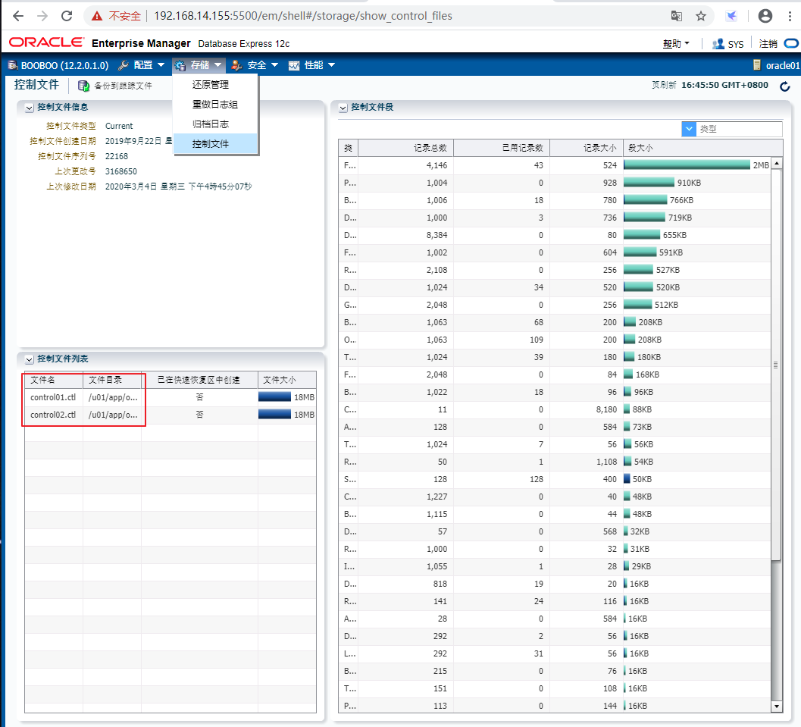

# 第3课的练习：配置可恢复性

> 2020.03.04 BoobooWei

<!-- MDTOC maxdepth:6 firsth1:1 numbering:0 flatten:0 bullets:1 updateOnSave:1 -->

- [第3课的练习：配置可恢复性](#第3课的练习：配置可恢复性)   
   - [第3课的练习：概述](#第3课的练习：概述)   
   - [练习3-1：配置默认备份目标和ARCHIVELOG模式](#练习3-1：配置默认备份目标和archivelog模式)   
      - [总览](#总览)   
      - [假设条件](#假设条件)   
      - [任务](#任务)   
   - [练习3-2：设置RMAN的日期和时间格式](#练习3-2：设置rman的日期和时间格式)   
      - [总览](#总览)   
      - [假设条件](#假设条件)   
      - [任务](#任务)   
   - [练习3-3：配置RMAN设置](#练习3-3：配置rman设置)   
      - [总览](#总览)   
      - [假设条件](#假设条件)   
      - [任务](#任务)   
   - [练习3-4：配置控制文件](#练习3-4：配置控制文件)   
      - [总览](#总览)   
      - [假设条件](#假设条件)   
      - [任务](#任务)   
   - [练习3-5：Cloud Control中的恢复设置](#练习3-5：cloud-control中的恢复设置)   
      - [总览](#总览)   
      - [假设条件](#假设条件)   
      - [任务](#任务)   
   - [练习3-6：配置重做日志文件](#练习3-6：配置重做日志文件)   
      - [总览](#总览)   
      - [假设条件](#假设条件)   
      - [任务](#任务)   

<!-- /MDTOC -->

## 第3课的练习：概述

在这些实践中，您将多路复用控制文件，配置快速恢复区域，配置重做日志文件以及将数据库配置为ARCHIVELOG模式。

在这些实践中，您将配置默认的备份目标，设置RMAN显示数据和时间格式，配置控制文件自动备份，配置备份保留策略以及为备份配置设备。

## 练习3-1：配置默认备份目标和ARCHIVELOG模式

### 总览

在实践中，您将确定默认的备份目标设置，设置DB_RECOVERY_FILE_DEST_SIZE初始化参数，并验证是否正在使用默认位置。

接下来，启用ARCHIVELOG模式并重新启动ORCL数据库实例。

### 假设条件

您将打开一个终端窗口，其中已为ORCL数据库实例设置了环境变量。使用$ LABS作为工作目录。除非另有说明，否则始终从该目录运行。

### 任务

**语法：**更改数据库的归档模式，请使用`ALTER DATABASE`带有`ARCHIVELOG`or `NOARCHIVELOG`子句的语句。

**权限：**必须以管理员权限（`AS SYSDBA`）连接到数据库。

```sql
sqlplus / as sysdba
show parameter DB_RECOVERY_FILE_DEST_SIZE
--此处我选择在指定路径中存放归档日志，而不放在快速恢复区域
show parameter log_archive_dest_1
--设置归档日志存放路径
!mkdir /u01/software/arc_booboo_dest1
alter system set log_archive_dest_1='location=/u01/software/arc_booboo_dest1';
--查看当前归档模式为 No Archive Mode
archive log list
--关闭数据库实例
shutdown immediate
--启动到mount状态
startup mount
--修改数据库归档模式
alter database archivelog;
--修改数据库实例状态从mount到open
alter database open;
--查看归档模式
archive log list

--使用RMAN备份数据库
rman tagert "'/ as sysbackup'"
backup database;
--删除过期备份
 delete obsolete;
```

更改数据库归档模式将更新控制文件。更改数据库归档模式后，必须备份所有数据库文件和控制文件。以前的任何备份均已在`NOARCHIVELOG`模式下使用，因此不再可用。

所以变更归档模式后一定要备份 。

备份结果

```bash
......
Starting Control File and SPFILE Autobackup at 04-MAR-20
piece handle=/u01/app/oracle/product/12.2.0/db_1/dbs/c-3416647573-20200304-00 comment=NONE
Finished Control File and SPFILE Autobackup at 04-MAR-20
```

请注意，`04-MAR-20`日期不包括时间（只是日期）。

## 练习3-2：设置RMAN的日期和时间格式

### 总览

在实践中，您可以设置RMAN用于显示时间戳的日期/时间格式。默认日期格式不包括时间信息。在本研讨会中，您将在同一天内执行多个备份和恢复，在某些情况下，需要确定要使用的备份。

### 假设条件

您已完成先前的练习。

### 任务

```sql
--设置NLS_LANG和NLS_DATE_FORMAT变量，以使RMAN在任何时间戳记值中包括时间信息。
vim ~/.bashrc
export NLS_LANG=american_america.al32utf8
export NLS_DATE_FORMAT="yyyy-mm-dd:hh24:mi:ss"

--登陆RMAN查看备份列表
rman tagert "'/ as sysbackup'"
list backup;
exit;
```

**工作提示**：由于RMAN命令的输出可能会很长，因此请考虑使用`SPOOL LOG TO <file>` 命令将输出定向到您指定的文件。

```sql
--设置Rman输出日志
rman tagert "'/ as sysbackup'"
spool log to '/tmp/rman.log'
list backup;
exit;

--查看日志
less /tmp/rman.log
```


## 练习3-3：配置RMAN设置

### 总览

在实践中，您可以配置或确认以下任务的RMAN设置：

* 每次RMAN备份数据库中的任何内容时都要备份控制文件和服务器参数文件（SPFILE）
* 确保保留一个冗余备份

然后，您执行表空间备份以验证这些设置。

### 假设条件

您已完成先前的练习。

### 任务

```sql
--.以SYSBACKUP身份登录到RMAN会话，检查是否启用了控制文件自动备份。
rman tagert "'/ as sysbackup'"
show controlfile autobackup;
--如果没有开启，则启用控制文件自动备份
configure controlfile autobackup on;
--查看当前的保留策略设置
show retention policy;
--将保留策略配置为冗余1
configure retention policy to redundancy 1;
--删除过期备份
DELETE OBSOLETE;
--查看数据库架构报告
REPORT SCHEMA;
--备份USER表空间
backup tablespace users;
exit;
```

架构报告部分数据如下：

```sql
List of Permanent Datafiles
===========================
File Size(MB) Tablespace           RB segs Datafile Name
---- -------- -------------------- ------- ------------------------
1    820      SYSTEM               YES     /u01/app/oracle/oradata/booboo/system01.dbf
3    670      SYSAUX               NO      /u01/app/oracle/oradata/booboo/sysaux01.dbf
4    65       UNDOTBS1             YES     /u01/app/oracle/oradata/booboo/undotbs01.dbf
5    250      PDB$SEED:SYSTEM      NO      /u01/app/oracle/oradata/booboo/pdbseed/system01.dbf
6    350      PDB$SEED:SYSAUX      NO      /u01/app/oracle/oradata/booboo/pdbseed/sysaux01.dbf
7    5        USERS                NO      /u01/app/oracle/oradata/booboo/users01.dbf
```


**注意**：

− 如果未连接到恢复目录，则`RB segs`列中将包含`***`作为值。当您连接到恢复目录时，它包含`Yes`和`No`。

− 在此示例中，USERS表空间是文件号7。您的USERS表空间可能具有不同的文件号。您可以将表空间备份为数据文件或表空间。该解决方案显示表空间备份。

## 练习3-4：配置控制文件

### 总览

在实践中，您可以多路复用控制文件以减少失败或数据丢失的机会。您使用以下工具：

* Enterprise Manager Database Express 12（EM Express）以查看现有的控制文件（作为SYSDBA）
* SQL * Plus和一个编辑器来更新初始化参数文件中的CONTROL_FILES参数（作为SYSDBA）

### 假设条件

您已完成之前的练习。

### 任务

您的总体任务是验证您至少有两个控制文件，每个控制文件位于不同的磁盘上，以确保冗余。该实践还向您介绍了用于学习目的的不同工具。

1.使用浏览器，访问 EM Express



2.以SYSDBA用户身份登录SQL * Plus

```sql
sqlplus / as sysdba
--查看参数control_files
show parameter control_files;
```


## 练习3-5：Cloud Control中的恢复设置

### 总览

该练习中，您将确认并配置设置以减少失败或数据丢失的机会。本练习还旨在向您介绍可用于备份和恢复的不同工具。

### 假设条件

您已经完成了前面的练习。

### 任务

1.使用浏览器，启动企业管理器云控制

2.使用提供给您的密码以SYSMAN用户身份登录。

3.选择当前的实例进行管理

4.单击**可用性>备份和恢复>恢复设置**。

云管理控制中的备份恢复配置，可以理解为图形化界面配置RMAN，非常方便。

## 练习3-6：配置重做日志文件

### 总览

该实验中，您检查每个重做日志组中有多少成员。确保每个组中至少有两个重做日志成员。每个组中的一个成员应存储在快速恢复区中。

### 假设条件

您已完成先前的练习。

### 任务

1使用Cloud Control 进行配置管理，单击“ **管理”>“存储”** >“ **重做日志组”**

2使用命令行管理

```sql
--查看日志的工作工作状态
select * from v$log;
--查看日志的物理信息
select * from v$logfile;
--在组下增加成员
!mkdir /u01/software/redolog
alter database add logfile member
'/u01/software/redolog/redo01b.log' to group 1,
'/u01/software/redolog/redo02b.log' to group 2,
'/u01/software/redolog/redo03b.log' to group 3;
```
