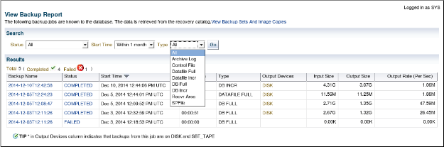

# 第6课：创建备份的练习

> 2020-04-09 BoobooWei

<!-- MDTOC maxdepth:6 firsth1:1 numbering:0 flatten:0 bullets:1 updateOnSave:1 -->

- [第6课：创建备份的练习](#第6课：创建备份的练习)   
   - [第6课：概述的练习](#第6课：概述的练习)   
   - [练习6-1：配置块更改跟踪](#练习6-1：配置块更改跟踪)   
      - [总览](#总览)   
      - [假设条件](#假设条件)   
      - [任务](#任务)   
   - [练习6-2：使用增量备份](#练习6-2：使用增量备份)   
      - [总览](#总览)   
      - [假设条件](#假设条件)   
      - [任务](#任务)   

<!-- /MDTOC -->

## 第6课：概述的练习

在该实践中，您将配置块更改跟踪，创建增量备份，备份控制文件以及备份存档的重做日志文件。

## 练习6-1：配置块更改跟踪

### 总览

在这该实践中，您将配置块更改跟踪（BCT）。

尽管BCT是可选的，但它可以将增量备份所需的时间从扫描数据库中的所有块的时间减少到与自上次备份以来已更改的块数成比例的时间。

注意：BCT文件只能包含8个位图，因此，如果新的增量备份基于父级备份，则增量备份超过8个就无法优化备份。开发增量备份时，请考虑8位图限制战略。

例如，如果先进行0级数据库备份，再进行7次差异增量备份，则块更改跟踪文件现在将包含8个位图。如果然后进行累积的1级增量备份，RMAN将无法优化备份，因为与父级0备份相对应的位图将被跟踪当前更改的位图覆盖。

### 假设条件

以前的实践已经完成。

您已打开一个终端窗口。为数据库实例设置了环境变量。

### 任务

配置块更改跟踪以将BCT文件放置在默认数据文件创建目标中。

```SQL
!mkdir /home/oracle/oracle_bct
# 确保将DB_CREATE_FILE_DEST初始化参数设置为正确的位置
ALTER SYSTEM SET DB_CREATE_FILE_DEST = '/home/oracle/oracle_bct';
SHOW PARAMETER DB_CREATE_FILE_DEST

# 启用块更改跟踪
ALTER DATABASE ENABLE BLOCK CHANGE TRACKING;
```


Block ChangeTracking 是Oracle 10g里推出的特性。官网对Block change tracking 的定义如下：

```
       Adatabase option that causes Oracle to track data file blocks affected by eachdatabase update. The tracking information is stored in a block change trackingfile. When block change tracking is enabled, RMAN uses the record of changedblocks from the change tracking file to improve incremental backup performanceby only reading those blocks known to have changed, instead of reading datafiles in their entirety.

       --Block change tracking 会记录data file里每个block的update 信息，这些tracking信息保存在tracking 文件里。 当启动block change tracking 后，RMAN 使用trackingfile里的信息，只读取改变的block信息，而不用在对整个data file进行扫描，从而提高了RMAN 备份的性能。
```
      
在使用RMAN 增量备份的情况下，启动block change tracking，在做增量备份时会缩短RMAN 备份的时间， 因为不用扫描整个data file。 但是block tracking 也会带来其他的一些开销。 所以要根据实际情况决定是否启用block change tracking。

[11gR2 文档里的说明](http://download.oracle.com/docs/cd/E11882_01/backup.112/e10642/rcmbckba.htm#BRADV8125)


## 练习6-2：使用增量备份

### 总览

在该实践中，您将创建目标数据库的映像副本，以用作增量备份策略的基础。您执行1级增量备份，并将增量应用于0级备份。

注意：将增量备份应用于级别0的映像副本，将使级别0的备份与您采用级别0而不是级别1相同。

### 假设条件

以前的实践已经完成。

您有两个终端窗口打开。当前目录是$LABS目录。为数据库实例设置了环境变量。

### 任务

1.从labs目录执行`lab_06_02_01.sh`脚本。该脚本创建`INVENTORY`表空间（即INVENTORY用户），并以`NOLOGGING`模式填充模式。

```bash
$ ./lab_06_02_01.sh
```

* 该脚本的执行可能要花一些时间。
* 该脚本可以运行多次，但是请注意，它会完全重置库存模式每次运行。

2.创建`LEVEL 0`的备份，tag为`BASE01`

```bash
rman target "'/ as sysbackup'"
run {
  ALLOCATE CHANNEL "ch1" DEVICE TYPE DISK FORMAT "/u01/backup/orcl/%U";
  BACKUP AS COPY TAG 'BASE01' INCREMENTAL LEVEL 0 DATABASE;
}
```

3.在另一个终端窗口中，通过执行`lab_06_02_03.sh`脚本来启动工作负载以更新数据库。

```bash
$ ./lab_06_02_03.sh
```

4.创建`LEVEL 1`的备份，tag为`incr_update`

```bash
rman target "'/ as sysbackup'"
run {
  ALLOCATE CHANNEL "ch1" DEVICE TYPE DISK FORMAT "/u01/backup/orcl/%U";
  BACKUP TAG 'incr_update' INCREMENTAL LEVEL 1 DATABASE;
}
```

注意：增量数据文件备份的时间比原始级别0快，并且某些数据文件根本不需要备份。


5.将增量备份应用于现有的0级备份。请注意数据文件副本的恢复和还原操作。

```bash
rman target "'/ as sysbackup'"
run {
  ALLOCATE CHANNEL "ch1" DEVICE TYPE DISK FORMAT "/u01/backup/orcl/%U";
  RECOVER COPY OF DATABASE WITH TAG 'BASE01';
}
```

6.在学习环境中禁用块更改跟踪。您可以在SQL * Plus或RMAN中执行命令。

```SQL
ALTER DATABASE DISABLE BLOCK CHANGE TRACKING;
```

7.退出RMAN客户端并通过执行`cleanup_06_02.sh` 清理测试数据。

```bash
./cleanup_06_02.sh
```

该脚本将删除INVENTORY表空间和INVENTORY用户。

8.（可选）在执行脚本时，使用另一个终端窗口在`/tmp/cleanup.log`文件中查看输出。

```bash
cat /tmp/cleanup.log
```

9.作为SYSBACKUP，删除过时的备份。

```bash
rman target "'/ as sysbackup'"
delete obsolete;

Do you really want to delete the above objects (enter YES or NO)? y
```

10.（可选）交叉检查ORCL数据库的所有数据文件副本。然后退出。

```bash
RMAN> crosscheck datafilecopy all;
```

11.（可选）在Cloud Control中查看您的备份。

主页导航：可用性>备份和恢复>备份报告。

您可以自定义“查看备份报告”页面。默认情况下，将显示所有类型的备份，并按开始时间降序排列。


