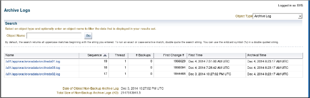
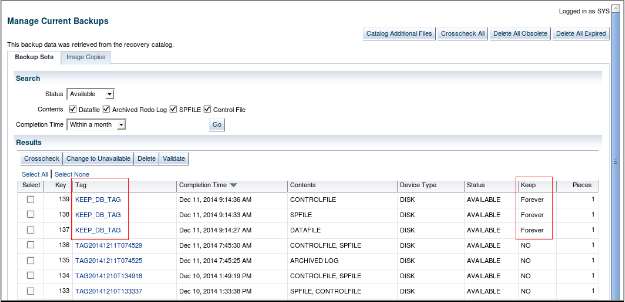
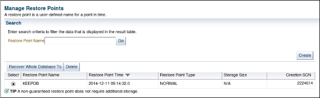

# 第7课：改善备份的实践

> 2020-04-13 BoobooWei

<!-- MDTOC maxdepth:6 firsth1:1 numbering:0 flatten:0 bullets:1 updateOnSave:1 -->

- [第7课：改善备份的实践](#第7课：改善备份的实践)   
   - [实践概述](#实践概述)   
   - [练习7-1：备份其他数据库文件](#练习7-1：备份其他数据库文件)   
      - [总览](#总览)   
      - [假设条件](#假设条件)   
      - [任务](#任务)   
   - [练习7-2：创建档案备份](#练习7-2：创建档案备份)   
      - [总览](#总览)   
      - [假设条件](#假设条件)   
      - [任务](#任务)   

<!-- /MDTOC -->

## 实践概述

在这些实践中，您将备份控制文件，备份存档的重做日志文件，并创建`KEEP FOREVER`数据库备份，如果您的某些活动需要它，则可以将其用于恢复。

## 练习7-1：备份其他数据库文件

### 总览

在这种做法中，您将创建不属于默认备份集的重要数据库文件的备份。

### 假设条件

以前的实践已经完成。

### 任务

```sql
sqlplus / as sysbackup
# 创建控制文件的备份副本
ALTER DATABASE BACKUP CONTROLFILE TO '/u01/backup/orcl/control.ctl';
SELECT name FROM v$datafile;
SELECT member FROM v$logfile;
# 将控制文件备份到跟踪文件
ALTER DATABASE BACKUP CONTROLFILE TO TRACE AS '/u01/backup/orcl/control.sql';
# 查看跟踪文件
cat /u01/backup/orcl/control.sql
# 备份ORCL数据库的存档日志文件，备份完成后删除所有存档文件。
rman target "'/ as sysbackup'" catalog rcatowner/oracle_4U@rcat
run {
  allocate channel "CH1" DEVICE TYPE DISK FORMAT '/u01/backup/orcl/%U';
  backup archivelog all delete all input;
}
# 列出可用于恢复到1小时前的某个时间点的备份归档日志文件
list backup of archivelog until time 'sysdate-05/60/24';
```

* `sysdate-05/60/24` 表示5分钟前

在Cloud Control中查看存档日志,管理>存储>存档日志:



## 练习7-2：创建档案备份

### 总览

在这种做法中，您将创建档案备份，即不在正常保留策略下并且不在常规FRA目标中的备份。如果您以后的一些动手活动需要使用此`KEEP FOREVER`数据库备份来进行恢复。可以使用打开的数据库或装入的数据库创建档案备份。

### 假设条件

您以oracle OS用户的身份进入终端窗口，指向orcl数据库实例。

### 任务

```sql
# 1.使用恢复目录登录到RMAN。
rman target "'/ as sysbackup'" catalog rcatowner@rcat
# 2.关闭并重新启动数据库实例，以便您可以在装入状态下创建整个数据库的备份副本。
SHUTDOWN IMMEDIATE;
STARTUP MOUNT;
# 3.备份您的ORCL数据库作为档案备份。会出现报错。
backup as copy database keep forever;
# 问题：为什么backup命令失败？
# 可能的答案：之所以失败，是因为无法将具有 KEEP属性的备份（档案备份）写入闪回恢复区。允许这样做有可能导致快速恢复区空间不足。此错误将迫使您指定其他位置。
# 4.使用FORMAT子句创建档案备份
BACKUP DATABASE FORMAT '/u01/backup/%U' TAG keep_db_tag KEEP forever RESTORE POINT KEEPDB;
# 5.打开数据库并退出RMAN。
alter database open;
# 6.对于备份的备用视图，（可选）以SYSMAN用户身份登录Cloud Control 并导航至Availability> Backup＆Recovery> Manage Current Backups。（看对于KEEP_DB_TAG标签。）
# 7.如果你没有看到你的存档备份，在页面底部设置NC_ORCL_HOST_ORACLE主机凭据，单击交叉检查所有。
# 8.（可选）查看还原点在Cloud Control中，导航：可用性>备份和恢复>还原点
# 问题：非保证的还原点是否使用额外的空间？
# 答：不可以。
```






以下列出了使用归档备份的恢复步骤。此时请勿执行这些步骤！

```sql
rman target "'/ as sysbackup'" catalog rcatowner@rcat
# 确认要使用的还原点的名称,在此示例中为KEEPDB
LIST RESTORE POINT ALL;
# 使用还原点还原和恢复数据库
RESTORE DATABASE UNTIL RESTORE POINT 'KEEPDB';
RECOVER DATABASE UNTIL RESTORE POINT 'KEEPDB';
# 由于您的数据库现在处于较早的时间，因此请使用RESETLOGS打开数据库
ALTER DATABASE OPEN RESETLOGS;
SELECT DBID FROM V$DATABASE;
# 在大多数环境中，Oracle建议在恢复后执行新的备份：
BACKUP DATABASE PLUS ARCHIVELOG DELETE INPUT;
```
