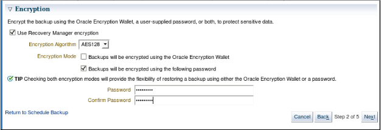
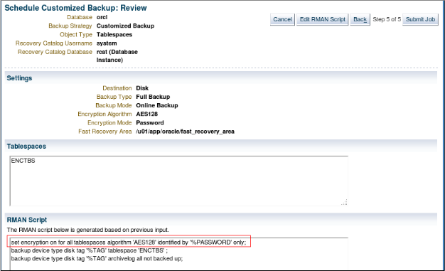
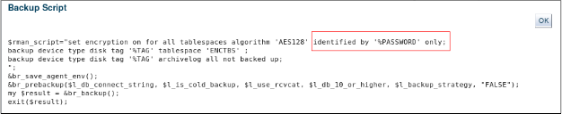
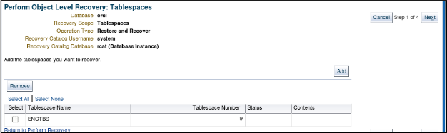
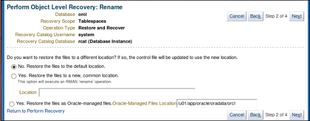
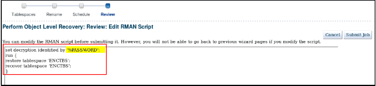

# 第8课练习：使用RMAN加密的备份

> 2020-04-13 BoobooWei


## 实践概述

在这些实践中，您将使用RMAN工具备份，并使用密码对备份进行加密。

## 练习8-1：使用RMAN加密备份

### 总览

在实践中，您将创建`ENCTBS`表空间的密码加密备份。该练习显示了Cloud Control中的步骤。有关命令行，请参阅步骤10中的RMAN脚本。

### 假设条件

您已以SYSMAN用户身份登录到Enterprise Manger Cloud Control，并具有orcl主页显示。

您还将打开一个终端窗口，其中将`/home/oracle/labs` 作为当前目录。环境变量指向orcl实例。

### 任务

1.在终端窗口中，以oracle用户身份执行`lab_08_01_01.sh`脚本。该脚本为此创建`ENC`用户和`ENCTBS`表空间。可以在`/tmp/setup.log`文件中查看输出。

```bash
$ ./lab_08_01_01.sh
```

2.在企业管理器云控制中，导航到**可用性>备份和恢复>计划备份**。如果需要，请使用`NC_SYSDBA`命名凭据登录。

3.在“计划备份”页面上，确保将主机凭据设置为`NC_ORCL_HOST_ORACLE`。选择表空间，然后单击计划自定义备份。

4.在“计划自定义备份：表空间”页面上，单击“ 添加”。

5.选择 `ENCTBS` 表空间，然后单击“ 选择”按钮。

6.返回“计划自定义备份：表空间”页面，单击“ 下一步”。


7.在“计划自定义备份：选项”页面上：

A)确认以下选择：

* 完全备份

* 同时备份磁盘上的所有存档日志

其他所有选项均应取消选择。

B)展开“加密”部分，然后选择以下选项：

* 使用Recovery Manager加密

* 加密算法：AES128

* 将使用以下密码对备份进行加密

C)在密码和确认密码中输入`oracle_4U`或您选择的密码。

如果您选择其他密码，请确保记住该密码。当你使用密码加密时，必须为备份和还原操作提供相同的密码。这是一种适合将在远程位置还原的备份的适当技术。



注意：只有在创建和打开Oracle Encryption Wallet（也称为密钥库）之后，才能使用它，如稍后的实践所示。

D)单击下一步。

8.在“计划自定义备份：设置”页面上，接受“ 磁盘”作为目标，然后单击“ 下一步”。

9.在`Schedule Customized Backup：Schedule`页面上，输入 `BACKUP_ENC` 作为 `Job Name`，接受`Job Description`，确保 `Schedule` 为 `One Time`（立即），然后单击Next。



10.查看整个`Schedule Customized Backup：Review`页面，然后单击`Submit Job`。

注意：密码不会以文本形式显示，因为这将违反安全性。如果使用命令行界面，则还可以使用`SET ENCRYPTION ON ...`

在RMAN脚本中使用“仅由密码标识” 命令来启用密码加密。

11.单击查看作业。

12.在执行：orcl页面上，单击备份脚本的显示链接。

13.请注意，备份脚本本身也不显示密码。单击确定。



14.如果您的备份作业仍在运行，请单击“刷新”图标（右上角）。

15.（可选）在“步骤：备份”的“状态”列中单击“ 成功”链接，查看单击“输出日志”，然后在导航栏中单击“ 执行：orcl ”。

16.从`Execution：orcl`页面，您可以通过多种方式返回orcl主页。例如，单击历史记录> orcl。替代方法是 **目标>数据库> orcl** 或 **所有目标> orcl （数据库实例）**。

注意：接下来的大多数操作都是可选的，但是最后的清理和备份任务（步骤16）是必需的。

## 练习8-2：还原加密的备份

### 总览

这是一种可选的挑战练习（因为您很可能尚未在课堂上介绍过还原和恢复操作）。仅在您有足够的时间完成挑战时才尝试挑战。

在这种情况下，您将还原密码加密的备份。

所有这些仅最后一项清理和备份任务是强制性的。

### 假设条件

您完成了前面的练习，并记住了您的加密密码。

您以SYSMAN用户身份登录到Cloud Control，并显示orcl主页。

您还将打开一个终端窗口。

### 任务

```SQL
# 1.在终端窗口中，通过中止ORCL数据库并删除ENCTBS表空间的数据文件来创建问题。
sqlplus / as sysdba
shutdown abort
rm /u01/backup/orcl/enctbs01.dbf
exit
# 然后挂载数据库。
sqlplus / as sysdba
startup mount
exit
# 2.（可选）确认已删除数据文件。
ls /u01/backup/orcl
#3.在云控制中，导航到可用性>备份和恢复>执行恢复。（如果需要，请使用名称为NC_SYSDBA的凭据登录。）
注意：可能已经发现数据库故障，但是为了您的学习经验，请执行以下步骤。
# 4.在“执行恢复”页面上：
* 选择表空间作为恢复范围。
* 确保选择“恢复到当前时间或上一个时间点”。
* 展开“ 解密备份”，然后输入以前的做法的密码（或者oracle_4U或您选择的密码）作为密码并确认密码。
* 确认NC_ORCL_HOST_ORACLE主机凭据，然后单击“ 恢复”。

# 5.在执行对象级别恢复：表空间页面上，单击下一步。
# 注意：如果未显示ENCTBS，请单击添加，选择ENCTBS，然后单击选择按钮。
```



```SQL
# 6.确认“否。将文件还原到默认位置。” 然后单击“ 下一步”。
```



```SQL
# 7.在“执行对象级别恢复：计划”页面上，输入RECOVERY_ENC作为作业。
# 命名，接受职位描述，然后单击下一步。
# 8.在“执行对象级别恢复：查看”页面上，单击“ 编辑RMAN脚本”。
```


```SQL
set decryption identified by '%PASSWORD';
run {
sql 'alter tablespace "ENCTBS" offline immediate';
restore tablespace 'ENCTBS';
recover tablespace 'ENCTBS';
sql 'alter tablespace "ENCTBS" online';
}
对于命令行界面，您输入此RMAN脚本中显示的命令。
* 出于安全原因，不会显示密码。
* 如果在联机数据库中执行这种类型的恢复，则会看到以下命令：
# 9.单击提交作业。
# 10.单击查看作业。
# 11.在Execution：orcl页面上，可以选择单击Show链接以查看恢复脚本。
# 查看脚本，然后单击“ 确定”。
# 12.刷新Execution：orcl页面，直到看到作业的状态为Succeeded。
# 13.如果执行了本练习的步骤1，则打开ORCL数据库。
sqlplus / as sysdba
ALTER DATABASE OPEN;
exit
# 14.强制性清理和备份任务：
# 从$LABS目录执行cleanup_08_02.sh脚本以删除此实践中使用的测试数据。可以在/tmp/cleanup.log文件中查看输出。
./cleanup_08_02.sh
# 执行backup_orcl.sh脚本，以创建新的数据库备份，以供以后的实践使用。
./backup_orcl.sh
```
